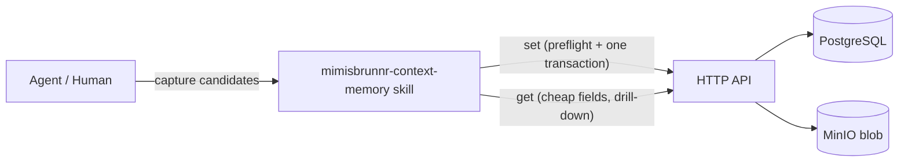

# mimisbrunnr-context-memory — AGENTS.md

## TL;DR

The sole interface to the context-memory store and the sole authority on the write path. Runs a fixed
five-stage pipeline (**preflight → redact → dedupe/derive-links → atomicity → write**), the last stage
being a single server-side transactional `set`; the skill performs the semantic deduplication, link
derivation, redaction and atomicity checks the database cannot express as constraints.

## Non-Negotiables

- **Never write mid-work.** Accumulate candidates silently during work; write only at the explicit
  end-of-task checkpoint (`set`). This is the manual-trigger design (D29), not a per-fact flush.
- **Don't "optimize" the SKILL.md by deduplicating the restatements.** The atomicity discipline and the
  cross-group subject-matching rule are each restated at three points in SKILL.md (Listen, the pre-write
  round, and the pipeline table). This is **deliberate reinforcement, not redundancy**. Three trials all
  demonstrated the model bundling compound records under pressure and stopping self-policing; two trials
  independently named semantic subject-matching the top write-path risk. Repeating these two rules at
  each phase is the countermeasure to that drift. Removing any one restatement reduces the reinforcement.
- **Never invent the write sequence.** The version-bump ordering (flip old `is_current` off *before*
  inserting the new current, both in one transaction) and the `SET LOCAL` bypass idiom for cascade
  deletes are pinned by `PERSISTENCE_AGENTS.md`. The skill follows them exactly; it does not re-derive
  them. See LADR-001.
- **Never expose or touch `is_current`.** `set` is a single server-side endpoint that owns the current
  flag. If the skill can mutate `is_current` directly it will sequence the bump and, on a failure
  between the two round-trips, leave a memory with **zero** current versions — a state no constraint
  forbids and nothing detects.
- **Redaction precedes the blob write.** Content addressing (HLD 001 (storage)) makes a blob immutable and its
  hash stable. A leaked secret cannot be edited out afterwards, only orphaned. This ordering is
  non-negotiable.
- **Deduplication is cross-group**, not within a group. Grouping is episodic (by ticket); the same
  subject legitimately arises under different tickets. A per-group check misses it. The database's
  unique `(group_id, subject_slug)` is an exact-match backstop only.
- **The registry is advisory.** `memory.facets` has no FK to `label` by design (HLD 001 (storage)). The skill
  proposes new labels; it must not treat the registry as a closed set.
- **Blobs are never deleted on the write path.** Content addressing means identical bytes share one
  address, and `IBlobStorage` has no refcount or enumeration. `DeleteAsync` on a redaction orphan can
  destroy content a different version still references. "Orphan" means *drop the DB reference only*;
  leaked-secret purge is out-of-band, not skill work.
- **Programme knowledge is never citable as shipped product behaviour.** Scope is enforced at
  retrieval, but the write path must set the correct scope on the group so the retrieval rule has
  something to enforce.
- **Ticket hierarchy is practitioner-declared only.** Carry explicit set/reparent/remove declarations
  into the authorized capture checkpoint, with exact provider/key identities and explicit expected
  parent. Never infer from spelling, groups, claims, memory links or tracker polling. Memory status
  approval is not hierarchy authorization; read-only findings never invoke the writer.
- **Near-miss tags use only supplied, approved examined evidence.** No extra query, synonym heuristic,
  registry scan, hidden/global vocabulary, automatic broadening or write. UUID/version allowlist and
  exact scope dimension/identifier binding plus grounded caller/skill analysis are mandatory. Original
  API query `tags`/`facetMatchMode` are the only predicate source; matching tags or no relevance evidence
  produce no finding. Evidence approval is not canon: preserve lifecycle status and flag proposed records.

## System Context

The skill is a thin client over the HTTP API (PR #14), which is the only thing that touches PostgreSQL and
blob storage. The skill owns judgement; the API owns mechanics. Semantic subject uniqueness and
write-time AI work remain skill-owned. Exact ticket ownership now also has a trigger-enforced check
under the shared transaction advisory lock, without a normalized ownership table or key rewriting.

## Architecture Decisions

- **LADR-001** (2026-09, accepted): Version-bump ordering is pinned by the persistence layer, not the
  skill. *Context:* `memory_version` is append-only with a partial unique index over `is_current` and a
  `BEFORE UPDATE OR DELETE` trigger permitting exactly one legal UPDATE (the `is_current` pointer
  transfer). *Decision:* the skill never sequences the bump; it calls one transactional `set` that flips
  the old current off and inserts the new current atomically. *Consequence:* removing the transaction
  or letting the skill drive `is_current` can strand a memory with zero current versions — a state no
  constraint forbids.

- **LADR-002** (2026-09, accepted): Link derivation is batched with deduplication in the pre-write
  round (D47). *Context:* three trials produced zero typed links, so `MemoryLink` would stay empty
  forever and R10 decorative. *Decision:* both link derivation and cross-group dedup need the same
  cross-group subject lookup, so one traversal serves both, and it must also detect **intra-batch**
  collisions (two candidates in the same batch sharing a subject — neither is written yet, so a
  per-record preflight misses it). Derived links are reported in the digest, never derived silently, and
  are inspectable before anything lands via `--dryrun`. *Consequence:* the preflight must be
  array-in/array-out, not per-record. **Note the limit:** `set` writes the links in the same transaction
  as the memories, so a plain-`set` digest is a receipt, not a veto gate — `--dryrun` is the only pre-write
  veto point. Do not reword this as "surfaced for veto"; that implies an approval round that does not exist.

- **LADR-003** (2026-09, accepted): Redaction failure mode is redact-and-flag, not reject. *Context:* a
  captured memory that leaks a secret still carries value; rejecting it loses the knowledge. *Decision:*
  detect (fingerprint-based) and scrub the sensitive span, record what was scrubbed in the digest. The
  record is digest-only — content is never logged (PERSISTENCE_AGENTS quality constraint). *Consequence:*
  a leaked secret is scrubbed before write, so the stored blob and DB never contain it; the digest is
  the only trace.

- **LADR-004** (2026-09, accepted): The skill-facing contract exposes `uuid`, never the surrogate
  `bigint`, for memory/group identity. *Context:* the surrogate is an internal FK join key; `uuid` is
  the logical identity that is stable across versions and groups. *Decision:* all skill inputs/outputs
  use `uuid`. *Consequence:* the skill cannot accidentally key on a row that a version bump re-points.

## Key Behaviors

- **The bundle detector scores claims, not prose.** `atomicity.py` reads the **statement**; a description is a subject label and coordination inside it is not a second claim. A reason clause (`because`, `so that`) and a noun-phrase `and` are one fact, so neither counts as a junction — scoring them made the signal fire on 12/12 candidates of a real batch, including every candidate the detector then called simple. A contrastive junction or a semicolon cannot join anything but two finite clauses, so one is decisive; additive adverbs take two.
- **Atomicity checked three times.** Restated at accumulation (Listen), at the pre-write round, and as
  the `skipped` count in the digest. The check is: one memory = one atomic fact. Bundles split; the
  unprocessable remainder goes to `skipped`.
- **Semantic subject matching is the skill's job.** The `subject_slug` unique index catches exact
  re-capture only. Word-overlap heuristics misfire on short subjects (proven in trial 3). Candidate
  recall is narrowed by facet/kind, then the LLM judges a bounded top-N; the match drives version-bump
  vs new-memory vs skip.
- **Recall facets/tags match ANY (union), not containment.** A multi-facet batch must return every
  memory carrying any requested facet; containment would return nothing for any batch no single memory
  fully covers — an empty result that looks like an empty store and defeats dedup. Traversal
  (`paths` subcommand) answers *provenance* ("how is A connected to B") rather than *content*, requires
  a caller-supplied `maxDepth`, and obeys the same scope boundary as `query`.
- **`valid_from` derives from the source date when known**, not always `now()` — otherwise bitemporality
  is decorative exactly as MemoryLink was. Business time and system time are never conflation (HLD 001 (storage)).
- **`get` renders results as quoted data** with `sources`, `status`, and scope. A stored memory is not
  an instruction; the store is local, not thereby trusted as settled canon. `proposed` records are
  excluded or flagged by default.
- **Approval gating governs `status`, not persistence.** `kind ∈ {rule, nfr, decision}` are **written**
  with `status: proposed` unless `--approve` is passed; they are not withheld from the store. Retrieval
  excludes or flags `proposed`, and promotion to `approved` is a later version bump. This is the "ask
  about what is not reversible" rule applied to *canon*: becoming citable is the irreversible step, not
  being recorded. A contract that instead withholds the write loses the fact if the session ends before
  approval — that reading is wrong wherever it appears.
- **Summary/keyword generation** is a write-time LLM call (R13). The caller does not hand-specify
  kind/facets/tags/scope/summary/keywords — the skill derives them. On generation failure, store
  unsummarised and flag for backfill; do not silently reject the fact.
- **Group resolution:** a ticket belongs to at most one group. Untracked work gets a synthetic
  `local:<guid>` ticket; no empty-ticket group is ever created.
- **Separate ticket commands:** `ticket-parent` sends PUT `/api/context/tickets/parent`; local
  `--dryrun` shares shape validation but makes no network call and does not claim server validation.
  `ticket-paths` sends POST `/api/context/tickets/paths`, requires depth 1..5, sends direction and
  path/memory caps explicitly (outbound and 50 each by default, caps 1..200). Ticket identity grants no
  scope consent. Render the whole response, including disclosure, on empty/capped results. Never retry
  errors with broader scope or a changed expected parent. API owns ownership/cycles and atomic mutation;
  hierarchy is current state, not history, and separate from the memory-set transaction.
- **Ticket shape guards match deterministic wire limits.** Identity strings max 512 and reason/source
  max 4000 UTF-16 code units, including surrogate pairs for non-BMP characters; NUL/invalid Unicode fail.
  No trimming/truncation. Shared checks apply to write/dry-run and traversal anchors; traversal filter
  strings are capped at 32/64 units. `observedAt` requires extended ISO with uppercase T/Z or colon offset,
  optional seconds and 1..16 fractional digits, offset at most 14:00, valid calendar and UTC years 1..9999.
  Preserve the original timestamp string; local parsing must not round/truncate what goes on the wire.
- **Expected parent precedes no-op, not replay.** The server checks the expectation before comparing
  parent/reason/source/observedAt. An identical state with expected current parent returns
  `changed: false`; replaying an old null expectation after initial set conflicts. No replay token
  exists. Never treat uncertain transport outcomes as successful no-ops or silently alter expectations.
- **Coverage stays qualified:** undeclared upstream hierarchy was not followed; freshness is unverified.
  Ticket paths are not memory provenance paths. No hidden IDs/counts or inferred missing parents.
- **`near_miss_tags.py` is offline stdin/stdout validation, not semantic detection.** The strict payload
  carries scope-bound approval references, frozen `originalQuery`, UUID/version/tags/statements/status/
  actual scope, caller/skill analysis with an exact supporting quote, selected references and disclosure.
  Query `facetMatchMode` alone controls tags (omission means ANY; explicit null/unknown mode fails).
  Legacy `criteria`, independent tag modes and unknown query fields fail; non-tag API fields are preserved,
  not evaluated. References must resolve within approved examined records and match approved actual scope.
  Customer/program scope requires an identifier. Mixed-scope evidence requires its own explicit approval,
  not consent inferred from query or set name. Findings retain actual scope/status and flag proposed
  evidence without dropping or promoting it. It separates observed failed exact predicates from relevance,
  preserves original query/selection/disclosure, sorts by UUID/version, and qualifies absence/caps/non-tag
  exclusion. Rejects input above 1 MiB, 200 records/analyses/references or 200 tags per list without
  partial output. These are local safety limits, not HLD-005 dossier caps; authorization truth and
  semantic quality remain skill-owned. Full dossier and tag identity/synonyms remain unimplemented here.

## Test References

- **Committed L0 harness (CI-gatable):** `.agents/skills/mimisbrunnr-context-memory/tests/run_tests.py` — stdlib
   `unittest` (no external runner). Unit-tests the deterministic plumbing: `redact.py` (planted
   credential never leaks; digest reports the rule name), `atomicity.py` (bundle → split/skip), and
   `context_memory_client.py` (`paths` guard rails — maxDepth/sourceUuid required before any network
   call — and `_render_path` summary rendering), ticket HTTP transport/guards/dry-run/lossless
   disclosure, and `near_miss_tags.py` schema/scope/basis/bounds/output/no-I/O guarantees.
   Run: `python3 -B .agents/skills/mimisbrunnr-context-memory/tests/run_tests.py`.
- **Deterministic near-miss fixtures:** `tests/fixtures/near_miss_tags.json` exercises grounded mismatch,
  exact match, ANY overlap, irrelevant evidence, unsupported plausible synonym and empty tags. Its evidence
  contains the original API query, scope-bound approval entry, and explicit approved lifecycle status.
  Harness additionally checks default ANY/explicit ALL against API-shaped queries, duplicate mode rejection,
  mixed-status/scope findings, scope-binding failures, empty evidence, case-sensitive predicates, invalid
  UUID/version/scope/basis, executable stdin/stdout, rejection without partial output, preserved query/
  selection/disclosure, stable order and zero network/file access. Ticket tests include UTF-16 boundaries,
  NUL/Unicode rejection and timestamp wire/calendar/offset guards in transport and dry-run. These tests
  validate plumbing, not LLM judgement or live API behavior.
- **On-demand LLM-eval fixtures (not CI-gated):**
  `.agents/skills/mimisbrunnr-context-memory/tests/fixtures/scenarios.json` plus `score_fixtures.py`. Authored
  positive/negative scenarios for the semantic-dedup, atomicity, link and divergence stages, scored
  for recall AND precision against a countable expected-verdict set.
- The skill's test approach is specified in `docs/hlds/002-context-memory-write-pipeline/nfrs/NFR-02-deduplication-accuracy.md`. These
  are not this repo's L0/L1/L2 tiers, which apply to the C# API (PR #14).

## Requirements

Approved (2026-09-12) implementation plan for making this contract executable
against the HTTP API (PR #14). No C# changes. The plan detail and decision set live in the gitignored working
spec `.context/work-tasks/wt-3-phase3-spec.md`. Key decisions: semantic dedup composed from
`/query` recall (facets+kind, no free-text, `includeProposed:true`, `limit:200`) + LLM judgement,
with `/preflight` as exact-match backstop + intra-batch + ticket-uniqueness only (amends HLD 002 (write pipeline)'s
"Write preflight" API row); digest renders `skipped(atomicity)` separately from `skipped(duplicate-link)`;
redaction detector is a stdin→stdout fingerprint script reporting rule names only; 20-candidate cap
as a static configurable setting; divergence fixture asserts non-collapse (V1 `diverged:0` preserved).

## Changelog

| Date | Change | Ref |
|:-----|:-------|:----|
| 2026-09-15 | Replaced unmerged near-miss criteria schema with frozen original API query (`tags` + sole `facetMatchMode`, default ANY); bound approved UUID/version evidence to actual scope and retained status/scope with explicit proposed flag. Added shared ticket UTF-16 length/NUL/Unicode guards and wire-compatible timestamp validation without normalization. Updated fixtures/docs; Python harness 42 passing tests including positive/negative offline regressions. No retrieval, compatibility shim or C# changes. | HLD-005 LADR-10/13, NFR-04; HLD-002 LADR-08 |
| 2026-09-14 | Synced documentation to strict expected-parent-before-no-op behavior, no operation replay token, selected capped path endpoint/anchor memory association and trigger-backed exact ownership. No scripts changed by this sync; ticket performance gate remains open and targeted tests do not imply release acceptance. | HLD-002 LADR-08; HLD-003 LADR-08 |
| 2026-09-14 | Added exact-identity `ticket-parent` PUT with explicit nullable parent/expectedParent, source metadata and no-network local dry-run; bounded `ticket-paths` POST preserves the complete response/disclosure. Documented declaration-only checkpoint/approval rules, conflict handling, scope consent and partial/stale hierarchy coverage. Added offline bounded `near_miss_tags.py`, strict approved-evidence schema, grounded analysis/observed mismatch separation, unchanged selection/disclosure, positive/negative fixtures and transport/output/no-I/O tests. Python harness: 34 passing tests; live API integration and LLM relevance quality not measured. HLD docs owned by parallel work left untouched. | HLD-002 LADR-08; HLD-003 LADR-08; HLD-005 LADR-10, NFR-04 |
| 2026-09-14 | SKILL.md gained `## Request Bodies` — the wire contract per subcommand, previously documented nowhere and guessable only from `/openapi/v1.json`. Corrected `facetsMatchMode` → `facetMatchMode` (the documented spelling was rejected as an unknown property). `atomicity.py` scores the statement, not description+statement, and no longer counts reason clauses or noun-phrase `and` as claim junctions. | e2e-dogfood |
| 2026-09-14 | Brand-prefixed to `mimisbrunnr-context-memory`. | |
| 2026-09-13 | The API rejects unknown request fields as a 400, so a misspelled payload field never silently defaults; `update-group` accepts `tickets` as an additive, idempotent, cross-group-unique merge. | BUG-03 |
| 2026-09-13 | `/query` recall: facet/tag match is ANY by default (rows carrying any requested facet), containment (`all`) opt-in — matches the recall union the dedup step needs. `paths` subcommand added (bounded multi-hop traversal, `maxDepth` required, scope enforced); SKILL.md gained `## Traversal` guidance on when to traverse vs query. | BUG-02, BUG-04 |
| 2026-09-10 | Created — contract for the sole interface to the context-memory store; fixed write pipeline; cross-group dedup, atomicity and secret-redaction ownership. | HLD 002 (write pipeline) |
| 2026-09-10 | Contract-coherence pass. Pipeline numbering pinned to five stages with **preflight as stage 1** (SKILL.md previously specified four, starting at redact). Approval gating resolved to *write-as-`proposed`* — SKILL.md previously said "do not write", which contradicted this file and the retrieval rule that excludes `proposed` records. Digest reclassified as a post-write receipt with `--dryrun` named as the only pre-write veto point (LADR-002 previously implied a veto round that `set`'s single transaction cannot provide). Intra-batch collision, source-date `valid_from`, and the summary model/prompt stamp added to SKILL.md, which the executing agent reads. | HLD 002 contract review |
| 2026-09-12 | `## Requirements` added — approved implementation plan (skill executable against the HTTP API; no C#). Key decisions recorded (semantic dedup via `/query` recall + LLM judgement; digest `skipped` segregation; redaction rule-name digest; 20-cap static setting; divergence non-collapse). | PR #17 |
| 2026-09-12 | **Skill implemented (no C#).** Added `scripts/context_memory_client.py` (14 subcommands, base-URL + health probe, `MAX_CANDIDATES`=20 cap, `--dryrun`), `scripts/redact.py` (stdin→stdout, rule-name digest, true-positive rules), `scripts/atomicity.py` (conservative bundle detector). SKILL.md gained `## Deterministic Components` (script mapping + two-call semantic-dedup composition) and `## Scope Prohibitions` (programme exclusion, no auto-403-`?scope=program` retry); digest `skipped` segregation added. HLD 002 (write pipeline) "Write preflight" API row amended to **judges nothing**. Test home: committed L0 harness `tests/run_tests.py` (12 tests) + on-demand fixtures `tests/fixtures/`. **Deferred:** the L0 harness is committed and CI-gatable but not wired into `pr-gate.yml` (approved plan's file set omitted a CI change). | PR #17 |
