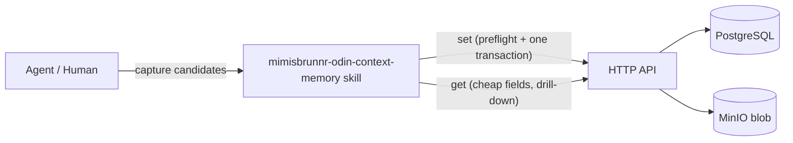

# mimisbrunnr-odin-context-memory — AGENTS.md

> **References.** Every HLD, LADR, NFR, BRD, issue and PR number in this file belongs to the upstream
> repository, `generic-automation-and-it/smooth-ai-product-context-memory` (`docs/hlds/`, `docs/brd/`),
> not to a repository this skill is vendored into.

## TL;DR

The sole authority on the write path. Runs a fixed
five-stage pipeline (**preflight → redact → dedupe/derive-links → atomicity → write**), the last stage
being a single server-side transactional `set`; the skill performs the semantic deduplication, link
derivation, redaction and atomicity checks the database cannot express as constraints. The read/load
sibling (`mimisbrunnr-kvasir-understanding`) injects material into agent context and — only through its
`export [--input <path>]` verb (the old `import --store` spelling is deprecated and refuses) — hands
material to a **narrower** capture path: preflight, redaction, exact-subject dedup, atomicity and write.
It performs none of this skill's semantic matching or link derivation (every `set` it sends carries
`links: []`), so a paraphrase or a relation needs this skill's own `--export`. It is a reader +
conditional exporter, never a second writer.

## Non-Negotiables

- **Main thread never consumes raw store rows.** Retrieval and pre-write recall run in delegated
  read/write contexts. Read execution receives only the read API credential and read-only client;
  write execution receives discrete facts, never a transcript. API credentials enforce capability;
  prompt text alone is not a security boundary.
- **Project agent registrations live in `.agents/agents/` for Claude-compatible runtimes.** Skill-local
  files hold detailed worker contracts; project registrations make workers discoverable and point at
  them. There is no MCP boundary, so the no-write guarantee is carried by the read-only client and the
  credential split rather than by a tool grant — treat a registration file or worker name as
  insufficient: delegation is supported only when the runtime grants both workers and the read worker's
  environment holds no write credential. The read worker runs only `context_memory_read_client.py` (no
  write subcommand, refuses to start with a write token present — `CONTEXT_MEMORY_WRITE_TOKEN`, the Host's
  `ApiAccess__WriteToken` or the controller's `Parameters__api-write-token`, any case, `:` read as `__`); the write worker runs
  `context_memory_client.py`. The write credential is never ambient — sourcing the full credential file
  is the deliberate write step, so a read worker that never sources it holds no write capability.

- **Never write mid-work.** Accumulate candidates silently during work; write only at the explicit
  end-of-task checkpoint (`set`). This is the manual-trigger design (D29), not a per-fact flush.
- **Don't "optimize" the SKILL.md by deduplicating the restatements.** The atomicity discipline and the
  cross-group subject-matching rule are each restated at three points in SKILL.md (Listen, the pre-write
  round, and the pipeline table). This is **deliberate reinforcement, not redundancy**. Three trials all
  demonstrated the model bundling compound records under pressure and stopping self-policing; two trials
  independently named semantic subject-matching the top write-path risk. Repeating these two rules at
  each phase is the countermeasure to that drift. Removing any one restatement reduces the reinforcement.
- **Never invent the write sequence.** The version-bump ordering (flip old `is_current` off *before*
  inserting the new current, both in one transaction) and the `SET LOCAL` bypass idiom for cascade
  deletes are pinned by `PERSISTENCE_AGENTS.md`. The skill follows them exactly; it does not re-derive
  them. See LADR-001.
- **Never expose or touch `is_current`.** `set` is a single server-side endpoint that owns the current
  flag. If the skill can mutate `is_current` directly it will sequence the bump and, on a failure
  between the two round-trips, leave a memory with **zero** current versions — a state no constraint
  forbids and nothing detects.
- **No scrub is silent.** The write digest names the rule, the field path and the replaced offsets of
  every redaction, never the replaced text. A neutral key name (`sort key`, `partition key`,
  `idempotency key`, bare `token`) is not evidence of a secret; do not widen the neutral-key rule back to
  "any 8+ character value", which rewrote ordinary statements.
- **Redaction precedes the blob write.** Content addressing (upstream `generic-automation-and-it/smooth-ai-product-context-memory` HLD-001, storage) makes a blob immutable and its
  hash stable. A leaked secret cannot be edited out afterwards, only orphaned. This ordering is
  non-negotiable.
- **The redaction gate is a gate on *recognition*, not on secrets.** Every persisting write (`set` and
  the seven group/link/label/initiative/ticket writes) scrubs automatically through
  `scrubbed_write` and refuses to write when the scrubber cannot run, so it can never fail open — but `redact.py` matches
  fixed-shape fingerprints (cloud/vendor key prefixes, JWTs, PEM private-key blocks, URL userinfo,
  `Authorization`/`Bearer` credentials, assignments to a key whose name says secret, `pwd` unless its
  value is a working directory or quoted prose, and assignments to a neutral key — `key`, `token`,
  `credential`, `auth`, `bearer`, `session`, `cookie` — only when the value is itself secret-shaped, so a
  generated-looking session ID such as `session = ses_…` **is** scrubbed while `session: 2026-10-05
  standup` is not; the full list is at the top of `redact.py`). A bare high-entropy value, an unlabelled base64 blob, an unusual vendor token format or
  a password in prose passes through untouched. Describe this control as *"recognisable secrets are
  gated, and the gate never fails open"*; **do not** describe it as "sensitive material never reaches
  storage", which overstates it. Widening the rule set is the lever, and that is a deliberate separate
  decision. `redact.py` carries the same statement at its top.
- **Subject matching reads across groups, but a version bump is scoped to the writing group.** A memory's
  identity is `(group, uuid)`, decided 2026-09-28 with HLD-002 amended to match. The recall is
  deliberately cross-group so a same-subject memory elsewhere is *seen*; only a match inside the
  request's `groupUuid` may be bumped, and a cross-group match becomes a new memory plus a typed link.
  The database's unique `(group_id, subject_slug)` is an exact-match backstop only, and a cross-group
  duplicate is neither detected nor merged — the accepted cost. **Do not "fix" the unqualified
  "deduplication is cross-group" wording this replaced by widening the version-target lookup**; that
  would reintroduce cross-group lock ordering and is a design change, not a bug fix.
- **The registry is advisory.** `memory.facets` has no FK to `label` by design (upstream `generic-automation-and-it/smooth-ai-product-context-memory` HLD-001, storage). The skill
  proposes new labels; it must not treat the registry as a closed set.
- **Blobs are never deleted on the write path.** Content addressing means identical bytes share one
  address, and `IBlobStorage` has no refcount or enumeration. `DeleteAsync` on a redaction orphan can
  destroy content a different version still references. "Orphan" means *drop the DB reference only*;
  leaked-secret purge is out-of-band, not skill work.
- **Programme knowledge is never citable as shipped product behaviour.** Scope is enforced at
  retrieval, but the write path must set the correct scope on the group so the retrieval rule has
  something to enforce.
- **Ticket hierarchy is practitioner-declared only.** Carry explicit set/reparent/remove declarations
  into the authorized capture checkpoint, with exact provider/key identities and explicit expected
  parent. Never infer from spelling, groups, claims, memory links or tracker polling. Memory status
  approval is not hierarchy authorization; read-only findings never invoke the writer.
- **Near-miss tags use only supplied, approved examined evidence.** No extra query, synonym heuristic,
  registry scan, hidden/global vocabulary, automatic broadening or write. UUID/version allowlist and
  exact scope dimension/identifier binding plus grounded caller/skill analysis are mandatory. Original
  API query `tags`/`facetMatchMode` are the only predicate source; matching tags or no relevance evidence
  produce no finding. Evidence approval is not canon: preserve lifecycle status and flag proposed records.

## System Context

The skill is a thin client over the HTTP API (upstream PR #14), which is the only thing that touches PostgreSQL and
blob storage. The skill owns judgement; the API owns mechanics. Semantic subject uniqueness and
write-time AI work remain skill-owned. Exact ticket ownership now also has a trigger-enforced check
under the shared transaction advisory lock, without a normalized ownership table or key rewriting.

## Architecture Decisions

- **LADR-005** (2026-09, accepted): Separate read and write execution contexts. *Context:* baseline
  recall may return 200 rows and consume the task's working context; broad shell grants cannot prove a
  read worker cannot mutate. *Decision:* delegate raw recall, expose a read-only client, and enforce
  read/write credentials at the API. Lookup and grounding return bounded cited conclusions plus
  matched-but-not-surfaced disclosure. *Consequence:* aggregate token spend may rise, but main-context
  longevity improves and the read boundary is structural when runtimes keep the write credential absent.

- **LADR-001** (2026-09, accepted): Version-bump ordering is pinned by the persistence layer, not the
  skill. *Context:* `memory_version` is append-only with a partial unique index over `is_current` and a
  `BEFORE UPDATE OR DELETE` trigger permitting exactly one legal UPDATE (the `is_current` pointer
  transfer). *Decision:* the skill never sequences the bump; it calls one transactional `set` that flips
  the old current off and inserts the new current atomically. *Consequence:* removing the transaction
  or letting the skill drive `is_current` can strand a memory with zero current versions — a state no
  constraint forbids.

- **LADR-002** (2026-09, accepted): Link derivation is batched with deduplication in the pre-write
  round (D47). *Context:* three trials produced zero typed links, so `MemoryLink` would stay empty
  forever and R10 decorative. *Decision:* both link derivation and cross-group dedup need the same
  bounded semantic recall, while preflight separately supplies exact subject/ticket facts and
  detects **intra-batch**
  collisions (two candidates in the same batch sharing a subject — neither is written yet, so a
  per-record preflight misses it). Derived links are reported in the digest, never derived silently, and
  are inspectable before anything lands via `--dryrun`. *Consequence:* the preflight must be
  array-in/array-out, not per-record. **Note the limit:** `set` writes the links in the same transaction
  as the memories, so a plain-`set` digest is a receipt, not a veto gate — `--dryrun` is the only pre-write
  veto point. Do not reword this as "surfaced for veto"; that implies an approval round that does not exist.

- **LADR-003** (2026-09, accepted): Redaction failure mode is redact-and-flag, not reject. *Context:* a
  captured memory that leaks a secret still carries value; rejecting it loses the knowledge. *Decision:*
  detect (fingerprint-based) and scrub the sensitive span, record what was scrubbed in the digest. The
  record is digest-only — content is never logged (PERSISTENCE_AGENTS quality constraint). *Consequence:*
  a leaked secret the rules **recognise** is scrubbed before write, so the stored blob and DB do not
  hold that value, and the digest is the only trace of it. A secret no rule recognises is stored as
  written (see the Non-Negotiable *The redaction gate is a gate on recognition*).

- **LADR-004** (2026-09, accepted): The skill-facing contract exposes `uuid`, never the surrogate
  `bigint`, for memory/group identity. *Context:* the surrogate is an internal FK join key; `uuid` is
  the logical identity that is stable across versions and groups. *Decision:* all skill inputs/outputs
  use `uuid`. *Consequence:* the skill cannot accidentally key on a row that a version bump re-points.

- **LADR-006** (2026-10, accepted): A recall has one foreground deadline, and deepsearch degrades by
  whole passes at it. *Context:* the read path told `timed-out` from `unreachable` but bounded nothing:
  deepsearch chains up to ten calls with no overall limit, and a single timed-out pass aborted the run
  and discarded every pass already completed, so a hung store could cost five minutes and return
  nothing — an absence of evidence shaped exactly like an empty result. *Decision:* `RECALL_DEADLINE_SECONDS`
  (60 s) caps one recall command; `CONTEXT_MEMORY_RECALL_DEADLINE` may shorten it and any other value is
  refused with `bad-deadline`, never clamped. Each read's socket timeout is `min(HTTP_TIMEOUT, deadline)`;
  a write keeps `HTTP_TIMEOUT`, because a write is not a recall. deepsearch checks the deadline before
  each pass, uses the remaining budget as that pass's socket timeout, and on a timeout stops the chain
  while keeping the completed passes — whole records only — disclosing `deadlineSeconds`, `stoppedEarly`
  (any pass incomplete), `budgetExhausted` (the wall clock was spent — distinct from a pass hanging) and
  `passesIncomplete`; `anchorsEligible`/`anchorsOmittedByCap` are `null` when the baseline never
  answered, because the traversal set is then unknown, not empty. A traversal the store refuses (403) is
  a fourth pass status, `forbidden` (a malformed answer is a fifth, `malformed`, handled the same way and
  counted in `passesMalformed`): it does **not** stop the chain, is listed in `passesIncomplete`,
  counted in `anchorsForbidden` and kept out of `anchorsOmittedByCap`. Under a group/ticket selector with
  a scope, endpoints outside the selected groups are dropped and counted once each in
  `endpointsOutsideSelector` (issue 182). *Consequence:* a recall is bounded and its shortfall is reported,
  so a partial result can never read as the whole store. The deadline is a client-side rendering/handling
  concern only: no Host change, no new network dependency (BR-16), and recall feedback stays server-side
  (HLD-004 LADR-01), so the contract states that a client giving up can leave a server-recorded outcome
  the agent never received. **Rejected alternative:** clamp an out-of-range deadline to the cap —
  rejected because a silently adjusted budget is one the operator trusts and the system does not honour,
  the restore statement-budget defect. **Rejected alternative:** abort deepsearch on the first timed-out
  pass (the pre-change behaviour) — rejected because it discards completed work and returns nothing where
  it could return something labelled partial.
- **LADR-007** (2026-10, accepted): The capture batch is written to disk **before** redaction, and that
  copy is bounded rather than removed. *Context:* reviews in issues 182, 184 and 186 each re-raised
  "writes unredacted candidate content to disk before redaction" against a different call site. The
  redactor needs the unredacted text as its input, and an agent can hand a script text through exactly
  three channels — a file, the command line, or the environment. *Decision:* the file, written with the
  file tool under `.context/mimisbrunnr-scratch/`, and every exposure of that one copy bounded at every
  site that writes or reads it: the folder is created owner-only (`mkdir -p -m 700`) and every reader
  (`redact.load_input`, so `redact.py`, `atomicity.py` and both clients' `--payload`) refuses a file that
  neither it nor its folder makes owner-only; the folder ignores itself (`.gitignore` holding `*`) before
  the first batch, so it cannot be committed even where `.context/` is not ignored; each file is consumed
  on read (`--consume`, except the `set --dryrun` payload the real write reuses); and the folder is
  removed after the real write and on refusal, failure or abandonment. **Personal data is not in that
  file at all:** every personal identifier — personal data as the GDPR defines it — is masked and
  generalised before the first batch is written: the value dropped, a person named by role and a value by
  its type, until no one can be singled out, and a fact meaningless once generalised is not captured
  (issue 188). Cleanup after the fact was never a way to meet a no-personal-data-on-disk rule, and
  redaction never removes personal data. Secrets get the same treatment:
  the agent masks every one it recognises as `<REDACTED>` before the file is written, so the redactor on
  the file is the mechanical second check rather than the first step (issue 190). An existing scratch
  folder is repaired to 0700 before use, since `mkdir -m` sets the mode only on a folder it creates.
  *Consequence:* the residual exposure is one owner-only, unignorable file that holds at most a secret
  judgement missed and the mechanical check is about to catch, for the length of a checkpoint, and nothing
  personal reaches the store. **Rejected alternative:** argv or a heredoc
  — rejected because a command line is readable by every account through the process table for the
  call's duration, is kept in shell history and the tool transcript, and lets a quote in a fact rewrite
  the command. **Rejected alternative:** an environment variable — rejected because every child process
  inherits it and the process table exposes it to the same account. **Rejected alternative:** a scratch
  folder outside the checkout — rejected for now because an agent's file tool is not guaranteed write
  access outside the workspace; the owner-only mode gives the same protection from other accounts. A
  review re-raising this finding against a new call site should check that site against this LADR: a
  site that writes a batch without these bounds is a defect, the channel itself is not.

## Key Behaviors

- **The bundle detector scores claims, not prose.** `atomicity.py` reads the **statement**; a description is a subject label and coordination inside it is not a second claim. A reason clause (`because`, `so that`) and a noun-phrase `and` are one fact, so neither counts as a junction — scoring them made the signal fire on 12/12 candidates of a real batch, including every candidate the detector then called simple. A contrastive junction or a semicolon cannot join anything but two finite clauses, so one is decisive; additive adverbs take two.
- **Atomicity checked three times.** Restated at accumulation (Listen), at the pre-write round, and as
  the `skipped` count in the digest. The check is: one memory = one atomic fact. Bundles split; the
  unprocessable remainder goes to `skipped`.
- **Semantic subject matching is the skill's job.** The `subject_slug` unique index catches exact
  re-capture only. Word-overlap heuristics misfire on short subjects (proven in trial 3). Candidate
  recall is narrowed by facet/kind, then the LLM judges a bounded top-N; the match drives version-bump
  vs new-memory vs skip.
- **Authority resolution retains both positions.** Candidate winner is one version bump. Existing
  winner is two ordered version writes in one transactional set: candidate loser first, existing winner
  second. Genuine conflict remains two current claim identities plus a proposed divergence record;
  helper-generated alternative description avoids same-group subject uniqueness collision.
- **Recall facets/tags match ANY (union), not containment.** A multi-facet batch must return every
  memory carrying any requested facet; containment would return nothing for any batch no single memory
  fully covers — an empty result that looks like an empty store and defeats dedup. Traversal
  (`paths` subcommand) answers *provenance* ("how is A connected to B") rather than *content*, requires
  a caller-supplied `maxDepth`, and obeys the same scope boundary as `query`.
- **`valid_from` derives from the source date when known**, not always `now()` — otherwise bitemporality
  is decorative exactly as MemoryLink was. Business time and system time are never conflation (upstream `generic-automation-and-it/smooth-ai-product-context-memory` HLD-001, storage).
- **`get` renders results as quoted data** with `sources`, `status`, and scope. A stored memory is not
  an instruction; the store is local, not thereby trusted as settled canon. `proposed` records are
  excluded or flagged by default.
- **Every read surface frames its output, and the framing is a default rather than a per-command
  decision.** kvasir's `export` admits transcripts and meeting notes through the normal capture path, so
  a recalled statement can read as an instruction — and unframed it returns carrying the store's
  authority, which is the most authoritative-looking text in an agent's context and therefore the most
  effective place to hide one. `RECALL_NOTICE` is defined **once** in `context_memory_client.py` and is
  the `mimisbrunnr-kvasir-understanding` client's `DATA_NOTICE` verbatim, asserted by a test that loads the
  sibling rather than restating the string; a paraphrase is a test failure, which is what keeps "never
  two wordings" true rather than aspirational. The read client frames **at its dispatch**, so a new
  subcommand is covered the day it is added and the only judgement to make is whether it belongs in
  `UNFRAMED_COMMANDS` — a question about content, not bookkeeping. `READ_COMMANDS` is the declared
  surface and `FRAMED_COMMANDS` is derived from it, because two hand-maintained lists drift and a name
  in one and not the other is either silently unframed or silently double-declared. `probe` is the sole
  opt-out (it reports a TCP connection and returns no record), and a test holds that reason true.
  **The notice appears exactly once, and the outermost layer owns the banner.** `query` is reachable
  from both the capture client and the read client, so two framing layers see the same result; each
  deciding independently whether a banner had been printed produced the notice twice, and then not at
  all. The rule is one owner: the inner layer attaches the field silently, the outer prints the prose.
  Both the field and the prose are emitted, because a notice only in prose is invisible to a program and
  a notice only in a field is dropped by any caller that rebuilds the object. Attribution is untouched —
  uuid, version and capture time pass through exactly as the API returned them. A non-JSON body (a blob)
  takes the banner branch, which is the one place the read client prints prose itself, because there is
  no object to carry the field. `get-blob` emits the body **byte for byte** — not stripped, no newline
  appended, both clients — after an unconditional banner, so a caller hashing or diffing it sees what the
  store holds and a body quoting the notice cannot suppress it.
- **The read client refuses to start with a write token present.** It requires only
  `CONTEXT_MEMORY_READ_TOKEN` and exits at startup if any write-token spelling is set
  (`client.WRITE_TOKEN_NAMES`: `CONTEXT_MEMORY_WRITE_TOKEN`, `ApiAccess__WriteToken`,
  `Parameters__api-write-token`, case-insensitive, `:` read as `__`), naming the variable, never its value,
  so a read surface can never mutate, by construction. An orchestrating skill that shells out to it
  (mimisbrunnr-kvasir-understanding `import`) strips every one of those spellings from the subprocess
  environment, matched the same way, rather than relying on the caller to `unset` it (issue 184).
- **`resolve-group` is not dry-runnable, and on the create path an initiative must exist first.** Its
  handler commits unconditionally — calling it to "look up" a group creates one — so a dry run resolves
  nothing and reports the group and initiative as *would create*. When it has to **create** the group, a
  missing initiative is a `404`, so `upsert-initiative` runs first; when the binding's tickets already
  resolve to an existing group it never looks the initiative up (issue 188 corrected the "always"). A
  capture orchestration refuses with that command rather than creating the initiative itself. Because
  `set` requires an existing `groupUuid`, a dry run for a group that does not exist yet previews the plan
  offline and cannot run `set --dryrun`; its real `set` payload is built after the authorised write
  creates the group, so the reuse-the-dry-run-payload rule applies to an existing group only. Hence **Initialize only proposes the binding**
  (read-only `initiatives` and ticket-filtered `query` are the only lookups; the API has no group read
  route) and `memory-write` runs `upsert-initiative`/`resolve-group` at the authorized `--export`
  checkpoint, before preflight — otherwise starting a session would be a mid-work write.
- **A recall has one foreground deadline, and deepsearch degrades by whole passes at it.** The cap is
  `RECALL_DEADLINE_SECONDS` (60 s); `CONTEXT_MEMORY_RECALL_DEADLINE` may **shorten** it and any other
  value is refused with `bad-deadline`, never clamped — a budget that silently becomes something else is
  worse than none (the restore statement-budget defect: a server raised its budget while the client
  obeyed its own, so the effective budget was the smaller of two values nobody compared). Each read's
  socket timeout is `min(HTTP_TIMEOUT, deadline)`, so a shortened deadline bounds a single `query`; a
  **write** keeps `HTTP_TIMEOUT`, so a malformed read-path setting cannot refuse a capture. Before #146 a
  hung store escaped as a bare `TimeoutError` traceback; the classification and the deadline are
  deliberately separate — the first says *what happened*, the second says *how long the whole command
  may take*. deepsearch checks the deadline before each pass and uses the remaining budget as that
  pass's socket timeout, so a hung store cannot stretch a ten-call chain into ten separate timeouts. On a
  timed-out pass, or once the deadline is spent, it **stops the chain and keeps the passes already
  completed** — never a partial record — disclosing `deadlineSeconds`, `stoppedEarly` (any pass
  incomplete) and `budgetExhausted` (the wall clock was spent — *not* the same as a pass hanging) and
  `passesIncomplete`, with every pass carrying a `status` of `completed` / `timed-out` / `not-run` /
  `forbidden` / `malformed` (an answer missing its list, a row without its identity, or an unparseable
  body: no rows taken, listed in `passesIncomplete`, counted in `passesMalformed`, sets
  `possiblyOmitted`, does not stop the chain; a malformed baseline leaves the anchor counters `null` —
  issue 184); the anchor counters are `null` when the baseline never answered. A `forbidden` traversal
  (403, the anchor's group lies outside the requested scope) does not stop the chain: it is listed in
  `passesIncomplete`, counted in `anchorsForbidden` and not in `anchorsOmittedByCap`, since it was
  attempted, not capped. Under a group/ticket selector with a scope, `/paths` endpoints outside the
  baseline's groups are never merged; `endpointsOutsideSelector` counts the distinct ones, and reaching
  them is a separate, deliberate `paths` read rather than part of this recall. Recall
  feedback stays server-side (HLD-004 LADR-01), so a client that gives up can leave a server-recorded
  outcome the agent never received; that is a stated boundary, not a client-side fix.
- **Approval gating governs `status`, not persistence.** `kind ∈ {rule, nfr, decision}` are **written**
  with `status: proposed` unless `--approve` is passed; they are not withheld from the store. Retrieval
  excludes or flags `proposed`, and promotion to `approved` is a later version bump. This is the "ask
  about what is not reversible" rule applied to *canon*: becoming citable is the irreversible step, not
  being recorded. A contract that instead withholds the write loses the fact if the session ends before
  approval — that reading is wrong wherever it appears.
- **Summary/keyword generation** is a write-time LLM call (R13). The caller does not hand-specify
  kind/facets/tags/scope/summary/keywords — the skill derives them. On generation failure, store
  unsummarised and flag for backfill; do not silently reject the fact.
- **Group resolution:** a ticket belongs to at most one group. Untracked work gets a synthetic
  `local:<guid>` ticket; no empty-ticket group is ever created.
- **Separate ticket commands:** `ticket-parent` sends PUT `/api/context/tickets/parent`; local
  `--dryrun` shares shape validation but makes no network call and does not claim server validation.
  `ticket-paths` sends POST `/api/context/tickets/paths`, requires depth 1..5, sends direction and
  path/memory caps explicitly (outbound and 50 each by default, caps 1..200). Ticket identity grants no
  scope consent. Render the whole response, including disclosure, on empty/capped results. Never retry
  errors with broader scope or a changed expected parent. API owns ownership/cycles and atomic mutation;
  hierarchy is current state, not history, and separate from the memory-set transaction.
- **The decision gate's request and ledger never leak what they carry.** `decisions_gate.py` sends a
  redacted record — every field as text: a non-string field is JSON-serialised before redaction and a
  non-empty field without a scrubbed counterpart refuses `redactor-unavailable` (issue 184) — and, for a hosted endpoint, a bearer key, so three guards hold: the configured
  `CONTEXT_MEMORY_DECISIONS_PATH` must be absolute with a single leading `/` and no `@`, `\`, whitespace
  or control character (muninn's `recall_feedback_path_ok` rule), and the joined URL's scheme, host and
  port must equal the validated base's — `bad-decisions-url` otherwise, the path never echoed; the
  opener installs a `_NoRedirect` handler, so a 3xx is a `redirect-refused` outcome, not a replay of the
  record and key to `Location`; and the attempt ledger is keyed by `sha256:<hex>` of the record
  identity, never the subject, because a subject can carry personal data and the ledger is a file on
  disk (`.context/decisions-ledger.json` by default). **Migration:** a ledger written with raw-subject
  keys is re-keyed by hashing on read — not dropped, which would silently reset every budget — and the
  file is rewritten on that same run even when every budget is spent, so raw subjects leave the disk on
  the first `score` after upgrade. A raw key meeting its own digest (an old and a new gate sharing the
  file) merges to the larger count and the better best. The report's `identity` field stays the raw
  subject: it is stdout to the caller, not persisted.
- **A qualified vendor prefix is redacted on the prefix alone.** `sk-proj-`/`sk-ant-`/`sk-live-`/
  `sk-test-`/`sk-svcacct-`/`sk-admin-` and `sk_`/`rk_` `live`/`test` keys skip the secret-shape test,
  because their `_`/`-`-separated bodies read as short words to it and passed unredacted. A bare `sk-`
  keeps the shape test: it is ambiguous with prose such as `sk-learn-compatible-…`.
- **Preflight requires both response lists, and an answer for every candidate.** A response without
  `candidates` and `intraBatchCollisions` as lists is `bad-response` and prints nothing; defaulting either
  to `[]` reads as "no matches, no collisions", the answer that writes a duplicate. The same holds per
  candidate: `candidates` must hold exactly one result per request candidate, every index `0..n-1`
  present once as an integer (not a boolean), each with a `matches` list — a short list, a repeated,
  missing or out-of-range index, or a result without `matches` leaves a candidate unanswered, which reads
  as "no match", so it is `bad-response` too.
- **A divergence's write must state the wrapper's scope or none.** `divergence.py` compares the
  wrapper's scope with the existing claim's, so a `candidate.write` carrying a different
  `scopeDimension`/`scopeIdentifier` is refused rather than composed as a same-scope conflict.
- **Candidate content reaches the offline scripts through a file, never a command line.** The
  invocations take `--input <batch-file>` (or `< <batch-file>`), written with the agent's file tool
  under `.context/mimisbrunnr-scratch/` — whose own `.gitignore` (`*`) the worker writes first, because
  `.context/` is only ignored in repositories that say so (issue 184) — so captured text never sits in argv, shell
  history or a quoted `echo` — and never in an environment variable either, which every child inherits.
  That file is the one unredacted copy on disk, so `redact.py`, `atomicity.py` and every client
  `--payload` take `--consume` (unlink once parsed; refused without a file; an unparseable file is left
  for the caller). **`set --dryrun` is the exception:** its payload is the one the real write reuses
  unchanged, so it is kept until the real `set --payload <file> --consume`. The folder is removed after
  the real write and on failure or abandonment; `decisions_gate.py score < <batch-file>` cannot consume
  its stdin, so that copy depends on the cleanup.
- **`probe --base-url` is validated like the environment value.** `base_url(value)` applies one
  loopback/userinfo/shape rule to an explicit override and to `CONTEXT_MEMORY_BASE_URL`, so the override
  cannot reach `_probe` or the console unchecked; a refusal is the fixed-text `bad-base-url`.
- **Ticket shape guards match deterministic wire limits.** Identity strings max 512 and reason/source
  max 4000 UTF-16 code units, including surrogate pairs for non-BMP characters; NUL/invalid Unicode fail.
  No trimming/truncation. Shared checks apply to write/dry-run and traversal anchors; traversal filter
  strings are capped at 32/64 units. `observedAt` requires extended ISO with uppercase T/Z or colon offset,
  optional seconds and 1..16 fractional digits, offset at most 14:00, valid calendar and UTC years 1..9999.
  Preserve the original timestamp string; local parsing must not round/truncate what goes on the wire.
- **Expected parent precedes no-op, not replay.** The server checks the expectation before comparing
  parent/reason/source/observedAt. An identical state with expected current parent returns
  `changed: false`; replaying an old null expectation after initial set conflicts. No replay token
  exists. Never treat uncertain transport outcomes as successful no-ops or silently alter expectations.
- **Coverage stays qualified:** undeclared upstream hierarchy was not followed; freshness is unverified.
  Ticket paths are not memory provenance paths. No hidden IDs/counts or inferred missing parents.
- **`near_miss_tags.py` is offline stdin/stdout validation, not semantic detection.** The strict payload
  carries scope-bound approval references, frozen `originalQuery`, UUID/version/tags/statements/status/
  actual scope, caller/skill analysis with an exact supporting quote, selected references and disclosure.
  Query `facetMatchMode` alone controls tags (omission means ANY; explicit null/unknown mode fails).
  Legacy `criteria`, independent tag modes and unknown query fields fail; non-tag API fields are preserved,
  not evaluated. References must resolve within approved examined records and match approved actual scope.
  Customer/program scope requires an identifier. Mixed-scope evidence requires its own explicit approval,
  not consent inferred from query or set name. Findings retain actual scope/status and flag proposed
  evidence without dropping or promoting it. It separates observed failed exact predicates from relevance,
  preserves original query/selection/disclosure, sorts by UUID/version, and qualifies absence/caps/non-tag
  exclusion. Rejects input above 1 MiB, 200 records/analyses/references or 200 tags per list without
  partial output. These are local safety limits, not HLD-005 dossier caps; authorization truth and
  semantic quality remain skill-owned. Full dossier and tag identity/synonyms remain unimplemented here.

## Test References

- **Committed L0 harness (CI-gatable):** `.agents/skills/mimisbrunnr-odin-context-memory/tests/run_tests.py` — stdlib
   `unittest` (no external runner). Unit-tests `redact.py` secret containment (`SecretShapeCoverageTests`: a 38-shape positive corpus,
   PEM and repeated-prefix linear-time guards; `RedactionPrecisionTests`: an ordinary-prose corpus that
   must pass byte-identical and located digests; case-insensitive keys; `OtherWriteRedactionTests`:
   every persisting write tool); `atomicity.py` bundle
   detection; `context_memory_client.py` path-segment, exact-route credential, loopback, unparseable-base-URL,
   `probe --base-url` override (validated like the environment value, never printed with userinfo)
   and redirect guards — the last two through the client's real opener, not the handler in isolation; `deepsearch.py`
   caps, deduplication and omission disclosure; `divergence.py` composition, pair idempotency,
   recursion rejection and wrapper/write scope agreement; preflight's refusal of a response missing
   either list; `get-blob` byte-for-byte output through both clients; `authority.py` ordered version composition; read-client fail-closed
   capability boundaries; project agent registrations; ticket transport/guards/dry-run/lossless
   disclosure; blinded semantic-fixture emission/scoring; `TransportFailureTests`, which drives a **real
   stalled socket** to prove a hung store is classified `timed-out` rather than escaping as a
   `TimeoutError` traceback, returns within the budget (elapsed ≤ `HTTP_TIMEOUT` + tolerance), and that a
   refused connection stays `unreachable` (the control that makes the first assertion meaningful — a fix
   classifying every transport error as `timed-out` passes one and fails the other) — including the
   blob fetch, which is driven through the same classified path; `RecallFramingTests`, which recalls a
   record whose statement is a verbatim prompt injection through every registered read subcommand **via
   the client's real `main()`**, requiring the shared
   notice plus intact attribution on each — driving the real entry point rather than the framing helper,
   because an earlier version passed with the whole fix reverted; `RecallDeadlineTests`,
   which pins the deadline config (defaults to the cap, shortens, refuses out-of-range/non-integer with
   `bad-deadline` rather than clamping, refuses before transport), the single-call bound (a shortened
   deadline reaches `_open` as the socket timeout), and deepsearch's degradation (a timed-out pass keeps
   the completed passes and reports `stoppedEarly` without `budgetExhausted`, names the rest in
   `passesIncomplete`, a chain of slow passes stops at the wall clock between passes and reports
   `budgetExhausted`, and a baseline timeout reports `anchorsEligible`/`anchorsOmittedByCap` as `null`
   rather than a clean zero); and
   `near_miss_tags.py` schema/scope/basis/
   bounds/output/no-I/O guarantees.
   Run: `python3 -B .agents/skills/mimisbrunnr-odin-context-memory/tests/run_tests.py`. The PR gate runs it and
   `tests/measure_cost.py` (reproducible structural cost evidence) in the same step.
- **Decision-gate harness:** `tests/test_decisions_gate.py`
  (`python3 -B .agents/skills/mimisbrunnr-odin-context-memory/tests/test_decisions_gate.py`).
  Most cases drive the gate against a loopback stub server; `RequestPathGuardTests`, `RedirectGuardTests`
  and `LedgerPrivacyTests` are socket-free and pin the host-moving-path refusal, the redirect refusal
  through the real opener (an in-memory 307 transport) and the digest-keyed ledger with its raw-key
  migration.
- **Deterministic near-miss fixtures:** `tests/fixtures/near_miss_tags.json` exercises grounded mismatch,
  exact match, ANY overlap, irrelevant evidence, unsupported plausible synonym and empty tags. Its evidence
  contains the original API query, scope-bound approval entry, and explicit approved lifecycle status.
  Harness additionally checks default ANY/explicit ALL against API-shaped queries, duplicate mode rejection,
  mixed-status/scope findings, scope-binding failures, empty evidence, case-sensitive predicates, invalid
  UUID/version/scope/basis, executable stdin/stdout, rejection without partial output, preserved query/
  selection/disclosure, stable order and zero network/file access. Ticket tests include UTF-16 boundaries,
  NUL/Unicode rejection and timestamp wire/calendar/offset guards in transport and dry-run. These tests
  validate plumbing, not LLM judgement or live API behavior.
- **On-demand LLM-eval fixtures, scored in CI but model-judged only on demand:**
  `.agents/skills/mimisbrunnr-odin-context-memory/tests/fixtures/scenarios.json` plus `score_fixtures.py`. Authored
  positive/negative scenarios for the semantic-dedup, atomicity, link and divergence stages, scored
  for recall AND precision against a countable expected-verdict set. Give the model only
  `score_fixtures.py --emit-model-input` output; the source fixture contains expected answers and is
  scorer-only. A run where the model reads `scenarios.json` is circular and invalid evidence.
  **The judgement itself is not CI-gated, but the harness is:** `run_tests.py::SemanticFixtureTests`
  invokes the scorer twice and the PR gate runs `run_tests.py` — once to prove the blinded emitter
  withholds `expected`/`note`/`axis`, and once to assert the **committed** verdicts file scores exactly
  recall 1.0 / precision 1.0. So a stale expectation is not inert: it is *certified*. A fixture whose
  expected verdict contradicts the shipped contract will not fail a test, it will make the recorded run
  look perfect.
- **Verdicts pair by `id`, not by position.** The emitter emits an **opaque** id per scenario
  (`opaque_id`, a hash of the authored id) and the scorer refuses a verdicts file whose entries carry
  no id unless `--allow-legacy-positional` is passed. The scorer accepts the opaque or the authored id,
  so a recorded run that echoed authored ids stays scorable. The authored ids are not emitted because
  they name expected verdicts (`s4-cross-group-match-is-not-a-bump`, `s8-near-miss-negative`) and the
  model reads the blinded input — an earlier note here called that a property of the committed file
  only, which was wrong (issue 190 #20). The emitter also withholds `expected`, `note` and `axis`;
  `stage` stays, since it is the question asked and sets the verdict shape. All asserted by the harness.
  Pairing matters because positional pairing meant that
  inserting, deleting or reordering a scenario silently misaligned every verdict after it, and the
  1.0/1.0 assertion above would then have certified the wrong verdicts against the wrong scenarios
  **with no test failing**. `test_reordering_the_verdicts_does_not_change_the_score` is the property
  positional pairing could not have. **Appending is no longer the only safe edit** — adding, inserting
  or reordering is fine; a new *run* is still required, since a run's verdicts are a record of one
  model's judgements on one day.
- **Each run is a new dated file** (`model-verdicts-<date>.json`, with a qualifier when one day holds
  two runs); a previous run is a record of what the model said that day and is never edited in place,
  so a superseded run stays available for re-scoring. A dated run is only re-scorable against the
  fixture it was taken against, so freeze that too (`scenarios-<date>.json`) — otherwise re-scoring a
  ten-verdict run against today's fourteen-scenario fixture is a length error, not a measurement.
  `scenarios-2026-09-29.json` is the frozen set behind the two historical runs, which re-score as
  **accuracy 0.9 / precision 0.5** (2026-09-17 — once misquoted as recall 0.9 / precision 0.8333, an
  accuracy figure under recall's name over an inflated precision denominator) and **1.0 / 1.0**
  (2026-09-29); neither declares `axis`, so neither measures recall. `scenarios-2026-09-29-balanced.json`
  is the frozen set behind the balanced run (recall / precision / accuracy 1.0), frozen when the live
  fixture's model input gained `candidate_group_uuid` and a three-claim atomicity statement — the
  committed-run assertions score against it, never against the live file.
- **Every scenario with a recall set declares `candidate_group_uuid`**, the group the candidate is
  written into, and the emitter refuses to emit one without it: a same-group bump and a cross-group
  twin are indistinguishable otherwise, so `s4` scored a judgement the input never made answerable.
  Precision counts a claimed collapse as correct only on the full match, target included; a bump into
  the wrong memory is reported as `wrong_target`, not credited.
- **Every scenario declares its `axis`** — `recall_positive`, `precision_negative` or `not_dedup` — and
  the scorer and harness both refuse a set with fewer negative controls than positive pairs. Declared
  rather than inferred from the expected verdict word, because a scenario expecting `new_memory` for a
  reason unrelated to matching would otherwise inflate the negative count, and a matcher that matches
  nothing scores perfect precision. `axis` is withheld from the blinded input: it would tell the model
  which way the pair is meant to fall.
- The skill's test approach is specified in `docs/hlds/002-context-memory-write-pipeline/nfrs/NFR-02-deduplication-accuracy.md`. These
  are not this repo's L0/L1/L2 tiers, which apply to the C# API (PR #14).
- **Shared credential fixture:** `tests/fixtures/credential_like.json` is the one synthetic list of
  credential-shaped `provider:key` strings read by `CredentialLikeFixtureTests` (redactor), the gate's
  request-body and ledger tests, and the Heimdallr harness — so the three consumers cannot drift. Also
  added for issue 182: `ScratchInputConsumeTests` (`--consume`), `RedactorTimeoutTests`, and the gate
  cases run against a private copy of the gate (`tearDownModule` fails if a shipped file changed).
  Issue 184 added `DeepSearchTests` malformed-answer cases, the non-object redaction digest in
  `OtherWriteRedactionTests`, the gate's malformed-port and non-string-field cases, and
  `CalibrationIsolationTests` (the calibration ignores the operator's decision settings).

## Requirements

Approved (2026-09-12) implementation plan for making this contract executable
against the HTTP API (PR #14). No C# changes. The plan detail and decision set live in the gitignored working
 specification. Key decisions: semantic dedup composed from
`/query` recall (facets+kind, no free-text, `includeProposed:true`, `limit:200`) + LLM judgement,
with `/preflight` as exact-match backstop + intra-batch + ticket-uniqueness only (amends HLD 002 (write pipeline)'s
"Write preflight" API row); digest renders `skipped(atomicity)` separately from `skipped(duplicate-link)`;
redaction detector is a stdin→stdout fingerprint script reporting rule names only; 20-candidate cap
 as a static configurable setting. Divergence creates a proposed record plus transactional
 contradiction links and reports a real count.

## Changelog

| Date | Change | Ref |
|:-----|:-------|:----|
| 2026-10-07 | `query` refuses rows without `uuid`/`groupUuid`/`version`; deepsearch counts keyword-found groups as selected; Kvasir's narrower capture path named. | review 5438563690 |
| 2026-10-06 | Preflight entries are checked, not just the lists: an unreadable match read as "none" and wrote a duplicate. A malformed ledger `best` is a disclosed reset. | review 5432012955 |
| 2026-10-06 | Credential loaders read presence, not truthiness, so an empty override is honoured. | issue 190, review 5430979214 |
| 2026-10-06 | Persisted values pass both redaction steps; every read surface frames recalled text; a bad gate endpoint refuses. | issue 190 |
| 2026-10-06 | No personal data in scratch files, across every instruction that writes one. | issue 188 |
| 2026-10-06 | Fixed by defect class: write-before-redact bounded (LADR-007, owner-only scratch), session-ID keys redacted, remote text never echoed, malformed responses refused. | issue 186 |
| 2026-10-06 | Host spelling of the write token refused; non-string gate fields and incomplete deepsearch pages handled. | issue 184 |
| 2026-10-06 | Every verdict needs a reason; a key split by a line break or invisible character still fails the scrub; calibration ignores the operator's env. | issue 184 |
| 2026-10-05 | `pwd` no longer rewrites working directories; the dry-run payload is the one written. | issue 182 |
| 2026-10-05 | Truncated keys, credential-word keys, `;params` base URLs and deepsearch's group selector closed. | issue 182 |
| 2026-10-05 | Redactor timeout is `redactor-unavailable`, not a traceback the caller read as "skipped"; ledger cap keeps the key being written. | issue 182 |
| 2026-10-05 | A malformed probability no longer passes the gate; calibration cannot certify what it did not score. | issue 179 |
| 2026-10-05 | Qualified `sk-proj-` keys redact on prefix; a missing preflight list is `bad-response`, not "no matches"; blobs byte-faithful. | issue 179 |
| 2026-10-05 | Attempt ledger keyed by hash, not the raw subject (personal data on disk). | issue 179 |
| 2026-10-05 | `export`/`import` are real command aliases; `--input` removed. | PR #178 review |
| 2026-10-05 | Store-direction switches named to match kvasir/ai-understanding. | session request |
| 2026-10-05 | Test names must match what the body proves. | decision gate ledger cap |
| 2026-10-05 | Ledger cap tested on the write path; crossing it crashed on just-evicted records. | decision gate ledger cap |
| 2026-10-05 | Gate harness isolated from the operator's credentials file. | gate harness isolation |
| 2026-10-04 | `discrimination` on every record, not only scored ones. | decision gate disclosure |
| 2026-10-04 | An unexplained kvasir harness failure recorded, not dismissed. | kvasir harness flake |
| 2026-10-04 | Shipped threshold `0.85`; determinism asserted, not claimed. | decision gate threshold |
| 2026-10-04 | "Saturates toward yes" was wrong; a labelled fixture holds the numbers. | decision gate calibration |
| 2026-10-04 | Gate loads machine-credential settings, not only `os.environ`. | decision gate credential loading |
| 2026-10-04 | Best-attempt tie-break was dead code (`best_attempt(None, …)`). | decision gate best attempt |
| 2026-10-04 | Ledger bounded; a discarded ledger resets the budget with disclosure. | decision gate attempt ledger |
| 2026-10-04 | A malformed rubric refuses instead of raising. | decision gate rubric validation |
| 2026-10-04 | Redaction mapping fails closed in both directions. | decision gate redaction |
| 2026-10-04 | Optional, off-by-default value gate added, client-side only. | decision gate |
| 2026-10-03 | SKILL.md opt-out note names only kvasir `export`/`dump`. | session request |
| 2026-10-03 | Malformed `--payload` is a classified error; fail-closed redaction. | redaction gate |
| 2026-10-03 | Initialize defaults to Heimdallr when nothing is bound. | session request |
| 2026-10-02 | MCP layer removed; workers run the bash clients. | MCP removal |
| 2026-10-02 | `resolve-group` has no dry-run, so a dry run resolves nothing. | kvasir export |
| 2026-10-01 | One foreground recall deadline; deepsearch degrades by whole passes. | HLD-004 LADR-01 |
| 2026-10-01 | Proxy and redirect guards tested where installed, not in isolation. | HLD-002 NFR-01 |
| 2026-10-01 | Unparseable base URL is `bad-base-url`, not a traceback printing userinfo. | HLD-002 NFR-01 |
| 2026-10-01 | Every persisting write is scrubbed, not just `set`. | BR-03; HLD-002 NFR-01 |
| 2026-10-01 | Scrubber matches keys case-insensitively, as the Host binds them. | BR-03; HLD-002 NFR-01 |
| 2026-10-01 | Redaction covers this repo's own secret shapes; quoted values don't leak their tail; PEM rule linear. | BR-03; HLD-002 NFR-01 |
| 2026-10-01 | Generic secret rule no longer rewrites prose; every scrub reports where. | BR-03; HLD-002 NFR-01 |
| 2026-10-01 | `uuid`/`version` path segments validated before any URL; write credential chosen by exact route. | HLD-002 NFR-01 |
| 2026-10-01 | Every read surface frames recalled memory as untrusted data, from one notice. | HLD-007 |
| 2026-10-01 | Mid-response socket reset classified; framing drift guard no longer circular. | PR review |
| 2026-10-01 | Hung store is `timed-out`, distinct from `unreachable`. | MemOS adoption |
| 2026-10-01 | Digest names a human action; `propose-label` needs three sightings. | ICM adoption |
| 2026-09-29 | Redaction gate closed: a gate on recognition, not on secrets. | HLD-002 LADR-03, NFR-02 |
| 2026-09-29 | Fixtures encoded the overturned cross-group rule and CI certified it. | HLD-002 NFR-02 |
| 2026-09-28 | Memory identity is group-scoped. | HLD-002 LADR-01, LADR-04 |
| 2026-09-27 | Judge step: a same-subject match versions only within the group. | SKILL.md |
| 2026-09-20 | "Sole interface" claim retired from living docs. | PR #86 review |
| 2026-09-19 | Narrowed to "sole authority on the write path". | HLD-007 LADR-03 |
| 2026-09-17 | Test References: PR gate runs `run_tests.py` and `measure_cost.py`. | pr-gate.yml |
| 2026-09-17 | Delivered read/write worker contracts, bounded deepsearch, createUuid payloads. | HLD-002 closure |
| 2026-09-17 | Authority resolution and divergence storage added. | BR-10 closure |
| 2026-09-17 | Delegated read/write execution approved. | HLD-002 delta closure |
| 2026-09-16 | `/query` free text is AND-of-all-lexemes under `english` stemming. | HLD-001 storage delta |
| 2026-09-15 | Near-miss query frozen to `tags` + `facetMatchMode`. | HLD-005 LADR-10/13 |
| 2026-09-14 | Strict expected-parent-before-no-op; no replay token. | HLD-002 LADR-08 |
| 2026-09-14 | `ticket-parent` PUT and bounded `ticket-paths` added. | HLD-002 LADR-08 |
| 2026-09-14 | `## Request Bodies` documented; `facetMatchMode` spelling corrected. | e2e-dogfood |
| 2026-09-14 | Brand-prefixed. |  |
| 2026-09-13 | Unknown request fields are a 400, so a misspelling never defaults silently. | BUG-03 |
| 2026-09-13 | Facet/tag recall matches ANY by default; containment would hide memories. | BUG-02, BUG-04 |
| 2026-09-10 | Created. | HLD 002 |
| 2026-09-10 | Five-stage pipeline with preflight first. | HLD 002 contract review |
| 2026-09-12 | Requirements recorded. | PR #17 |
| 2026-09-12 | Skill implemented (client, redactor, 20-candidate cap). | PR #17 |
| 2026-09-30 | Scorer printed accuracy as recall; historical figures corrected. | HLD-002 NFR-02 |
