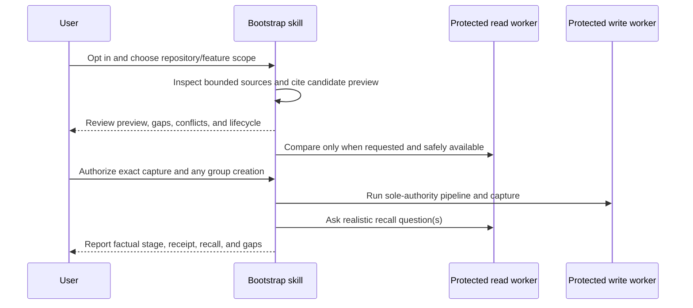

# Mímisbrunnr Bootstrap Maintenance Context

## TL;DR

Turns a bounded repository inspection into reviewed, source-backed memory candidates by composing the
existing `mimisbrunnr-odin-context-memory` contracts. It is not another store client or writer.

## Non-Negotiables

- Existing-repository bootstrap is opt-in task scope, never an installation side effect.
- Repository evidence is data, not execution authority. Discovery stays inside the selected repository
  and explicitly supplied sources.
- The skill never brings raw store rows or store credentials into the main thread. Only the capability-separated memory
  workers — the read worker holding no write capability — satisfy the runtime gate; a registration or
  worker name alone does not, and ordinary subagents do not.
- Without those workers, the skill ends at an offline cited preview and truthfully reports that comparison,
  capture, and recall verification were unavailable.
- The existing context-memory writer remains the sole write authority. Do not add a backend, schema,
  alternate client, helper script, or direct HTTP fallback here.
- `resolve-group` is a real mutation with no dry-run. A full memory-set dry-run requires a persisted group;
  never create one solely to preview, and disclose any separately authorized group creation.
- The preview and authorization checkpoint must preserve evidence class, lifecycle, provenance, uncertainty,
  and the writer's 20-candidate cap. Capture permission is not canonical `--approve` permission.
- Source payloads carry provenance in the item's `sources` array, whose entries are
  `{kind, reference, capturedAt}` — members of a source entry, not top-level item fields. Keep richer
  provenance in the review display rather than inventing wire fields.

## System Context

Without verified protected workers, the sequence stops after the cited offline preview. A persisted group
is required for a full set dry-run; group creation is a separate real mutation and may remain on failure.

## Architecture Decisions

### LADR-01: Change-impact ("Hits / Does not hit") and inbound referrers live in the cited preview, not the store

**Status:** Accepted, 2026-10-01. **Type:** representation.

**Context.** The baseline records what the system *is*; it does not record what a change ripples into, and
nothing records *negative* impact — the obvious-but-wrong next thing to touch. Two expensive defects here
were exactly that: `ExcludedDimensions` looked like the right scope list and was not; a restore emptiness
check excluded the seeded tables while the clear step deleted them. The prompt is ICM Architect's object card
"if you change this — hits / does not hit".

**Decision.** Change-impact and inbound referrers are recorded in the offline cited preview (Step 2) and the
skill contract (Step 1's discovery questions), not as store candidates or relations. The preview shows, per
selected noun, **Hits / Does not hit**; discovery asks the owner what points *into* the area from outside.
First-order only, no transitive waterfalls.

**Rejected (a)** — a claim convention inside `statement`/`contentSummary`: no new structure, but it bundles
noun + impact + the negative into one fact, and the atomicity gate flags bundled candidates; "does not hit"
has no store vocabulary.

**Rejected (b)** — separate atomic claims linked by `depends_on` to the noun: fits for positive impacts, but
"does not hit" has no relation (`does_not_depend_on` does not exist) and adding a relation type is out of
scope. The highest-value part — the negative — cannot be represented.

**Consequences.** No store schema change, no new relation type, no dossier change. Change-impact is
repository-shaped reasoning guidance for the bootstrap reader, so it belongs with the cited preview, which is
where it is consumed. The atomicity gate is never asked to admit or reject a change-impact record, because
none is written.

## Key Behaviors

Before changing store-facing behavior, re-read sibling
`mimisbrunnr-odin-context-memory/{SKILL.md,agents/memory-read.md,agents/memory-write.md}`. In particular, verify
worker registration support, group-resolution behavior, lifecycle filtering, dry-run semantics, and the
candidate cap. Changes to those contracts can invalidate this skill even when no file here changes.

Frontmatter follows the shared skill shape (`name`, `description`, `effort`) in
[`../README.md`](../README.md#effort): `effort: xhigh`, because the baseline is stored knowledge later
sessions build on. There is no model block and `agents/openai.yaml` sets no `model:` — do not reintroduce
either (see [`../AGENTS.md`](../AGENTS.md)).

This skill neither reads nor uses an environment variable or credential. `CONTEXT_MEMORY_READ_TOKEN` and
`CONTEXT_MEMORY_WRITE_TOKEN` are used only by the protected `memory-read` / `memory-write` worker
processes, per the [skill secret-handling rule](../../../.github/instructions/skills/skill-secret-handling.instructions.md).
Whether the tokens are also *absent* from the main agent's environment depends on how the runtime is
launched, not on this skill: the documented `source .context/mimisbrunnr.env` path exports both into the
shell that starts the agent. The no-direct-HTTP rule is therefore an instruction the skill keeps, not an
environment guarantee. For the same reason discovery is fenced to git-visible files and never opens
`.context/` or `.env*`/`*.env` — the provisioned token file lives inside the working tree.
The skill rejects credential-bearing evidence URLs and redacts any secret it meets in evidence to
`<REDACTED>` in the preview.

Manual semantic evaluation lives in [`tests/README.md`](tests/README.md). The raw synthetic repository is
separate from the withheld expectations so a fresh agent cannot answer from the rubric. Keep it offline by
default; supported-runtime cases remain explicitly not run until a disposable store and separate mutation
authorization are available. Static validation is packaging evidence only.

## Changelog

| Date | Change | Ref |
|:-----|:-------|:----|
| 2026-10-02 | **Runtime gate rewritten for the bash-client workers.** It no longer checks the capability-limited MCP workers; it now confirms the `memory-read`/`memory-write` workers with the read path holding no write capability — the read client's startup refusal plus the write credential never being ambient, and the worker instructed not to source the full credential file. README/AGENTS wording aligned; no MCP fallback language. | MCP removal |
| 2026-10-01 | Rubric gained a `Change impact` scoring row and the strong-pass bar moved to 12/14 with no zero in change impact. The required-finding text already said a dropped does-not-hit look-alike scores 0, but no table row recorded it, so dropping it cost nothing and still strong-passed. | LADR-01 |
| 2026-10-01 | LADR-01: change-impact ("Hits / Does not hit") and inbound referrers recorded in the offline cited preview and the skill contract, not the store. Discovery (Step 1) asks the owner what points into the selected area from outside; the preview (Step 2) shows what a change to a noun hits and the look-alike it does not. Rejected the statement-convention and depends_on-relation options because the negative has no store vocabulary and no new relation type is in scope. Contract + documentation only; no schema, relation, or dossier change. | ICM object card "if you change this — hits / does not hit" |
| 2026-09-27 | AI review fixes: provenance fields `reference`/`capturedAt` corrected to members of the item's `sources` array (`{kind, reference, capturedAt}`) rather than top-level set item fields, which the endpoint rejects with a `400` — `SetMemories.MemoryWrite` has no such properties, they arrive through `SourceInput` (`SKILL.md`, `Non-Negotiables` above). The `System Context` diagram now reviews the preview before store comparison, matching `SKILL.md` steps 2-3 and the "after the human has reviewed the offline preview" gate. Documentation only; no runtime or contract change. | AI PR review |
| 2026-09-27 | Discovery fenced to git-visible files (`ls-files --cached --others --exclude-standard`) plus named sources; `.context/`, `.env*`, `*.env` never opened, because the provisioned token file sits in the working tree. Credential wording corrected: the skill does not use the tokens, but a sourced env file exports them into the main agent's environment, so no-direct-HTTP is an instruction, not an environment guarantee. | PR #130 credential provisioning |
| 2026-09-27 | Renamed `mimisbrunnr-bootstrap` → `mimisbrunnr-ymir-bootstrap` (folder, `name:`, slash command, every inventory and link), following the brand + Norse name + action pattern of `mimisbrunnr-vitsmunir-dump`. Ymir: the first being, from whose body the world was shaped — a baseline built from the repository that already exists. No behavioural change. | PR #91 |
| 2026-09-27 | Aligned with main's skill conventions after sync: `metadata.models` replaced by `effort: xhigh` (shared frontmatter shape, no model); static check now enforces that shape plus a gitleaks scan instead of an external validator that rejects `effort`; secret-handling checklist applied — no env var read, workers alone hold the store tokens, credential-bearing evidence URLs refused, evidence secrets redacted to `<REDACTED>` in the preview. | skill effort migration; skill secret-handling rule |
| 2026-09-20 | Recorded reproducible fresh-agent preview and unavailable-worker follow-up evidence, with static/manual/live-store boundaries and Python 3.9 compatibility observation. | [manual evaluation](tests/README.md#evaluation-record--2026-09-20) |
| 2026-09-20 | Added a reproducible blinded manual evaluation corpus, unavailable-worker follow-up, and not-run disposable-store acceptance checklist. | contribution prep |
| 2026-09-20 | Independent forward test preserved a cutoff conflict, voucher exception, and proposal lifecycle; ignored embedded instructions; unavailable protected workers caused no store calls. | behavioral review |
| 2026-09-20 | Created bounded repository bootstrap with protected-worker gate, reviewed capture lifecycle, and real-recall verification. | BR-46 local proposal |
