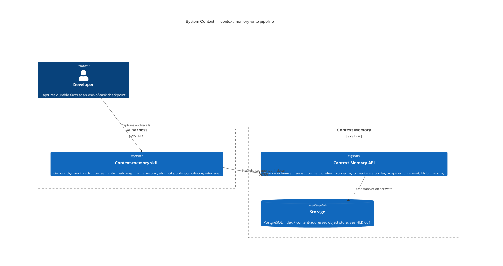

# Diagrams — Context memory write pipeline

Two diagrams. The entity model belongs to the storage HLD and is not repeated here; a container
diagram would add nothing, since this design introduces no container.

---

## C1 — System Context

Establishes where judgement lives. The skill is the only agent-facing interface, and it runs on the
harness rather than inside the service.



**Read this for:** the separation. The skill decides; the API enforces. A judgement failure is silent
and data-dependent; a mechanical failure is loud and reproducible. Keeping them in different systems
keeps the two kinds of bug distinguishable.

---

## Sequence — The five-stage write pipeline

The pipeline is inherently temporal — its correctness *is* its ordering — so this is the diagram that
carries the design.

```mermaid
sequenceDiagram
    autonumber
    participant H as Human
    participant S as Skill (judgement)
    participant A as API (mechanics)
    participant DB as PostgreSQL
    participant B as Object store

    H->>S: Checkpoint — capture what was learned

    rect rgb(245, 245, 245)
        Note over S,DB: Stage 1 — Preflight (batched, judges nothing, writes nothing)
        S->>A: Candidate batch (subjects, kinds, facets, ticket refs)
        A->>DB: One cross-group traversal
        DB-->>A: Exact-match candidates, ticket conflicts, intra-batch collisions
        A-->>S: Array out — facts only, no decisions
    end

    rect rgb(245, 245, 245)
        Note over S: Stage 2 — Redact (before anything reaches storage)
        S->>S: Fingerprint detection; scrub spans
        Note right of S: Content addressing makes a stored object<br/>immutable and its address stable. After the<br/>write there is no remedy, only orphaning.
    end

    rect rgb(245, 245, 245)
        Note over S,DB: Stage 3 — Dedupe and derive links (same traversal)
        S->>A: Recall by facet and kind
        A->>DB: Bounded candidate set
        DB-->>A: Cheap fields only
        A-->>S: Candidates
        S->>S: Judge per pair — version / new / skip; derive links with reasons
    end

    rect rgb(245, 245, 245)
        Note over S: Stage 4 — Atomicity check
        S->>S: One memory = one fact. Split bundles; route remainder to skipped
    end

    rect rgb(245, 245, 245)
        Note over S,B: Stage 5 — Write (one transaction, API-owned)
        S->>A: Resolved writes + derived links
        A->>B: Store bodies, content-addressed
        B-->>A: Addresses
        A->>DB: BEGIN
        A->>DB: Flip old is_current false, then insert new current
        A->>DB: Insert links
        A->>DB: COMMIT
        A-->>S: Digest
    end

    S-->>H: Receipt — created / versioned / linked / skipped(atomicity) / skipped(duplicate-link) / proposed
    Note over H,S: Dry-run executes stages 1–5 identically<br/>and renders this same digest, persisting nothing.<br/>That is the pre-write veto — the digest is not.
```

**Read this for three properties the ordering encodes:**

1. **Redaction sits at stage 2 because stage 5 is irreversible.** Once a body is stored it is immutable and its address is a function of its content; prevention is the only clean remedy.
2. **Stages 1 and 3 share one traversal.** Deduplication recall, link derivation and ticket uniqueness all need the same cross-group subject lookup, so the expensive read happens once.
3. **Stage 5 is one transaction, owned by the API.** The version flip must precede the insert or the partial unique index rejects it — and both must share a transaction, because a failure between them leaves the memory with *zero* current versions, which no constraint forbids and nothing detects.

Note also what stage 1 does **not** do: it returns facts, never decisions. The judgement is entirely
the skill's, which is why an endpoint returning a merge verdict would be a boundary violation.
