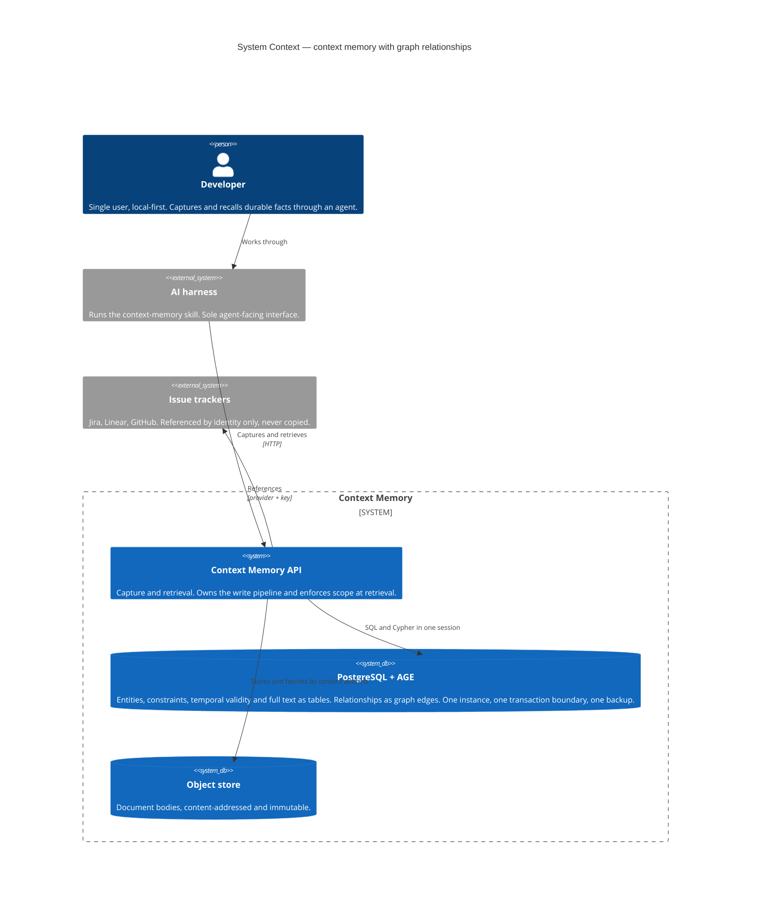
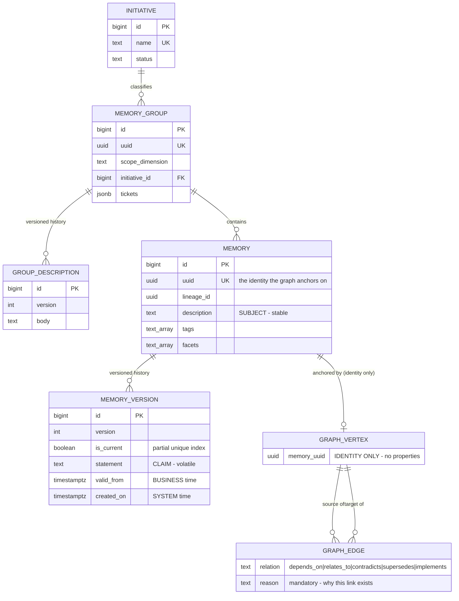
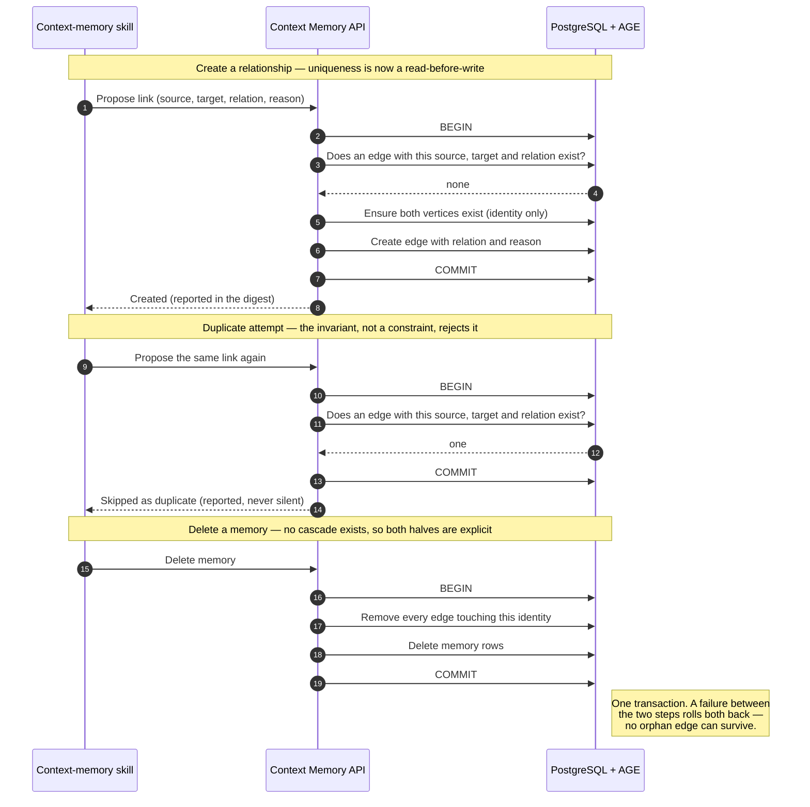

# Diagrams — Graph edges on Apache AGE

Three diagrams, each covering one concern. Container and flow diagrams are deliberately omitted:
the container topology does not change (same API, same database, same object store — only the
database image differs), and there is no new cross-service flow.

---

## C1 — System Context

Establishes that nothing new is deployed. The graph capability arrives inside an existing container.

**Read this for:** the boundary. The graph is inside the database the service already runs, and issue
trackers stay external and referenced — never mirrored into the graph.

---

## ER — The entity / edge boundary

The design *is* this boundary. Everything above the line stays relational; only the relationship
crosses over.

**Read this for:** what the graph is allowed to hold. `GRAPH_VERTEX` has exactly one attribute and it
is an identity; `GRAPH_EDGE` holds only what describes the *relationship*. Every descriptive property
— subject, claim, scope, validity, tags, facets — remains relational. A vertex gaining a second
descriptive attribute is the violation LADR-02 forbids.

Note also what is *absent*: no foreign key runs from `GRAPH_EDGE` into `MEMORY`. That missing line is
the guarantee LADR-05 replaces with an application invariant.

---

## Sequence — Relationship write and memory delete

The static view cannot show a consistency boundary. These two flows are where the forfeited database
guarantees are paid back, and where a mistake produces an orphan or a duplicate.

**Read this for:** why both operations are transactional. Step 2's existence check replaces the
composite primary key, and the delete's two ordered steps replace the foreign-key cascade. Neither is
optional, and neither is enforced by the database — NFR-01 exists to verify both, including the
failure case between the delete's two steps.
