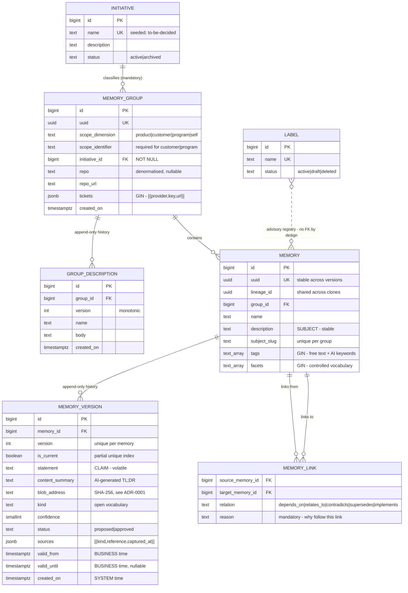

# ADR-0002: Persistence layer architecture

**Status:** Accepted — implemented (`.context/work-tasks/domain-model-and-migrations.md`)
**Date:** 2026-09-08
**Revised:** 2026-09-08 — hybrid relational/document model adopted; entity count reduced from 13 to 7
**Revised:** 2026-09-09 — implementation resolved the open items and confirmed the schemas: validity as two `timestamptz` columns (`valid_from`/`valid_until`) with a GIST index over `tstzrange(valid_from, valid_until)`; `subject_slug` application-computed in the Domain; `is_current` flag with a partial unique index (no `current_version` FK); `ticket_keys text[]` deferred (GIN over `tickets` jsonb suffices); append-only history enforced by a `BEFORE UPDATE OR DELETE` trigger that permits only the one legal `memory_version` UPDATE (a `is_current` pointer transfer with content unchanged), blocks everything else, and allows a history delete only when the session sets `app.allow_history_delete='true'` (gating cascade deletes of history); columns are snake_case matching the diagram.
**Related:** [ADR-0001](./adr-0001-blob-storage-backend-and-addressing.md) (blob storage)

## Context

The context-memory service stores atomic facts captured from agent sessions, retrievable long after the
originating session is gone. The persistence layer must support four capabilities that ordinary CRUD
storage does not:

1. **Claims change over time** while the subject they concern stays the same, and the reasoning behind a
   superseded claim must remain readable — carrying forward *why* something was true is frequently more
   valuable than the current answer.
2. **Knowledge goes stale independently of when it was recorded.** A fact discovered today may describe
   something that ceased being true months ago.
3. **The same subject arises under different work items**, so deduplication must reach across
   organisational boundaries rather than within them.
4. **Document bodies live in blob storage** (ADR-0001), so PostgreSQL is an index over content, not a
   content store — and content is therefore not full-text indexable.

A fifth constraint is operational: this is a **single-user, local-first service**. Write throughput is
negligible and read latency is uncritical. **Schema complexity is a real cost; performance is not.** That
inverts the usual normalisation trade-off and is the basis for the hybrid model below.

The design is specified in `.context/braindump/ai-context-memory-handoff_2026-08-29_1331.md` and its two
deltas, and was validated across three file-based simulation trials.

## Decision

### Engine

**PostgreSQL**, accessed through EF Core with Npgsql. The decisive factor was that Npgsql translates LINQ
into server-side JSONB and array operators, so document-shaped data stays queryable without raw SQL.

**Entity placement:** POCOs in `Domain/Entities/` with no external dependencies; all mapping is fluent
configuration in `Infrastructure/Persistence/Configurations/`.

### Storage strategy — hybrid relational and document

PostgreSQL is used as both a relational and a document store. Each concept is placed by rule rather than
by habit.

**Denormalise into columns, arrays or JSONB when all hold:**
- it is a value, not an entity with its own lifecycle
- it is only ever read alongside its parent
- no hard constraint depends on it
- it is not append-only under concurrency

**Keep relational when any hold:**
- it has independent state — status, lifecycle, or CRUD of its own
- it requires **bidirectional** traversal
- it is **append-only history**
- a constraint that is genuinely relied upon depends on it

Applying the rule removes six of thirteen entities:

| Concept | Placement | Reason |
|---|---|---|
| Tags | `tags text[]` on `MEMORY` | Pure value, no state |
| Facets | `facets text[]` on `MEMORY` | Pure value; registry is advisory by design |
| Sources | `sources jsonb` on `MEMORY_VERSION` | Read with its parent, never filtered alone |
| Repository | `repo`, `repo_url` columns on `MEMORY_GROUP` | A name and a URL; no lifecycle |
| Tickets | `tickets jsonb` on `MEMORY_GROUP` | Collapses an entity and a join table |
| Label registry | **table** | Has `active/draft/deleted` state about the label itself |
| Initiative | **table** | CRUD-able with description and status; must exist before it is referenced |
| Links | **table** | Graph edge requiring reverse traversal |
| Group descriptions | **table** | Append-only history |
| Memory versions | **table** | Append-only history |

### Three-level hierarchy

```
Initiative → MemoryGroup (tickets jsonb, repo columns) → Memory (logical) → MemoryVersion
                                                            ├── tags[] / facets[]  (unversioned)
                                                            └── blob address       (ADR-0001)
```

**`MemoryGroup`** is keyed by its own GUID, not by its tickets — tickets accumulate over time as an epic
acquires stories, so a ticket-derived key would change as work progresses. It holds many tickets, at most
one nullable repository, and the scope. Children inherit repository, scope and initiative, which makes
each one-per-memory rule *structurally impossible to violate* rather than something requiring
enforcement.

Work with no ticket — personal preferences, design preceding ticketing — receives a synthetic
`local:<guid>` ticket, so every group is legal and no empty-ticket special case exists.

### Memory splits into a stable row and a versioned row

| Stable → `Memory` | Volatile → `MemoryVersion` |
|---|---|
| uuid, lineage_id, group FK | version, is_current |
| name, **description (subject)**, subject_slug | **statement (claim)**, content_summary, blob address |
| tags, facets | valid_from/valid_until, created_on, confidence, status, sources |

The subject is stable *by definition*; the claim is what changes. Tags are classification rather than
claims and are therefore **unversioned** — placing them on the stable row is what makes that true. Facets
follow tags by the same argument.

This mirrors `MemoryGroup` / `GroupDescription`, so the model is stable-parent / versioned-child at both
levels. Sources sit on the **version**, because provenance records where *this claim* came from.

### Versioning replaces supersession

A changed claim on an unchanged subject is a **version bump**. A `supersedes` link survives only for the
rare case where a *different* subject renders a memory obsolete. Implementation is slowly-changing
dimension type 2: insert-only, one current version per **logical memory** enforced by a partial unique
index. Not per lineage — clones share a lineage while remaining distinct logical memories, so a
lineage legitimately has one current version per clone.

Nothing is deleted or overwritten. The store retains all versions; **current-only is a retrieval default,
never a storage rule.**

### Bitemporality

Two independent axes, neither derived from the other:

| Axis | Question | Mechanism |
|---|---|---|
| Business time | When was this true in the world? | `valid_from` / `valid_until` |
| System time | When did we believe it? | version chain + `created_on` |

### Three identity keys per row

| Key | Purpose | Stable across |
|---|---|---|
| Surrogate `bigint` | FK joins — narrow, fast | nothing, per row |
| `uuid` | Logical memory identity | versions |
| `lineage_id` | Clone set across groups | versions **and** groups |

Clones — the same fact recorded against a second repository — need distinct uuids (otherwise two rows
each claim to be the current version of one memory) but a shared lineage, so siblings are retrievable and
drift between them detectable.

### Entity model



*(`text_array` denotes `text[]`; bracket notation is avoided for diagram parsing.)*

**Reading the diagram — five structural features:**

1. **Two stable/versioned pairs.** `MEMORY_GROUP`→`GROUP_DESCRIPTION` and `MEMORY`→`MEMORY_VERSION` are
   the same shape at different levels. Both children are append-only; neither is updated in place.
2. **Tags and facets are columns on `MEMORY`, not on `MEMORY_VERSION`.** That placement *is* the
   unversioned-classification decision — moving them to the version row would version them.
3. **`sources` sits on the version**, because provenance answers "where did *this claim* come from".
4. **`MEMORY_LINK` is self-referential** between logical memories, not versions — a relationship holds
   between two *subjects* and survives either side changing its claim.
5. **`LABEL` has a dashed, non-enforcing association.** There is deliberately no foreign key; see below.

Also visible: the two time axes on `MEMORY_VERSION`, and the split of `description` (subject, stable row)
from `statement` (claim, versioned row).

### Why the registry has no foreign key

Dropping the facet join table removes the FK to `LABEL`, and this is **aligned with the specification
rather than a compromise**. The registry is explicitly *non-enforcing*: `kind` and facets are open
vocabulary and the capturing skill may propose new values. A foreign key would make the registry
enforcing, contradicting the design.

A second gain follows: usage counts stop being a maintained column and become derived.

```sql
CREATE VIEW label_usage AS
SELECT unnest(facets) AS name, count(*) AS uses
FROM memory GROUP BY 1;
```

A maintained counter can drift out of sync with reality. A derived one cannot.

### JSONB document contract

Every JSONB object carries its own `v` shape marker as the first key:

```json
{"v": 1, "provider": "jira", "key": "ACM-1", "url": "https://..."}
```

**Per-document, not per-column.** `tickets` accumulates over time — an epic gains stories across months —
so elements are appended under whatever shape was current when each was written. A column-level version
would claim a single shape for a row whose elements were written under two, and would be wrong the first
time a shape changed.

Writers always emit the current version; readers switch on `v`. Serialisation goes through one typed
model, so the marker is set in one place and never hand-written. **Retrofitting is impossible** — once
unmarked documents exist, old and new shapes are indistinguishable.

### Rules enforced by mechanism, not documentation

Four decisions in this ADR would otherwise survive only as prose, and prose gets skimmed. Each is
instead a failing test or a database error:

| Rule | Mechanism |
|---|---|
| History is append-only | **Triggers** on `MEMORY_VERSION` and `GROUP_DESCRIPTION` raising on `UPDATE`/`DELETE` |
| Denormalised concepts stay denormalised | **Model-shape guard test** asserting the `DbContext` exposes exactly seven entity types |
| The registry is advisory | L1 test: a facet absent from `LABEL` is accepted |
| Tags are unversioned | L1 test: tags survive a version bump unchanged |

The trigger earns its place because the alternative failure is **silent**. A future change moving history
into a JSONB array would lose concurrent appends with no error at all; the trigger makes the constraint
explicit in the schema itself.

### Constraint strategy

| Constraint | Enforcement |
|---|---|
| One current version per logical memory | **Hard** — partial unique index `where is_current` |
| Version chain integrity | **Hard** — unique `(memory_id, version)` |
| Logical identity unique | **Hard** — unique on `uuid` |
| Initiative always assigned | **Hard** — not-null FK, seeded `to-be-decided` sentinel |
| One subject per group | **Soft** — unique `(group_id, subject_slug)` is an exact-match backstop only |
| A ticket belongs to at most one group | **Soft** — application-enforced |

Two constraints are deliberately soft, and both are enforced in the **same read-before-write pass the
write path already performs** for deduplication, so neither costs an extra traversal.

Subject uniqueness cannot be hard-enforced regardless of schema: *"PostgreSQL is the storage engine"* and
*"we store in Postgres"* are the same subject with different strings, and semantic equivalence is not
expressible as a database constraint. **Semantic matching is the skill's responsibility, not the
database's.**

Ticket uniqueness became soft when tickets were denormalised. Enforcing it in-database over an array
would require `EXCLUDE USING gist (... WITH &&)`, which has no clean overlap operator for `text[]` — GIN
supports the operator but cannot back an exclusion constraint — so it would mean hashing ticket keys to
integers to use `intarray`. That is real complexity for a check the skill performs anyway.

### Search surface

Blob content is not indexable, so at write time an AI-generated **summary** and **keywords** are stored in
the database, making memories findable without their bodies being indexed.

- **Full-text** over `name`, `description` (stable row), `statement`, `content_summary` (version row)
- **GIN** over `tags`, `facets` and `tickets` for containment
- **GIST** over the validity range
- **B-tree** over `kind`, `status`, `initiative_id`

`repo` carries no index yet. It is a documented filter dimension, but the retrieval query that would use
it does not exist, so the index is deferred until there is something to measure — the same treatment
given to the embedding column below.

Semantic search is deferred but pre-wired: a nullable embedding column can be added by an additive
migration when semantic search is warranted. No such column exists today.

## Alternatives considered

- **A fully normalised model (rejected — this revision).** The original design used thirteen entities with
  separate tables for tickets, repositories, tags, facets and sources. Rejected because the constraints
  those tables bought are either unneeded (repository, sources), actively contrary to the design
  (facet-to-registry FK), or replaceable at zero cost by a check the write path already performs (ticket
  uniqueness). For a single-user local service, **schema complexity is a real cost and normalisation
  bought little.**
- **Full denormalisation, including history as JSONB arrays (rejected).** Appending to a JSONB array is
  read-modify-write; two concurrent appends silently lose one. A table `INSERT` is atomic. Version history
  *is* the audit trail, so silently losing entries would defeat the additive-only guarantee outright. This
  is why `MEMORY_VERSION` and `GROUP_DESCRIPTION` remain relational.
- **Links as JSONB on the source memory (rejected).** "What points *at* this memory?" becomes a
  containment scan across every row, where a table gives an index seek on `target_memory_id`. Graph edges
  are the one genuinely relational structure here.
- **SQLite (initial selection, reversed).** Chosen first for single-file volume simplicity and zero
  operational burden. Reversed once the requirement set grew to label arrays, temporal range queries,
  ticket lookups and repository filters. *Still true from that analysis:* local in-process embeddings prove
  semantic search needs no cloud service, and giving up single-file portability makes backup, restore and
  machine migration an explicit operational obligation.
- **Supersession-by-archive (reversed).** The original design archived the old row, created a new one and
  linked them. Rejected as versioning implemented twice: it mints a new identity on every change, needs a
  status filter plus a null check plus link-walking to answer "what is current", and makes carrying
  forward surviving rationale a *manual discipline* that gets skipped under pressure. Versioning makes it
  structural.
- **A single flat `Memory` table.** Rejected once tags were confirmed unversioned — unversioned data
  cannot live on a versioned row. The split also removed a latent error: `description` and `subject_slug`
  are stable by definition and were being repeated on every version.
- **One time axis.** Rejected: without separating record time from world time, *correcting* a record is
  indistinguishable from the world *changing*, and every downstream staleness judgement becomes unreliable.
- **A fixed `kind` enumeration.** Rejected — the domain needs `architecture`, `nfr`, `ladr`, `pattern`,
  `constraint` and more, and new kinds keep emerging.
- **Markdown files as the source of truth**, with the database as a disposable index. Rejected because the
  metadata is rich and structured and files cannot serve the compound filtered query. A trial showed a
  hand-maintained index becomes a maintenance chore immediately. The cost is inspectability — see
  Consequences.
- **A ticket-derived group key.** Rejected because tickets accumulate, so the key would mutate as work
  progresses.
- **Suggestion-only label registry.** Rejected on measurement: two trials produced ~120 distinct labels
  across 35 memories with almost no reuse. Replaced by controlled facets plus a free-tag safety net.

## Consequences

**Positive**

- **Seven entities instead of thirteen.** Three foreign keys on the main path (initiative→group,
  group→memory, memory→version) plus two on links.
- Common reads need no joins — a memory carries its tags and facets, a group carries its tickets and
  repository.
- "What is current" is one predicate; history is the same table ordered by version.
- Carrying forward superseded reasoning is structural, not a discipline.
- Automatic version bumps are safe because nothing is destroyed — the worst case is a reversible
  misclassification.
- Label usage counts cannot drift, being derived rather than maintained.
- The compound retrieval query is served entirely from PostgreSQL; blob storage is touched only on
  drill-down.

**Negative / accepted costs**

- **JSONB shape drift is the principal new risk.** A table change gets a migration; a shape change inside
  `tickets` or `sources` gets nothing, so heterogeneous shapes would accumulate silently. Mitigated by the
  per-document `v` marker and strict serialisation through one typed model. The marker cannot be
  retrofitted, which is why it is mandatory from the first migration.
- **Two constraints are soft** — subject and ticket uniqueness. Both depend on the skill performing its
  read-before-write correctly.
- **Renaming a repository or initiative touches many rows.** Accepted: writes are rare and performance is
  uncritical.
- **JSONB predicates are less discoverable** than joins for anyone reading the schema cold. The ADR and
  `PERSISTENCE_AGENTS.md` are the compensating documentation.
- **The store is opaque without tooling.** Content-addressed blobs (ADR-0001) are not human-navigable
  either, so a **generated** Markdown export is required for inspectability — generated, never maintained.
- **Backup spans two stores**, database and blob volume, and they must be captured consistently.
- **Tables grow monotonically.** Accepted; mitigated by the current flag so retrieval cost is unaffected.
- **The write path depends on an LLM call** for summary and keywords. If that output is poor the memory
  becomes hard to find, with no full-text fallback over content. The model identifier and prompt version
  are stored so summaries can be regenerated in bulk.
- **Grouping is episodic while retrieval is semantic.** A trial showed that, given free choice, an agent
  groups by subject rather than by work item. Cross-group deduplication is the mitigation; the friction
  may be structural and is being watched.

## Open items

Resolved during implementation (2026-09-09); each is recorded because it cost a migration if reversed:

1. **Validity as `tstzrange` or two timestamp columns.** Chosen: two `timestamptz` columns
   (`valid_from`/`valid_until`) for simple EF mapping, plus a GIST index over
   `tstzrange(valid_from, valid_until)` to keep `@> now()` index-served.
2. **`subject_slug` generated or application-computed.** Chosen: application-computed in the Domain
   (`Slug.Subject`), so slug logic lives in one place and is L0-tested.
3. **`is_current` flag on the version, or a `current_version` FK.** Chosen: the `is_current` flag
   with a partial unique index.
4. **Whether `tickets` also needs a generated `ticket_keys text[]`.** Chosen: deferred — GIN over the
   `tickets` jsonb column suffices; an additive migration later if profiling demands it.
5. **Trigger implementation.** Chosen: `RAISE EXCEPTION` in a `BEFORE UPDATE OR DELETE` trigger
   (`append_only_guard`). It permits only the one legal `memory_version` UPDATE — the version-bump
   `is_current` pointer transfer with all content unchanged — and raises on any content edit or
   delete. A history delete is admitted only when the session sets
   `app.allow_history_delete = 'true'` (gating cascade deletes of history).

Resolved by this revision: tag search strategy (`tags text[]` with GIN, no join required); whether
`Initiative` is an entity (yes — it has independent lifecycle state); and JSONB shape versioning
(per-document `v` marker).

Deferred beyond this ADR: **divergence** (V2 — needs no table, being a `divergence` kind plus
`contradicts` links) and the **embedding column** (additive migration when semantic search is warranted;
index-first retrieval outperforms vectors below roughly a thousand records).
