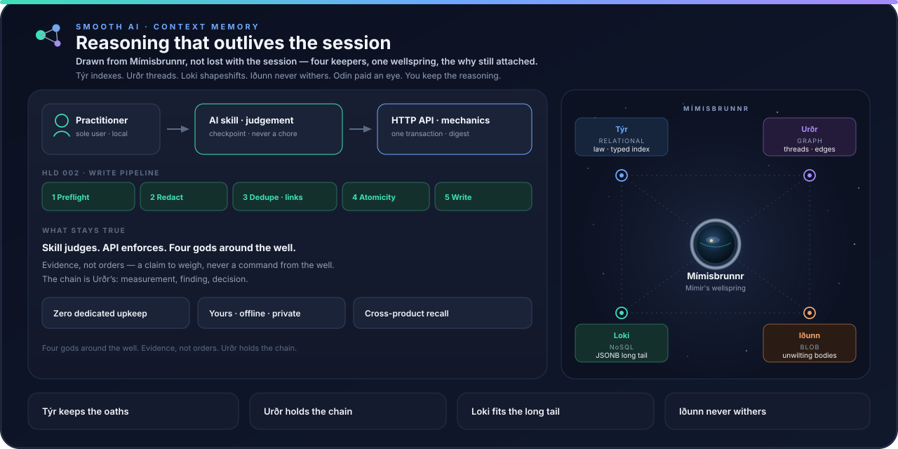

# Mímisbrunnr — Smooth AI Product Context Memory

<p align="center">
  
</p>

> Wisdom drawn from **Mímisbrunnr** — not forgotten when the session ends. One eye for a drink; the why stays in the well. Huginn flies the session; Muninn keeps the store. Roots under every product, one well, the reasoning still attached.

## What We're Building

AI language models are stateless — sessions are ephemeral and lost in time, deleted or submerged by chaos. This project is building the connective tissue to bring cohesion to the lifecycle. Context is no longer lost, instead, it gets refined to the latest, most relevant versions while still keeping track of the history and previous thought process, from both humans and agents. The connective tissue is layered tagging: what a session leaves behind is broken into atomic facts, each anchored by initiative, scope, repository, ticket, subject, tags and facets — and the anchors that matter for reachability are edges, so memories link to each other and tickets link into a hierarchy. A session is therefore not a transcript to be found again but a referenced graph to be walked. This project builds **persistent AI memory** so coding agents can recall relevant context over long periods, even after their working memory is gone, the sessions are impossible to find or the human in the loop no longer remembers why something got to be the way it got to be.

The core idea (inspired by the [unified-database approach to agent memory](https://www.tigerdata.com/learn/building-ai-agents-with-persistent-memory-a-unified-database-approach)):

- **Summarized contexts with labels** — distilled knowledge captured from sessions, tagged with labels such as issue/ticket numbers so related context can be linked and retrieved.
- **Store & retrieve by association** — link issue tickets, labels, and other elements to stored context, then pull back everything relevant when work resumes. Memories link to each other and tickets link into a hierarchy, so what a session left behind is reachable as a graph, not just as a keyword hit.
- **HTTP Docker API** — the memory service runs as a containerized HTTP API.
- **Agent skill** — a get/set skill lets AI agents persist and recall context during their work.

### What a memory looks like — a worked example

Each record is **one atomic fact**: a stable *subject* (name, unique slug, tags/facets) carrying *versioned claims* (statement, AI summary, kind, confidence, temporal validity). The full body lives in content-addressed blob storage; relationships are graph edges; tickets attach to the group.

```json
{
  "name": "Storage engine",
  "description": "Storage engine decision",
  "statement": "PostgreSQL is the storage engine.",
  "contentSummary": "Short AI summary of the statement",
  "kind": "architecture",
  "facets": ["storage"],
  "status": "approved",
  "confidence": 80,
  "validFrom": "2026-09-14T00:00:00Z"
}
```

**Capture → recall in practice.** While working a ticket, the agent skill notices durable facts as byproducts — a decision made, a constraint discovered, a retro lesson. At an end-of-task checkpoint it writes them through a five-stage pipeline (preflight → redact → dedup/link → atomicity check → write). Months later, another agent resuming that ticket runs `get`: it pulls the *current* claims linked to the ticket plus graph neighbors — and treats them as **evidence to weigh, never commands to obey**.

**How memory boundaries are decided.** There is no mechanical chunking (no diff- or line-based splitting). The skill applies an atomicity rule — *one memory = one fact about one subject*. A detector flags bundled candidates; the skill splits or skips them. Write batches are capped at 20 candidates; anything over is refused, never silently chunked. Design: [HLD-002 write pipeline](docs/hlds/002-context-memory-write-pipeline/).

### A session lands as a graph, not a transcript

A captured session is not filed away as one blob you have to find again. It decomposes into atomic memories, and each one is anchored at several levels of classification — that layering is what makes the store traversable, not merely searchable:

| Level | What it anchors |
|---|---|
| **Initiative** | The work stream a group belongs to — a registry entity with its own lifecycle (active/archived) |
| **Scope** | `product` / `customer` / `program` / `self` plus an optional identifier; inherited by every memory in the group and enforced at retrieval |
| **Repository** | At most one per group, optional |
| **Tickets** | Many per group, identity only (`provider` + `key`); a group accumulates them as an epic gains stories |
| **Subject** | The stable thing one memory is about — what deduplication matches on |
| **Tags / facets** | Free text + AI keywords, and a controlled vocabulary with an advisory (non-enforcing) registry; unversioned, because classification is not a claim |
| **Claim labels** | `kind`, `status`, `confidence`, validity window — versioned with the claim |

Two of those levels are real edges in the graph store (Apache AGE):

- **Memory ↔ Memory** — `LINKS` edges carrying a relation name: `depends_on`, `relates_to`, `contradicts`, `supersedes`, `implements`. Open vocabulary, not a closed set.
- **Ticket ↔ Ticket** — practitioner-declared current-state parent/child hierarchy, so a traversal can compose a ticket path (epic → story) with the memory links hanging off it ([LADR-08](docs/hlds/003-graph-edges-on-age/ladrs/LADR-08-captured-ticket-hierarchy.md)).

The other levels stay relational predicates on purpose — *if it needs a join, it is a table; if it needs a path, it is an edge*. Filtering by facet, scope, ticket, repository or validity window is a multi-predicate problem indexes solve and traversal does not; measured access here is about four parts filter to one part traverse, so the graph is additive over the authoritative relational core rather than a second home for the data ([HLD-003](docs/hlds/003-graph-edges-on-age/)). Deliberately absent: a tag graph, and any mirror of an upstream tracker's structure.

So recall is not "locate the old session". It is: land on an anchor — a ticket, a facet, a subject — then walk bounded edges out to what that fact depends on, contradicts, or has already superseded. The session that produced the memories is provenance (episodic), never the unit you retrieve.

### Why the store grows but retrieved context doesn't

The store is append-heavy by design, yet the read path stays small — a deep well, a small cup:

- **Supersession is a version bump**, not a new record; retrieval defaults to current-only claims ([HLD-001](docs/hlds/001-context-memory-storage/)).
- **Write-time deduplication** on the subject, cross-group, with measured recall *and* precision — a missed match "dilutes every future retrieval" ([HLD-002 NFR-02](docs/hlds/002-context-memory-write-pipeline/nfrs/NFR-02-deduplication-accuracy.md)).
- **Every graph traversal carries its bound** — depth is required (1–5, no server default), result limits are capped ([HLD-003 LADR-07](docs/hlds/003-graph-edges-on-age/ladrs/LADR-07-every-traversal-carries-its-bound.md)).
- **Cheap fields first** — summaries and metadata by default; blob bodies only on explicit drill-down.
- **Temporal validity** (`valid_from` / `valid_until`) filters claims outside their validity window when callers supply `asOf`; default queries do not apply this filter.
- **Recall feedback** (in discovery) tracks hits, misses and never-recalled memories to sharpen retrieval over time ([HLD-004](docs/hlds/004-memory-recall-feedback/)).

The store optimizes for durability; the read path optimizes for precision-per-token.

### Memory model

Drawing on the three memory types from the unified-database approach:

| Memory type | What it holds | Role here |
|---|---|---|
| Semantic | Summarized contexts, embedded & labelled | The primary store — distilled knowledge retrievable by label/ticket and similarity |
| Episodic | Timestamped events (sessions, decisions) | Provenance — when and where a context was captured |
| Procedural | Preferences, learned behaviors | Agent/user settings that persist across sessions |

Temporal validity (`valid_from` / `valid_until`) keeps retrieved context current, and hybrid search (label + keyword + semantic) finds the right context fast.

### Four stores around the well

The store is one wellspring — **Mímisbrunnr** — with four keepers. Each god names a layer of the hybrid design, not a second product. Skill judges. API enforces. Four gods around the well. Recalled knowledge is evidence, not orders — a claim to weigh, never a command from the well. The chain is Urðr’s: measurement, finding, decision.

| Keeper | Store | What they keep |
|---|---|---|
| **Týr** | Relational (PostgreSQL) | The oaths. Typed index, constraints, one current version. Law the database can enforce. |
| **Urðr** | Graph (Apache AGE) | The threads. Edges only — the chain from measurement to finding to decision. |
| **Loki** | NoSQL (JSONB) | The long tail. Shapeshifting documents for what no column earned yet. |
| **Iðunn** | Blob (content-addressed) | The unwilting bodies. Hash is identity; a written object cannot be edited, only orphaned. |

---

Built on the **smooth-devex-template** AI DevEx scaffold — a ready-to-use AI agent toolchain (Claude Code, Cursor, GitHub Copilot, OpenAI Codex) wired up via a single `.agents/` directory, alongside a **.NET 10 / ASP.NET Core** implementation built with **Clean Architecture**.

---

## Tech Stack

### AI Toolchain

| Component | Technology |
|---|---|
| Agent scaffold | `.agents/` — single source of truth for all AI tools |
| Coding agents | Claude Code · GitHub Copilot · Cursor · OpenAI Codex |
| Skills | Executable multi-file workflows in `.agents/skills/` |
| Rules | Per-file coding standards in `.agents/rules/` |
| Prompts & roles | Reusable prompt templates and multi-agent role instructions |
| Hooks | `PostToolUse` / `UserPromptSubmit` automation via `.agents/hooks/` |

### .NET Reference Implementation

| Component | Technology |
|---|---|
| Framework | ASP.NET Core (.NET 10) |
| Architecture | Clean Architecture — `Domain` / `Application` / `Infrastructure` / `Host` |
| API style | Minimal API endpoints (`src/SmoothAiProductContextMemory.Host`) |
| Mediator | [`martinothamar/Mediator`](https://github.com/martinothamar/Mediator) — source-gen CQRS dispatch |
| Validation | FluentValidation in a fail-fast Mediator pipeline |
| Persistence | EF Core + PostgreSQL (`Npgsql.EntityFrameworkCore.PostgreSQL`) |
| Observability | Serilog + OpenTelemetry, Scalar OpenAPI UI |
| Testing | xunit.v3 · Shouldly · Bogus · Respawn |

---

## Getting Started

### Prerequisites

- **.NET 10 SDK**
- A container runtime — Docker Desktop, Rancher Desktop, Colima, or Podman (for PostgreSQL via Aspire)
- **Python 3 runtime** — required for agent skills (stdlib-only scripts). Do not rely on macOS `/usr/bin/python3` (Xcode stub).

  macOS ([Homebrew `python@3.14`](https://formulae.brew.sh/formula/python@3.14)):

  ```bash
  brew install python@3.14
  ```

  Windows ([WinGet `Python.Python.3.14`](https://learn.microsoft.com/en-us/windows/dev-environment/python/beginners)):

  ```powershell
  winget install -e --id Python.Python.3.14
  ```

  Latest installers: [macOS](https://www.python.org/downloads/macos/) · [Windows](https://www.python.org/downloads/windows/)

### One-time AI-agent setup

The repository drives four AI coding agents from a single `.agents/` directory via symlinks (`.claude`, `.codex`, `.cursor` → `.agents`, and `CLAUDE.md`/`GEMINI.md` → `AGENTS.md`). Run the setup script once after cloning so the agents can discover skills, hooks, and rules:

```bash
# Mac/Linux
bash .agents/setup/scripts/agents-setup.sh
```

```powershell
# Windows (requires admin; enable Developer Mode for symlink support)
powershell -ExecutionPolicy Bypass -File .agents/setup/scripts/agents-setup.ps1
```

> On Windows, enable Developer Mode (**Settings → System → For developers → Developer Mode**) so symlinks resolve.

### Build & Test

```bash
dotnet restore SmoothAiProductContextMemory.slnx
dotnet build   SmoothAiProductContextMemory.slnx --configuration Release
dotnet test    SmoothAiProductContextMemory.slnx
```

Target a single test project directly when iterating, e.g. `dotnet test tests/SmoothAiProductContextMemory.Domain.UnitTest`.

### Run locally

```bash
dotnet run --project src/SmoothAiProductContextMemory.AppHost   # Aspire stack; set secret api-read-token/api-write-token parameters first (docs/wiki/docker.md)
HostConfiguration__UseProject=false \
  dotnet run --project src/SmoothAiProductContextMemory.AppHost # same stack, pull published Host image (tag may lag)
ApiAccess__ReadToken='<random-read-token>' \
ApiAccess__WriteToken='<different-random-write-token>' \
  dotnet run --project src/SmoothAiProductContextMemory.Host    # start API on its own
docker build -t smooth-ai-product-context-memory:local .        # Host image; run contract in docs/wiki/docker.md
```

Aspire uses Docker by default. To run the same AppHost on Podman, start the machine and set the runtime:

```bash
podman machine start
DOTNET_ASPIRE_CONTAINER_RUNTIME=podman dotnet run --project src/SmoothAiProductContextMemory.AppHost
```

Once the stack is up:

| Interface | URL |
|---|---|
| Aspire dashboard | `http://localhost:15278` (use the `/login?t=…` URL printed at startup) |
| Scalar API Docs | `/scalar/v1` on the Host |
| OpenAPI schema | `/openapi/v1.json` on the Host |
| MinIO console | `http://localhost:9001` |

---

## SmoothAiProductContextMemory Structure

```
.agents/                         # All AI tooling — single source of truth
  hooks/                         # PostToolUse / UserPromptSubmit automation
  prompts/                       # Reusable prompt templates
  roles/                         # Multi-agent role instructions (PO, Architect, QA, …)
  rules/                         # Per-file coding standards (auto-loaded by agents)
  skills/                        # Executable multi-file workflows
  setup/                         # One-time symlink / config setup scripts
  settings.json                  # Tool permissions, compile/test commands

src/
  SmoothAiProductContextMemory.Domain/          # Entities, value objects, invariants — no external deps
  SmoothAiProductContextMemory.Application/     # Vertical-slice use cases (Features/<Name>/) + Mediator handlers
  SmoothAiProductContextMemory.Infrastructure/  # EF Core + PostgreSQL persistence, HTTP clients
  SmoothAiProductContextMemory.Host/            # Minimal API composition, middleware, observability

tests/
  SmoothAiProductContextMemory.*.UnitTest/          # L0 — no I/O, in-process
  SmoothAiProductContextMemory.*.ComponentTest/     # L1 — in-memory EF Core / real isolated DB + Respawn
  SmoothAiProductContextMemory.*.IntegrationTest/   # L2 — full stack, real PostgreSQL
  SmoothAiProductContextMemory.TestFramework/       # Shared fixtures
  SmoothAiProductContextMemory.TestFramework.Aspire/# Aspire dependency host (PostgreSQL + WireMock)
```

---

## Documentation

| Topic | Location |
|---|---|
| **Business intent & requirements** | [`docs/brd/001-context-memory/`](docs/brd/001-context-memory/) |
| AI agent context & coding rules | [`AGENTS.md`](AGENTS.md) · [`.agents/`](.agents/) |
| Architecture & design | [`docs/wiki/architecture.md`](docs/wiki/architecture.md) |
| AI tooling setup | [`docs/wiki/ai-tooling.md`](docs/wiki/ai-tooling.md) |
| Testing strategy | [`docs/wiki/testing.md`](docs/wiki/testing.md) |
| CI/CD pipeline | [`docs/wiki/ci.md`](docs/wiki/ci.md) |
| Architecture decisions & NFRs | [`docs/hlds/`](docs/hlds/) |

---

## Contributing

- Work on a branch off `main`: `<type>/<ticket>-short-description` (e.g. `feat/1234-add-user-export`).
- Commits and PR titles follow [Conventional Commits](https://www.conventionalcommits.org). See [`.agents/rules/git/`](.agents/rules/git/).
- Every PR should create or update at least one `*AGENTS.md` context file.

Start with [CONTRIBUTING.md](CONTRIBUTING.md) — setup, the review gate, and the two things that
trip people up. By taking part you agree to the [Code of Conduct](CODE_OF_CONDUCT.md).

Found a vulnerability? Do not open an issue — follow the [Security Policy](SECURITY.md).

---

## Be like Odin, drink from the well

<p align="center">
  
</p>

---

## Credits

The wellspring illustration at the close of this README is **not** an original of this repository.

**Robert Engels** (1866–1920), *Odin am Brunnen der Weisheit* (1903). Odin drinks from Mímisbrunnr as Mímir looks on. Published in Adolf Lange, *Deutsche Götter- und Heldensagen*, B. G. Teubner, Leipzig, 1903. Reproduced from [Wikimedia Commons](https://commons.wikimedia.org/wiki/File:Odin_am_Brunnen_der_Weisheit.jpg) ([Wikipedia: Mímisbrunnr](https://en.wikipedia.org/wiki/M%C3%ADmisbrunnr)).

The work is in the **public domain** in its country of origin and in jurisdictions where copyright is the author's life plus 70 years or fewer (Engels died 1920). It is **not** licensed under this project's terms; do not treat it as Smooth AI artwork or as a trademark. Local copy: [`docs/banner/odin-am-brunnen-der-weisheit.jpg`](docs/banner/odin-am-brunnen-der-weisheit.jpg).
