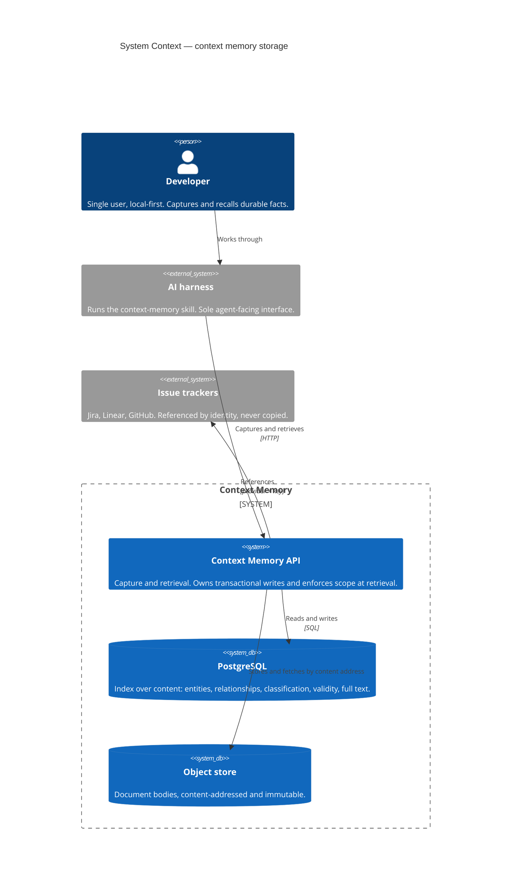
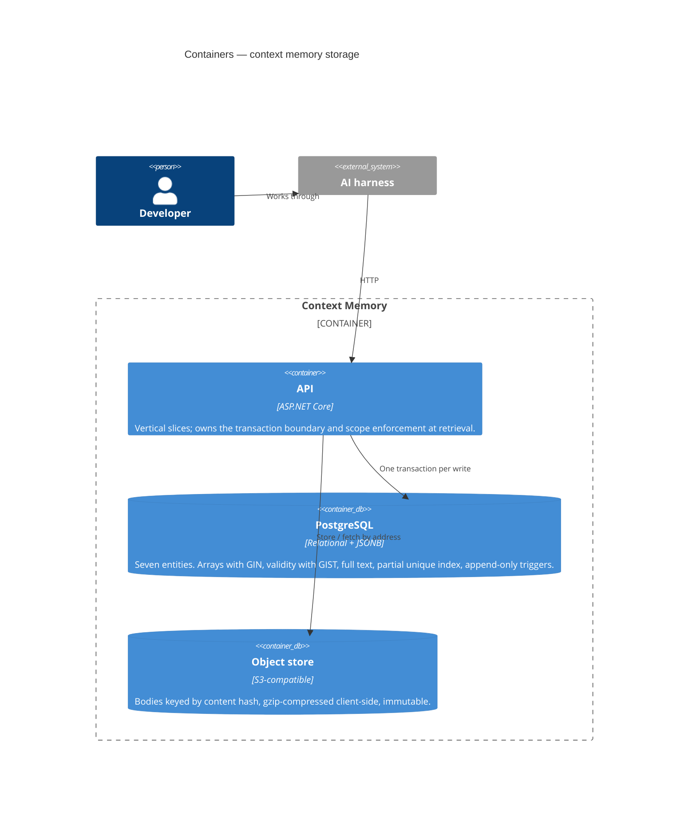
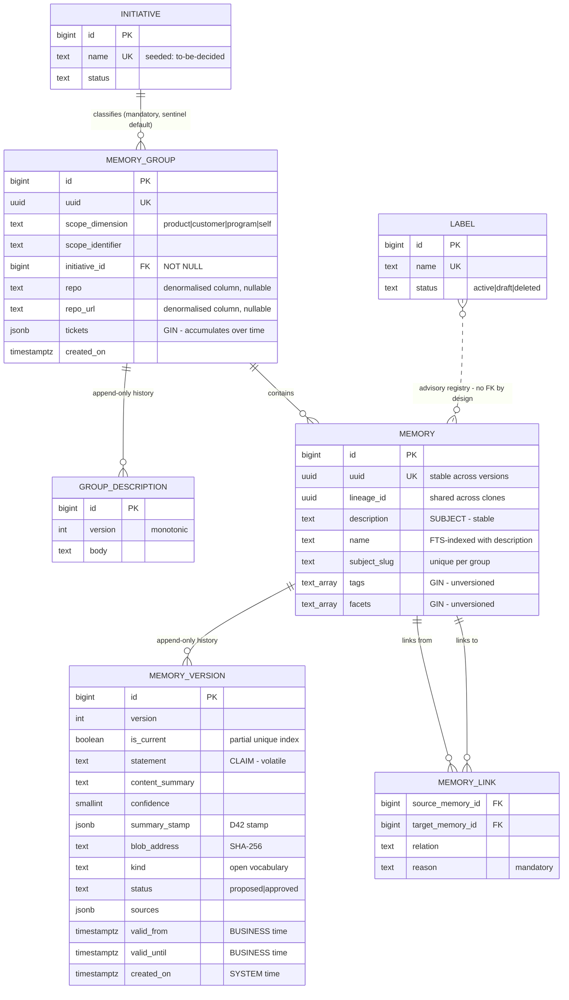

# Diagrams — Context memory storage

Three diagrams, each one concern. A sequence diagram is omitted: the write *order* is a behavioural
concern belonging to the write-pipeline HLD, not to storage.

---

## C1 — System Context

Establishes who uses the store and what it depends on.

**Read this for:** the boundary. Trackers are referenced, never mirrored. The agent reaches the store
only through the API.

---

## C2 — Containers

Shows the two-store split that NFR-03 exists to protect, and why the object store is a separate
backup concern.

**Read this for:** why recoverability is an NFR. Two durable stores means two snapshots, and a database
restored past its matching object snapshot yields references that resolve to nothing.

---

## ER — The entity model

Seven entities. The diagram's job is to show *what is not a table*: tags, facets, sources, tickets and
repository are all attributes, and that absence is the placement rule made visible.

*(`text_array` denotes a text array; bracket notation is avoided for diagram parsing.)*

**Read this for four decisions made visible:**

1. **Tags and facets sit on the stable row, not the versioned one.** That placement *is* the unversioned-classification decision — moving them one row down would version them.
2. **Sources sit on the version**, because provenance answers where *this claim* came from.
3. **The label association is dashed and has no foreign key.** The registry is advisory by design; an FK would make it enforcing.
4. **Two stable/versioned pairs** at different levels — group with its description, memory with its versions. One shape, applied twice.

Also visible: two time columns on the version row are business time and one is system time, and the
subject/claim split runs across the two memory rows.
