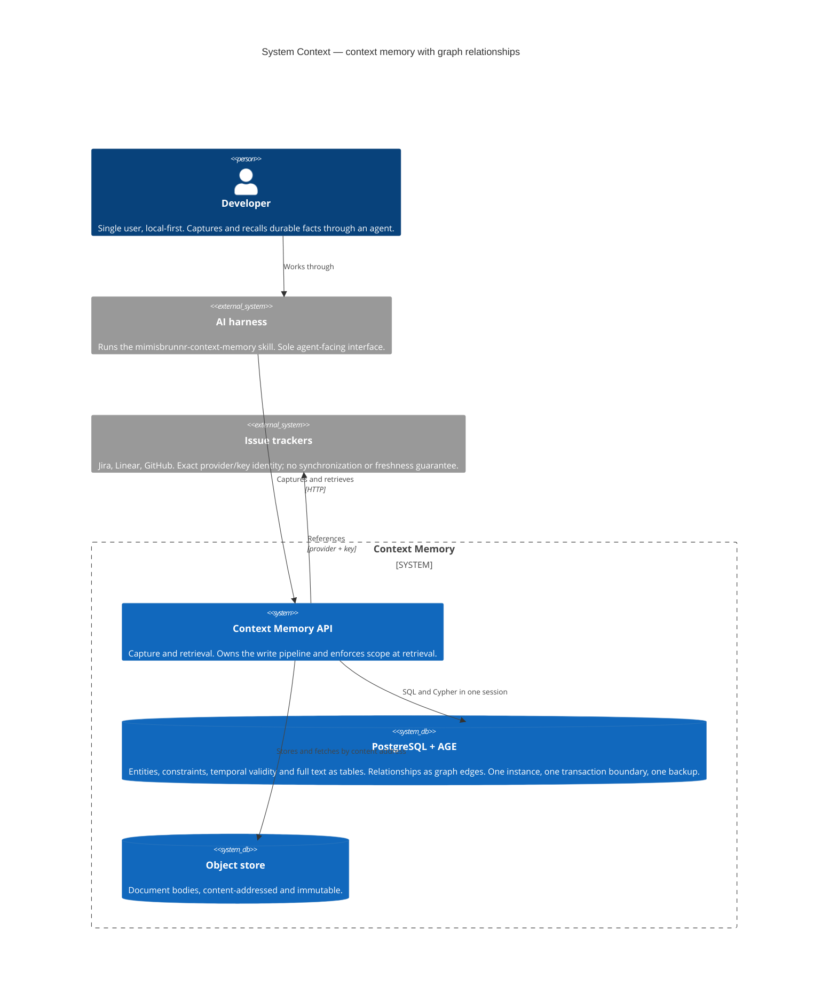
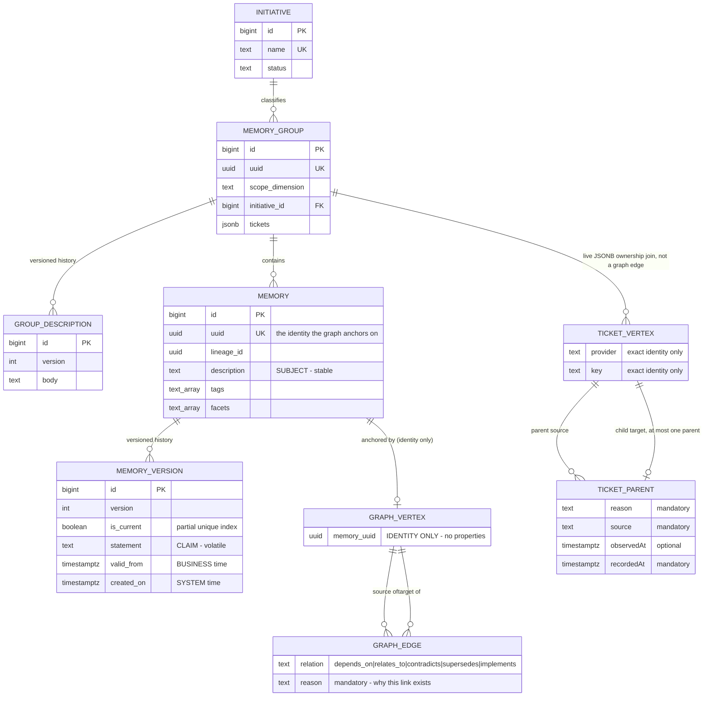
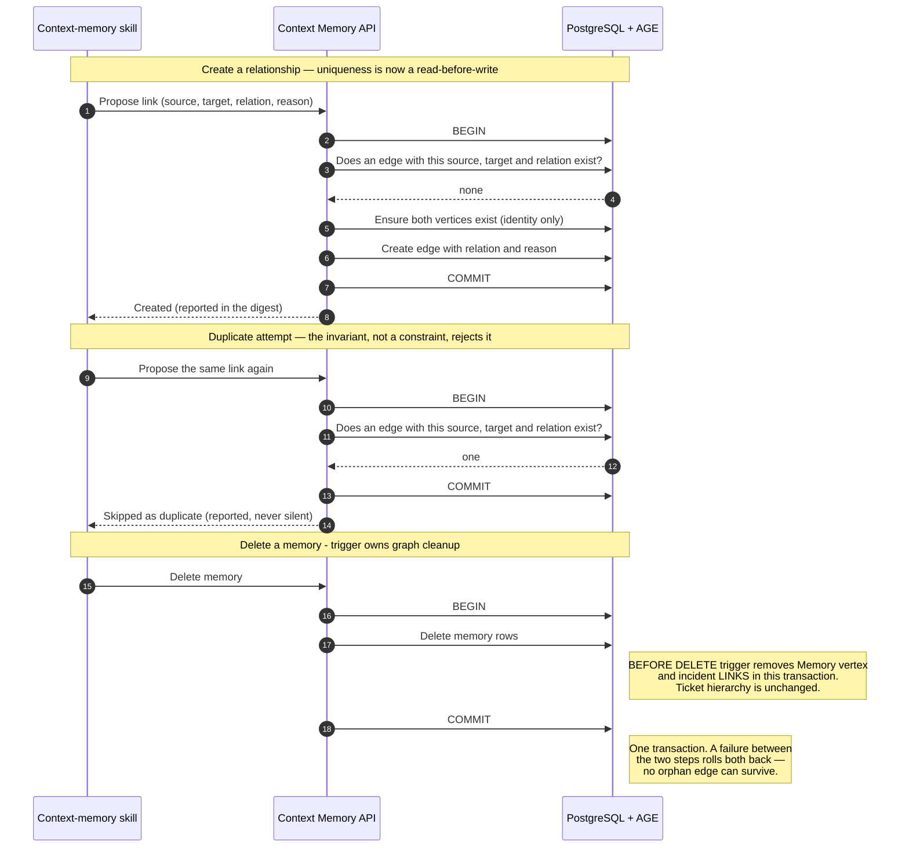

# Diagrams — Graph edges on Apache AGE

Three diagrams, each covering one concern. Container and flow diagrams are deliberately omitted:
the container topology does not change (same API, same database, same object store — only the
database image differs), and there is no new cross-service flow.

---

## C1 — System Context

Establishes that nothing new is deployed. The graph capability arrives inside an existing container.

**Read this for:** the boundary. The graph stays inside the existing database. Trackers remain
external; no network dependency or synchronization is added. LADR-08 accepts locally captured
practitioner-declared hierarchy, not an authoritative tracker mirror. Implementation and release
gates are accepted against the final NFR-02 evidence.

---

## ER — The entity / edge boundary

The design *is* this boundary. Everything above the line stays relational; only the relationship
crosses over.

**Read this for:** the accepted boundary. `GRAPH_VERTEX`/`GRAPH_EDGE` represent delivered `Memory`/
`LINKS`. `TICKET_VERTEX`/`TICKET_PARENT` represent LADR-08's implemented and accepted extension.
Vertex properties are identity only; edge properties describe the declaration. Subject, claim,
scope, validity, tags, facets and ticket membership remain relational. The ownership line is a live
join against group JSONB, not a foreign key or membership edge. Memories join through their group;
no Ticket-to-Memory fanout exists. Ticket edges form a current-state forest, not history.

Note also what is *absent*: no foreign key runs from `GRAPH_EDGE` into `MEMORY`. That missing line is
the guarantee LADR-05 replaces with an application invariant.

---

## Sequence — Relationship write and memory delete

The static view cannot show a consistency boundary. These two flows are where the forfeited database
guarantees are paid back, and where a mistake produces an orphan or a duplicate.

**Read this for:** why both operations are transactional. The existence check replaces the composite
primary key; the database trigger supplies graph cleanup that a foreign-key cascade cannot.
NFR-01 verifies rollback as well as success. Under LADR-08, group-ticket triggers and hierarchy
set/reparent/remove share one transaction-scoped advisory lock; group deletion removes Ticket
vertices and incident hierarchy in that transaction. These ticket flows are implemented and accepted
against standing tests and final benchmarks. Strict expected-parent validation precedes identical-state no-op detection.

The separate `ITicketGraph` read (POST `/api/context/tickets/paths`) requires `maxDepth` 1..5.
One composed statement combines a Cypher anchor with recursive SQL over indexed AGE adjacency,
not variable-length Cypher. Identity lookup uses separate provider/key HASH indexes plus properties
GIN for MERGE, not a composite btree over unrestricted keys. The read resolves each ticket to
exactly one live owner, gates all hops with `HiddenDimensions`, drops hidden paths whole, and applies
endpoint `Plan()` narrowing before returning deterministic capped paths. Their selected endpoint
groups plus the anchor supply distinct current non-proposed memories under a separate memory cap.
Ticket identity supplies no consent. Generic undeclared
upstream/freshness disclosure and visible cap flags reveal no hidden identities or counts.
