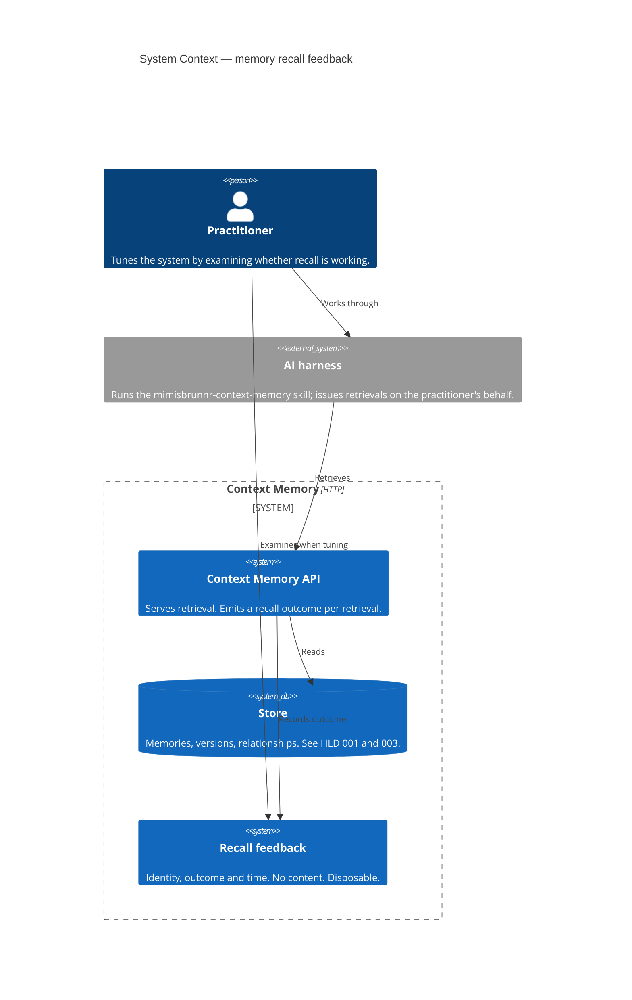
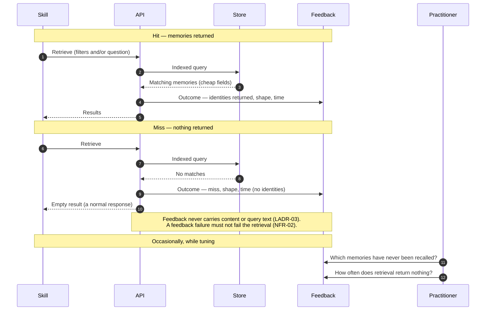

# Diagrams — Memory recall feedback

Two diagrams. An entity-relationship diagram is still omitted, now for a different reason: the placement
question is settled — feedback lives in append-only records, and LADR-02 records the field shape — but no
table exists yet. An ER diagram drawn ahead of the shipped one would be a second, divergent source for it.

The recall path below is unchanged by that decision: feedback was always emitted off the critical path, and
the chosen placement is where the outcome lands, not a new step.

---

## C1 — System Context

Shows that this design adds no participant. Feedback is produced by an existing path and consumed
occasionally by the practitioner.

**Read this for:** who consumes feedback. The practitioner reads it **occasionally, while tuning** —
not the agent, and not the retrieval path. Nothing feeds back into ranking, which is a deliberate
exclusion in the guiding principle.

---

## Sequence — The recall path and its feedback point

Marks where feedback is emitted and, importantly, that it is emitted on **both** outcomes.

**Read this for three properties:**

1. **Feedback is emitted on the miss path too.** Recording only hits produces a record of what recall already does well and silence about everything it does badly — and the miss is the more actionable signal.
2. **An empty result is a normal response**, not an error. The miss is interesting to *tuning*, not to the caller.
3. **Feedback is off the critical path.** A failure to record must not fail the retrieval; losing a tuning signal is acceptable, losing a recall is not.

Note what is absent: no arrow returns from feedback to the query. Ranking influenced by prior recall
would be self-reinforcing, and that failure would be slow and difficult to detect.
