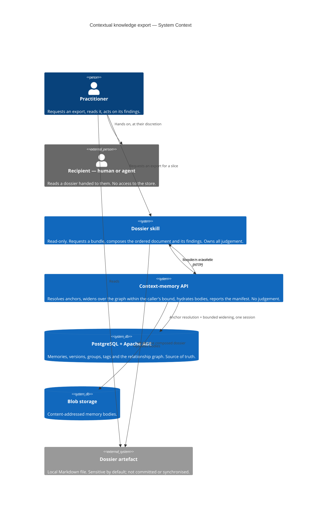

# Diagrams — Contextual knowledge export

The **C1 System Context** below is the mandatory floor. One further diagram earns its place and lives in
its own file: [flow — selection, bundle, composition, findings](./flow-selection-and-composition.md),
because the boundary between deterministic selection and model judgement is the design's thesis and is
invisible in a context diagram.

## System Context (C1)

A practitioner asks the dossier skill for everything the store knows about a slice of work. The skill
requests one **bundle** from the existing context-memory API, which resolves the anchors relationally,
widens over the graph within a caller-supplied bound, hydrates bodies from blob storage, and returns a
manifest of what it selected, reached and cut. The skill composes the **dossier** — ordered, collapsed,
cited, with its findings — and writes it as a local artefact. Nothing is written back to the store.

The recipient is outside the system boundary on purpose: they receive a file the practitioner chose to
give them, and hold no access to the store.

**What is deliberately absent from this diagram:**

- **Any arrow back into the store.** An export is a read (NFR-06); the composing skill has no write capability at all (LADR-08).
- **The forensic dump.** A separate whole-store projection with opposite rules; see LADR-01.
- **The capture skill.** It remains the sole *writer* and plays no part in an export (LADR-08).
- **Any network dependency beyond the local API.** The store is local and offline-capable; ticket-tracker relationships are out of reach for that reason (LADR-09).
