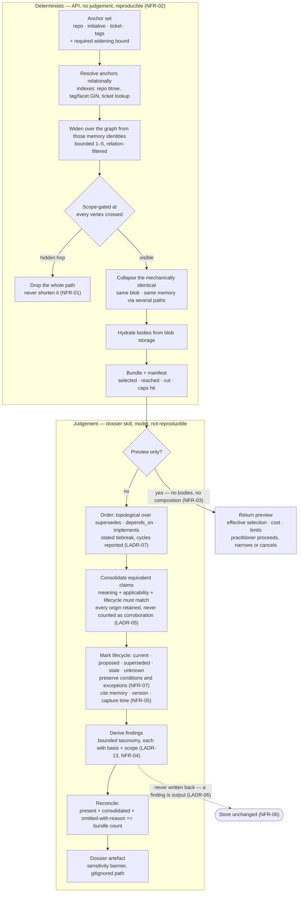
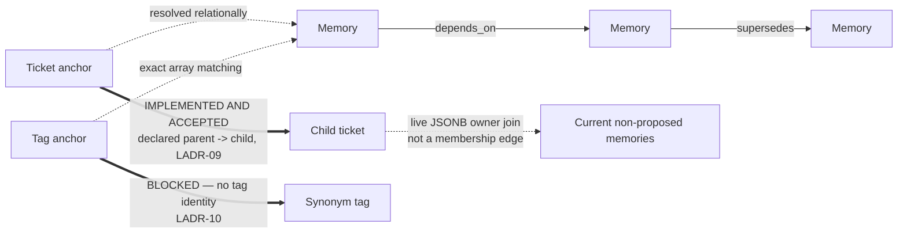

# Flow — selection, bundle, composition, findings

**Why this diagram exists:** the design's thesis is a boundary — deterministic selection on one side,
model judgement on the other (LADR-02). Everything downstream follows from where that line falls: which
guarantee is testable as byte-equality (NFR-02), where the cost lives (NFR-03), and why findings cannot
be produced server-side. A context diagram cannot show a line that runs *through* two components.

## The boundary

## What the boundary buys

| Property | Side it lives on | Why it could not live on the other |
|---|---|---|
| Byte-identical results (NFR-02) | Deterministic | Judgement legitimately varies; requiring equality would forbid the judgement |
| Scope enforcement (NFR-01) | Deterministic | Must be pushed into the composed statement; a skill filtering afterwards has already received the material |
| Ordering rationale (LADR-07) | Deterministic rule, applied on the judgement side | The rule is mechanical and testable; what the document does with the ordered material is not |
| Contradiction detection (LADR-04) | Judgement | Most contradictions carry no edge; no predicate finds them |
| Cost estimate (NFR-03) | Deterministic | Must be answerable *without* paying the composition cost it estimates |
| Findings (NFR-04) | Judgement | A gap is an unanswered question against the task, an included claim or a stated expectation (`BR-27`) — none of which is a predicate |
| Fidelity (NFR-07) | Judgement | Whether a condition still bounds a claim after rewriting is a semantic property, not a count |

## Implemented and accepted ticket reach

Delivered widening travels **memory to memory**. LADR-09 now resolves separate captured ticket
hierarchy under HLD-003 LADR-08; HLD-002 LADR-08 resolves its practitioner-declared writer.
Ticket implementation and release gates are accepted against final HLD-003 evidence.
Tag synonyms stay blocked; generic ticket blockers are not approved.

Arrows distinguish memory links, implemented and accepted ticket hierarchy, and blocked tags.
The separate ticket read requires depth 1..5 and exactly one live owner per ticket, gates every hop
with `HiddenDimensions`, drops whole hidden paths, and narrows returned memories through `Plan()`.
The read uses a Cypher anchor plus recursive SQL over indexed AGE adjacency; only selected capped
path endpoint groups and anchor contribute memories. Ticket identity grants no consent. Generic undeclared-upstream and
unverified-freshness disclosure plus visible-only cap flags qualify completeness without exposing
hidden IDs/counts (`BR-19`, `BR-30`). This diagram does not claim the full dossier is implemented.
