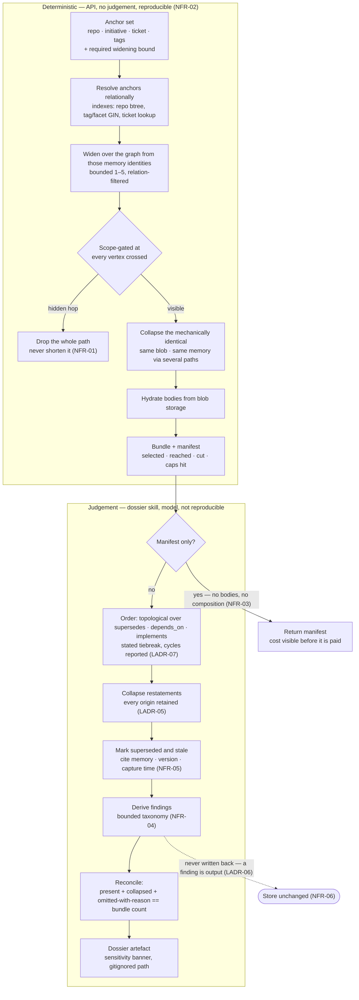
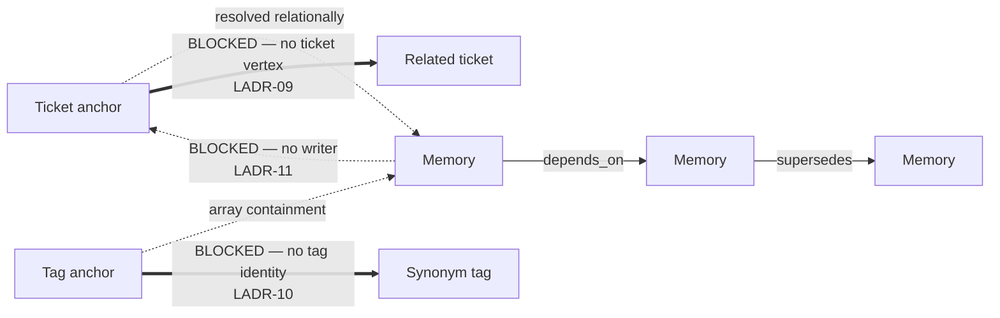

# Flow — selection, bundle, composition, findings

**Why this diagram exists:** the design's thesis is a boundary — deterministic selection on one side,
model judgement on the other (LADR-02). Everything downstream follows from where that line falls: which
guarantee is testable as byte-equality (NFR-02), where the cost lives (NFR-03), and why findings cannot
be produced server-side. A context diagram cannot show a line that runs *through* two components.

## The boundary

## What the boundary buys

| Property | Side it lives on | Why it could not live on the other |
|---|---|---|
| Byte-identical results (NFR-02) | Deterministic | Judgement legitimately varies; requiring equality would forbid the judgement |
| Scope enforcement (NFR-01) | Deterministic | Must be pushed into the composed statement; a skill filtering afterwards has already received the material |
| Ordering rationale (LADR-07) | Deterministic rule, applied on the judgement side | The rule is mechanical and testable; what the document does with the ordered material is not |
| Contradiction detection (LADR-04) | Judgement | Most contradictions carry no edge; no predicate finds them |
| Cost estimate (NFR-03) | Deterministic | Must be answerable *without* paying the composition cost it estimates |
| Findings (NFR-04) | Judgement | A gap is an absence relative to an expectation, which is not a query |

## Interim reach, and what it excludes

The widening step travels **memory to memory only**. Anchors are resolved relationally and then left
behind — a ticket anchor cannot follow that ticket's blockers, and a tag anchor cannot follow that tag's
synonyms, because neither has a vertex and nothing writes such edges.

Solid arrows work today. The heavy arrows are the blocked prerequisites, and the manifest states that
they were not followed — so an export's completeness claim is qualified rather than overstated
(`BR-19`, `BR-30`).
