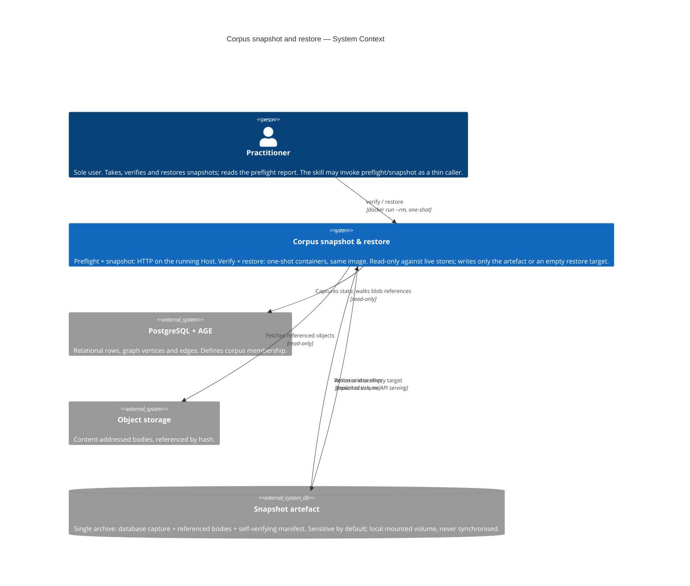
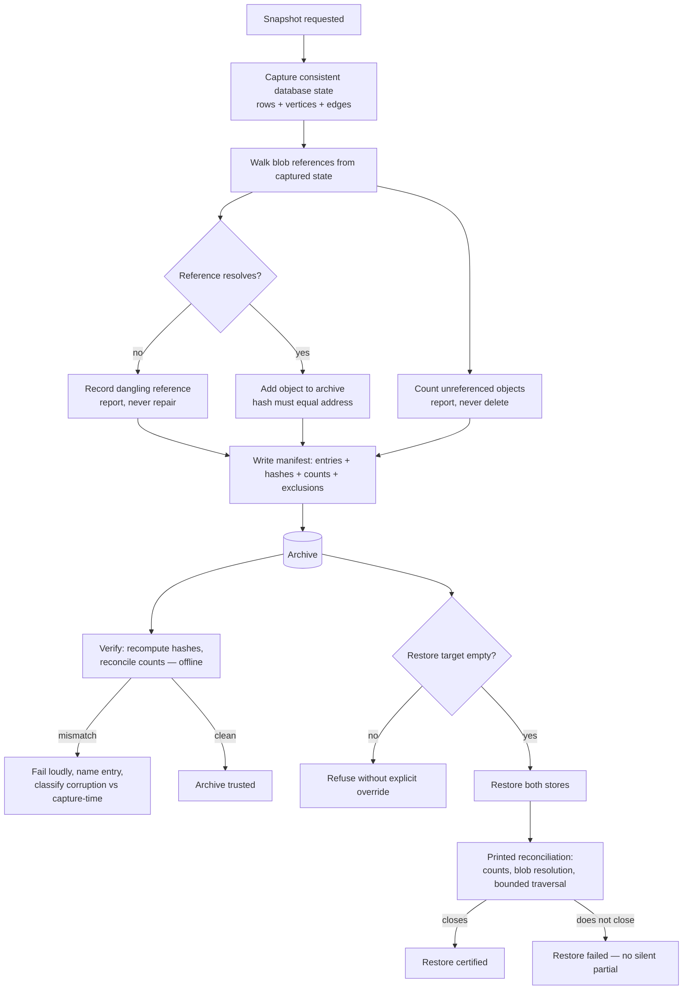

# Diagrams — Corpus snapshot and restore

## System Context (C1)

The snapshot tooling is an operator-facing surface delivered through the one published Host
image: preflight and snapshot are HTTP endpoints on the running container; verify and restore
run as one-shot containers from the same image, needing no live service (LADR-07). It reads
both stores, writes only the artefact, and restores only into an explicitly empty target.

## Flow — snapshot, verify, restore

One diagram earns its place beyond C1: the three claims (membership, integrity, sufficiency)
have three different owners, and the flow shows where each is established — which is the
design's thesis.

