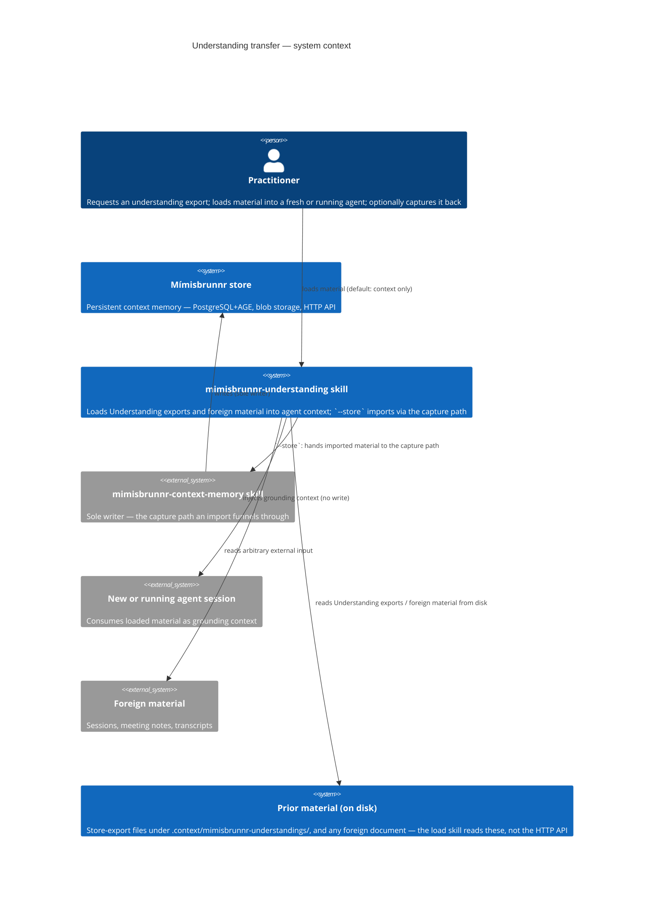

# C4 — System Context

```mermaid
C4Context
    title Understanding transfer — system context
    Person(practitioner, "Practitioner", "Requests an understanding export; loads material into a fresh or running agent; optionally captures it back")
    System(store, "Mímisbrunnr store", "Persistent context memory — PostgreSQL+AGE, blob storage, HTTP API")
    System(loadSkill, "mimisbrunnr-understanding skill", "Loads Understanding exports and foreign material into agent context; `--store` imports via the capture path")
    System_Ext(captureSkill, "mimisbrunnr-context-memory skill", "Sole writer — the capture path an import funnels through")
    System_Ext(agent, "New or running agent session", "Consumes loaded material as grounding context")
    System_Ext(foreign, "Foreign material", "Sessions, meeting notes, transcripts")
    System(material, "Prior material (on disk)", "Store-export files under .context/mimisbrunnr-understandings/, and any foreign document — the load skill reads these, not the HTTP API")

    Rel(practitioner, loadSkill, "loads material (default: context only)")
    Rel(loadSkill, agent, "injects grounding context (no write)")
    Rel(loadSkill, material, "reads Understanding exports / foreign material from disk")
    Rel(loadSkill, captureSkill, "`--store`: hands imported material to the capture path")
    Rel(loadSkill, foreign, "reads arbitrary external input")
    Rel(captureSkill, store, "writes (sole writer)")
```

The load skill is a **reader** by default; it becomes a writer only through the `--store` switch,
which routes through the capture skill.
