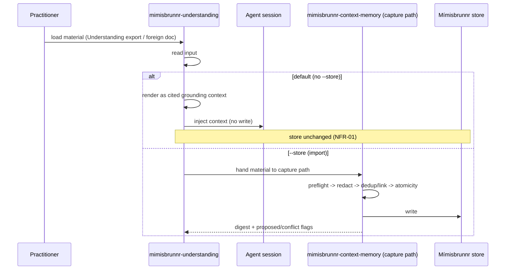

# Flow — load vs import

The default is a read and writes nothing. `--store` is the one thing that turns the read into a
capture, and that capture goes through the existing write path (LADR-02, LADR-03).
