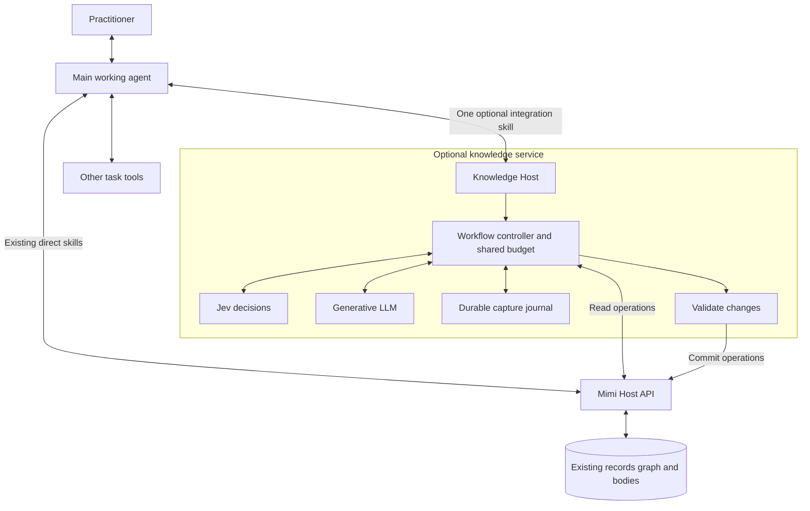
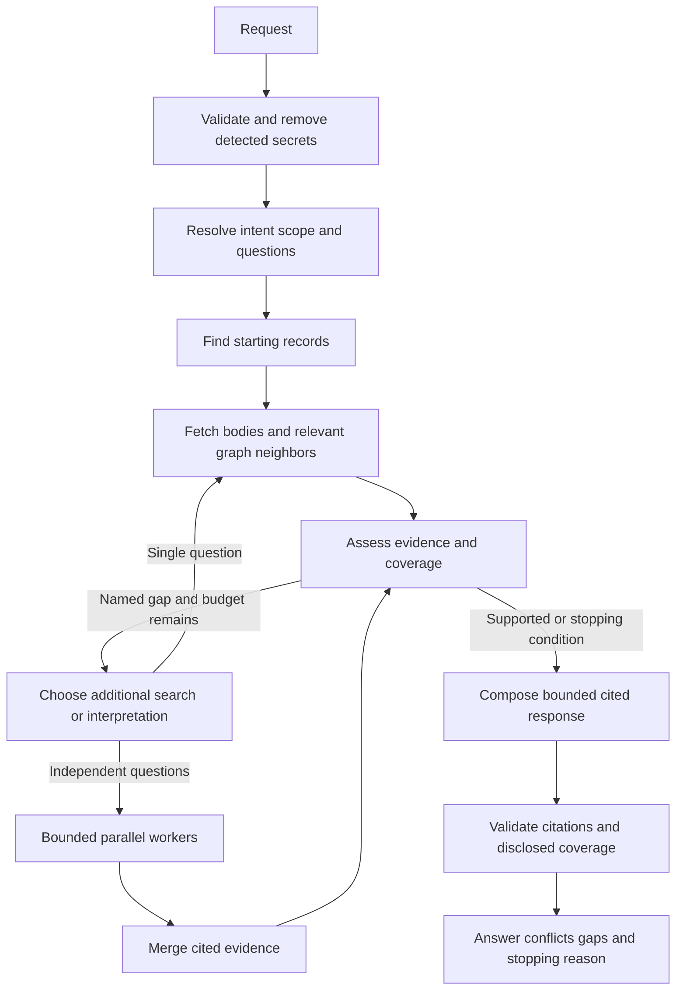
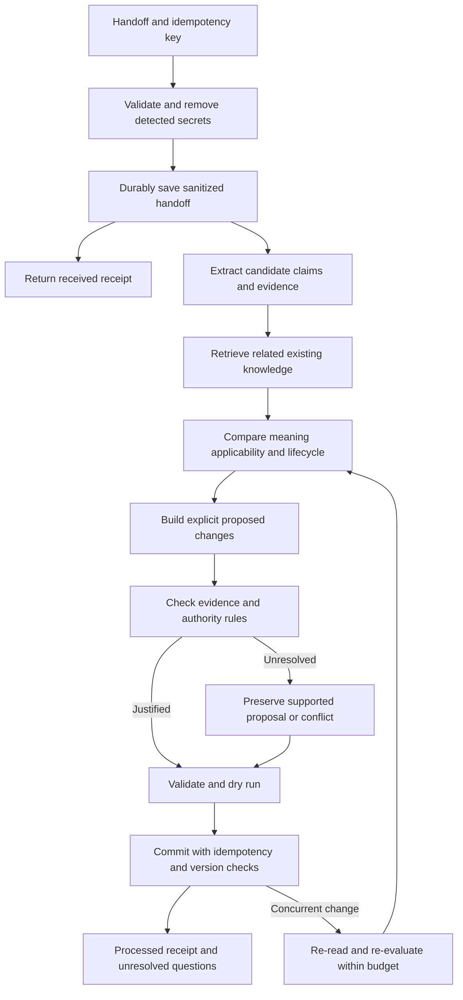

# Optional Mimi Knowledge Service technical design

> Execution status (October 3, 2026): Bob subsequently authorized implementation, GitHub feature-branch publication, bounded real provider calls, and installation/enablement on his existing Unraid stack. Earlier planning-only statements below describe the original document's status. See [EXECUTION.md](EXECUTION.md) for current progress and verified evidence.

Draft architecture, October 3, 2026. Implements the [product requirements](PRD.md). The product decisions in the [planning index](README.md) are agreed; component names, wire contracts, and storage changes below are implementation proposals.

## Architecture

Add a separately runnable Knowledge Host that communicates with the existing Mimi Host over HTTP. It owns model integrations and workflow execution. Keep generative-model calls out of the existing Domain, Application, and API Host layers. Use the current corpus and its supported write boundary rather than giving the new service direct access to business tables or blob storage.

Proposed projects are `SmoothAiProductContextMemory.Knowledge` for workflow logic and `SmoothAiProductContextMemory.KnowledgeHost` for HTTP hosting, providers, and durable job execution. Start with an explicit state machine in the existing .NET stack. A graph framework can be evaluated if durable execution becomes materially easier; neither LangGraph nor a Python orchestration runtime is a requirement.

The main agent is the central node of the user's overall workflow. It does not dispatch Mimi's internal workers or receive their raw histories. The service controller owns that subgraph. The diagram's two access paths are alternatives that may coexist, not two copies of the corpus.

## Two graphs and execution state

The **knowledge graph** contains domain relationships such as `depends_on`, `contradicts`, and `supersedes`. The existing AGE graph is part of this data model.

The **workflow graph** contains processing steps and conditional edges. Its nodes are operations, which may be database calls, ordinary functions, Jev calls, or LLM calls. It is not stored as domain knowledge. Worker fan-out creates bounded branches; fan-in reconciles their evidence before synthesis or writing.

Each request carries typed execution state: request identity, task and selectors, evidence references, questions under investigation, retrieved record/version identities, coverage outcomes, proposed changes, remaining budget, step outcomes, and workflow/model versions. Nodes return validated state changes. They cannot redefine permissions, invent executable tools, or change the budget.

Maintain a visited set of record/version identities to avoid traversing cycles repeatedly. Deduplicate evidence at fan-in so two workers finding the same source do not count as independent corroboration. Every loop has a stopping condition and a recorded reason. These are standard workflow graph techniques; see [workflow patterns](https://docs.langchain.com/oss/python/langgraph/workflows-agents).

## Jev and LLM responsibilities

[Jev](https://docs.typesafe.ai/introduction) returns Choice, Score, or Noul decisions from supplied state. Use small, specific questions rather than asking it to produce a research plan. Choice and Score include distributions and a derived confidence statistic; Noul supplies a probability without a separate confidence field. [Confidence](https://docs.typesafe.ai/confidence) is not interchangeable with empirical correctness.

| Operation | Jev | Generative LLM | Code |
|---|---|---|---|
| Request interpretation | Classify known intent and complexity dimensions | Produce focused subquestions or search terms when needed | Validate selectors and route |
| Candidate relevance | Score supplied records against a question | Interpret difficult records where necessary | Fetch and assemble candidate sets |
| Coverage | Evaluate whether supplied evidence addresses a specific question | Explain gaps and conflicts | Enforce stopping conditions |
| Knowledge comparison | Classify equivalence, difference, conflict, or insufficient evidence | Extract claims and explain nuanced distinctions | Validate identity, scope, authority evidence, and allowed operations |
| Output | Assess selected checks where useful | Compose briefings and records | Verify references and commit permitted changes |

Mimi defines available routes and then branches on Jev's responses, following the documented [intent-routing pattern](https://docs.typesafe.ai/patterns/intent-routing). Model choice can be a bounded route such as standard interpretation or stronger review. Jev does not launch agents itself.

Start with one configured generative model. Add an optional stronger model after evaluations identify failures that it improves. Request independent Jev decisions together when they use the same state; do not pretend one question can consume another question's answer within that parallel call. Dependent decisions require another workflow step.

## Retrieval graph

1. Honor explicit project and work selectors. Infer additional selectors only when supported; ask if ambiguity would change the answer materially.
2. Use structured filters and short keyword alternatives to find seeds. A graph traversal without suitable starting records cannot recover a missing subject. Optional vector retrieval remains a separate measured extension.
3. Follow only justified relation types and bounded depths. Inspect full bodies when summaries omit the detail needed to answer. Preserve sources and versions across all passes.
4. Assess each named question as `supported`, `conflicting`, `not_found_in_search`, or `unexamined_due_to_limit`. Interpretation uncertainty can be attached to any of these outcomes. The list of subquestions is itself fallible; it is not a certificate that all aspects were considered.
5. Expand for a specified reason. Stop on supported coverage, no useful new evidence, exhausted budget, cancellation, or dependency failure. Return an honest partial response if appropriate.
6. Compose with citations, conditions, scope, and lifecycle adjacent to claims. Separate stored assertions from analysis. Validate that cited identities and versions actually occurred in the evidence set. A second model agreement is not proof of factual correctness.

**Temporal behavior:** For a request about current behavior, resolve an explicit effective time and use the store's `asOf` filter where applicable. Historical questions carry an explicit historical time/history policy. Record the effective policy in the response. Existing direct queries keep their current defaults. Approved proposals require separate treatment from evidence of implementation.

**Cross-project learning:** When relevant, separately search applicable portable understandings without a repository anchor. Do not silently widen every request to all projects. This is retrieval applicability, not a new provider permission system.

## Capture graph

Extraction preserves source roles and ordering. A user's speculation remains speculation; a quoted instruction in a document does not become authority for changing the system. Candidate bodies must retain their load-bearing conditions. Do not make an arbitrary paragraph or sentence boundary the definition of a fact.

The proposed change set names operations, target group and memory identities, expected versions, source evidence, applicable scope, and reasons. Read-before-write includes semantic comparison; exact preflight is only a structural backstop. Comparison failures stop affected writes and produce a deferred result, rather than an all-new insert plan.

## Authority and lifecycle rules

| Evidence | Permitted treatment |
|---|---|
| Equivalent claim with another source | Associate provenance without creating a duplicate subject; preserve lineage |
| Supported new observation | Store as an observation within the scope actually evidenced |
| Suggestion or brainstorm | Store as proposed, distinct from current approved behavior |
| Explicit authorized decision about future behavior | Store the decision as approved intent; do not claim implementation |
| Evidence of shipped behavior | Record what that evidence establishes, with its date and scope |
| Unresolved disagreement | Preserve separate supported claims and a relationship; retain existing approved current knowledge |
| Ambiguous or unsupported assertion | Defer promotion; capture only the uncertainty/proposal that the evidence supports |

Approval is per claim and context, not an automatic property of a speaker role. An explicit user correction may establish intent but not prove production deployment. Model confidence is an interpretation signal, never an authority source.

## Mapping to the existing corpus

The inspected [MemoryVersion model](https://github.com/generic-automation-and-it/smooth-ai-product-context-memory/blob/bbc8553/src/SmoothAiProductContextMemory.Domain/Entities/MemoryVersion.cs) has `proposed` and `approved` status values and one current version per memory. It does not supply separate proposed and approved version branches, or a built-in shipped-state field.

Proposed mapping:

- Preserve existing fields and their meanings. Use ordinary kinds, scope, sources, statements, content, and relationships for all incorporated knowledge.
- Represent a competing proposal or conflict as a separate related memory, with an appropriately distinct subject identity. Do not version-bump an approved current memory into an excluded proposed version, which would hide the established claim on normal reads.
- Use an additive, optional, versioned evidence metadata shape for distinctions such as suggestion, approved intent, observed implementation, and unknown. Carry evidence references and applicability with it. Define and test the wire/schema extension in the first implementation milestone. Legacy records with absent metadata remain unknown on that axis; they are not relabeled as shipped.
- Include any new metadata in ordinary read, export, snapshot, and restore paths. It must not become intelligible only through the optional service. Existing clients may ignore the optional fields and must continue working.
- Equivalent-source attachment may require an additive provenance operation or a new version preserving the identical claim. Specify this operation explicitly; do not silently mutate append-only version history.
- Preserve group-scoped version targeting. A related subject in another group becomes a new scoped claim with a justified link, not a version bump against a foreign memory.

This deliberately extends the current skill-only write-orchestration rule: the service becomes another supported orchestrator through the same Host write boundary. Update those instructions when implemented. Share validation and regression fixtures so the two modes do not evolve incompatible write semantics.

## Proposed public contract

HTTP is the initial transport. One skill documents the semantic operations; a thin client handles transport and polling. Endpoint names below are proposals.

| Operation | Proposed route | Required content | Result |
|---|---|---|---|
| Get context | `POST /api/knowledge/context` | Question or task; known selectors | Cited brief, evidence identities, coverage, stop reason, usage |
| Capture learning | `POST /api/knowledge/captures` | Idempotency key; task context; attributed messages or evidence | Durable capture ID and received status |
| Read capture result | `GET /api/knowledge/captures/{id}` | Capture ID | Progress or final receipt |
| Supply clarification | `POST /api/knowledge/captures/{id}/clarifications` | New attributed evidence; idempotency key | Acknowledged continuation linked to the original capture |

The caller supplies known project/ticket selectors, not internal group UUIDs. The service resolves internal identity, and asks only when it cannot safely determine the intended scope. Response depth and effort can be requested in ordinary terms; server configuration supplies finite defaults.

Retrieval responses contain `requestId`, `brief`, `evidence`, `coverage`, `conflicts`, `stopReason`, and `usage`. Valid stop reasons distinguish answered questions, no new evidence, budget exhaustion, dependency failure, and cancellation. Evidence entries include memory identity, version, source, and applicability.

Capture receipts distinguish `received`, `processing`, `processed`, `needs_input`, `partial`, and `failed`. A processed receipt accounts for committed, linked, unchanged, and deferred candidates. `needs_input` and `partial` may include already committed safe additions, which the receipt must disclose. A failure never silently erases those additions.

A handoff carries stable message/source IDs, source roles, ordering, optional source timestamps, optional highlights, and an optional previous receipt cursor. Missing transcript access is disclosed; the service cannot recover omitted private context. API schemas and examples will be frozen with contract tests before enabling writes.

## Durable processing and concurrency

Proposed initial operational store: a small service-owned SQLite journal on a persistent local volume, with one active capture executor. It stores sanitized pending inputs, workflow checkpoints, plans, receipts, and references to committed operations. This suits the single-practitioner scope without a distributed queue. The business corpus remains in Mimi.

**Receipt boundary:** Return `received` only after sanitization and durable journal commit. Request-body logging is disabled. Raw handoffs are not persisted before secret detection. If the detector cannot run, reject rather than acknowledge material that has not passed the gate.

**Commit boundary:** A local journal alone cannot guarantee safe retries across a remote API commit. A crash can occur after Host commits but before the service records success. Add a backward-compatible Host operation that records an idempotency key, normalized payload hash, expected current versions, and result in the same database transaction as the accepted changes. Replay of the same key and payload returns the original result; reuse with a different payload is a conflict. Stable create UUIDs alone do not cover repeated version bumps.

Use compare-and-set checks for target versions. A service-only lock does not protect against a direct writer. On a concurrent change, re-read and rebuild the affected plan within the same budget, or leave it deferred. Do not retry a stale write blindly.

Group resolution and creation must participate in safe operation replay too. Existing `resolve-group` can mutate and has no dry-run mode; do not call it while promising a zero-mutation preview. Prefer a non-mutating resolution step followed by a recorded creation operation. Document per-batch commit boundaries; large captures are not falsely advertised as one global transaction. Initial comparison batches are bounded to 20 candidates, aligned with the current preflight/client convention, with completed and deferred batches accounted for.

Unfinished sanitized handoffs stay durable until processed or explicitly discarded. After successful processing, purge temporary handoff bodies on a configurable schedule while retaining receipts and source material necessary to substantiate stored claims in the corpus. The implementation must provide a bounded journal size and stop accepting new work before exhausting storage. Corpus snapshots and pending-work backups have different purposes; document and test both rather than implying a corpus snapshot preserves pending jobs automatically.

Include Host operation receipts in the corpus snapshot contract so restored records and their committed-operation identities agree. Restoring an older corpus against a newer service journal must pause automatic replay and reconcile the two histories before resuming. Do not report journal-only success for a commit absent from the restored corpus, or silently replay post-snapshot jobs into a deliberately restored state.

## Budget and failure behavior

The controller owns one budget ledger for the entire request, including parallel workers and retries. Reserve capacity before dispatching work; settle against returned usage. Persist capture usage and outstanding reservations across restart: resumption does not grant a fresh model budget. An exhausted job remains partial until an explicit continuation supplies additional allowance. Enforce token/output caps and call counts even when a provider does not return reliable billing data. Dollar limits use configured model rates and conservative estimates; estimates are labeled, never described as a provider billing guarantee.

Provisional development limits, to calibrate against the evaluation corpus:

| Bound | Interactive retrieval | Capture processing |
|---|---|---|
| Execution deadline | 30 seconds for the request | 120 seconds from first processing, durably retained across retry/restart; explicit continuation may grant a bounded extension |
| Additional retrieval passes | 2 | 2 per comparison batch |
| Concurrent model workers | 2 | 2 |
| Provider calls across all branches and retries | 8 | 12 |
| Aggregate provider input tokens | 60000 | 100000 |
| Aggregate generated output tokens | 8000 | 12000 |
| Main-agent briefing budget | 2000 tokens unless requested otherwise | Compact receipt |

These are engineering starting values, not measured optima or user commitments. Graph depth stays within the existing API's 1–5 bound and every call states its limit. Larger input is rejected with an actionable size limit or explicitly deferred; it is not silently clipped. The same content sent to multiple calls counts each time.

If Jev or the generative provider is unavailable, stop the dependent path with a classified outcome. A deterministic lookup may still return labeled evidence if it genuinely answers the request; do not disguise it as a completed model synthesis. Pending capture remains durable. The first release does not introduce an automatic provider failover framework.

## Secrets and observability

Use configured Jev and LLM providers without per-project permission policies. Sanitize ingress, material loaded from the existing corpus before provider use, and generated records before persistence. Providers receive the context needed for the step; there is no rigid field allocation scheme. Stored and supplied instructions are data, not permission to change the workflow.

Reuse the current redaction test corpus and fail-closed behavior, including false-positive prose examples. If implementation moves detection into shared .NET code, verify parity rather than copying rules and assuming equivalence. Never put credentials into model prompts, traces, receipts, or fixtures.

Trace request and node IDs, transitions, model identifiers, workflow/prompt versions, durations, usage, and error classes. Avoid logging bodies and complete model inputs. Evidence stays available through access-controlled knowledge and receipt interfaces, not general logs.

## Optional deployment and disablement

Introduce a proposed `KnowledgeService:Enabled` flag defaulting to false. Only an enabled service loads provider configuration or creates its runtime resource. Missing provider credentials then produce a clear service configuration error while the core Host remains available.

Deploy the Knowledge Host alongside the existing stack, using the same release controller installation, or as a separately launched process against the existing API. Do not start a second complete release controller as the implementation strategy; the inspected baseline has [an open multi-controller isolation defect](https://github.com/generic-automation-and-it/smooth-ai-product-context-memory/issues/159).

Read routes use the existing read-capability principle; capture routes require write capability. Only the commit component receives the core write capability. This preserves the current boundary without introducing multi-user authorization.

Disabling the service stops new service requests and safely stops or drains active work. Pending jobs remain in the service volume. Incorporated knowledge remains usable directly. Re-enabling resumes supported pending work with the original workflow version or reports that explicit reconciliation is needed. Do not automatically reinterpret old pending jobs under changed prompts.

Additive Host contracts or metadata migrations must remain compatible with direct clients. Disabling the optional service does not roll back a database migration; restoration or code rollback follows a tested compatibility procedure.

## October 3 collaborator review: implementation refinements

See [COLLABORATOR-REVIEW.md](COLLABORATOR-REVIEW.md) for the mandatory verification ledger. These refinements preserve the standalone service, authoritative core and shared bounded workflow.

Recall events require an explicit origin and a caller-request identity distinct from internal pass identity. Service retrieval and capture comparison cannot increase the legacy direct-request miss-rate denominator or make capture comparisons look like user recalls. API defaults must preserve old direct clients. The exact storage/API representation is implementation-owned and must be covered by real-store attribution tests.

Atomicity means independent meaning, not conjunction count. A refund rule and its unused-product condition form one meaningful claim. Use one shared fixture set across the direct detector and service enforcement, including genuinely bundled claims as negative controls. No mode receives an atomicity bypass.

Evidence attachment uses immutable versioning: retain old versions unchanged, create one next version containing the union of attributed sources, and preserve confidence, lifecycle, scope and other existing metadata for an equivalent claim. Coalescing retains each constituent source's own authority quotation/reference. Stable operation receipts prevent repeat version creation after uncertain commits or retries.

The implemented core snapshot contract is v4 with hashed operation receipts; v3 input remains readable without receipts, and unsupported or internally contradictory declarations are refused. Restore creates a fresh corpus epoch. Detection and pause are the first recovery stage only. The reconciliation operation must bind an explicit request to the observed restored epoch, durably archive old plans/operation identities, preserve usage and uncertain reservations, and generate fresh read/comparison/commit work under a new operation generation. Repeating its idempotency key cannot create another generation. It must never blindly resend a pre-restore plan. Snapshot and service-journal backups remain separate.

The service packages and invokes the existing direct Python redactor from its canonical source; it does not maintain a translated rule copy. Test sanitized ingress, provider input/output, derived write bodies/sources, journal and receipt boundaries. Detection still has the documented recognisable-pattern limitation.

Existing repository owner decisions concerning untracked capture identity and accepting designs over draft children remain explicitly open in the source README. The direct skill currently uses a synthetic `local:<guid>` ticket for untracked work. Optional service request/message namespaces are an additive technical identity, not a decision that changes memory `(group, uuid)` identity or approves a global untracked-work policy. Evidence metadata must distinguish approval of a document, approval of intended behavior and observed deployment; none implies another. HLD acceptance is not a release gate or a statement that all child artifacts have shipped.
