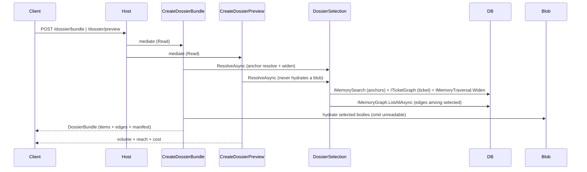

# DOSSIER_AGENTS.md

## TL;DR

Deterministic side of HLD-005 contextual export: `POST /api/context/dossier/bundle` and `.../dossier/preview`. The API assembles the **bundle** (selected memories + edges + manifest); the **dossier skill** composes the document. This feature is selection and materialisation only — no model, no judgement, no write.

## Non-Negotiables

- **Never call a model from Application or Host.** Selection is mechanical; ordering, collapse and findings are the skill's.
- **Never extend the forensic `export` CLI.** Separate path (LADR-01). The dossier reuses `ExportBlobReader` (internal) for body reads only — it does not touch `Features/Export` handlers.
- **Never default the widening bound.** `WidenDepth` is required on the wire (`1..5`), refused at the validator **and** the store layer (`NpgsqlMemoryTraversal.WidenAsync` throws outside 1-5). No server-side default.
- **Scope-gate every vertex crossed with `MemoryScopeFilter.HiddenDimensions`, not `Plan().ExcludedDimensions`** (empty for every explicit dimension). A path through a hidden memory is dropped whole, never shortened.
- **Never write.** No version, edge, label registration, or blob. The selection path never calls `SaveChanges`.
- **No generation timestamp anywhere in the payload** — that would break byte-equality (NFR-02). Stored times are data.
- **`kind = understanding` is a kind like any other** (LADR-15): same selection, widening, scope gating, citation, reconciliation, read-only. Adds no special path.
- **Omission reasons come from the bounded set** in `DossierOmissionReason`. No free text (NFR-04).

## System Context

## Architecture Decisions

### LADR-201: Two slices, one shared deterministic selection

- **Date**: 2026-09-22
- **Status**: Accepted
- **Context**: Bundle and preview must resolve the *same* selection (LADR-14 binds them to one recorded selection), and preview must never hydrate a body (NFR-03).
- **Decision**: `CreateDossierBundle` and `CreateDossierPreview` are separate Mediator slices sharing `DossierSelection.ResolveAsync` (anchor resolve + widen + mechanical collapse + deterministic ordering). The preview slice takes **no** `IBlobStorage` — it is blob-free by structure, so the zero-blob-read guarantee is structural, not behavioural.
- **Consequences**: A change to selection semantics lands once. The preview cannot hydate a body because it has no blob capability.

### LADR-202: Widening is a new store read, not N traversals

- **Date**: 2026-09-22
- **Status**: Accepted
- **Context**: LADR-03 rejects N per-anchor traversals.
- **Decision**: `IMemoryTraversal.WidenAsync(MemoryWidenQuery)` widens from a set of anchor identities in one statement, gating every vertex against `HiddenDimensions`, and enforces the 1-5 bound at the store layer.
- **Consequences**: One round trip per bundle; the store-layer bound is non-bypassable.

### LADR-203: Mechanical collapse only, on the bundle

- **Date**: 2026-09-22
- **Status**: Accepted
- **Context**: LADR-05 puts mechanical collapse on the reproducible side; semantic consolidation is the skill's.
- **Decision**: The bundle dedups to one item per memory-version, and collapses distinct memories whose inlined body is identical (`collapsed into another claim`). The bundle never merges equivalents by meaning.

## Key Behaviors

- **Anchor resolution**: repo/initiative/tags/kind/status via `IMemorySearch` (one statement, indexes); the ticket via `ITicketGraph.TraverseAsync` (mirrors `FindTicketPaths`, grants no scope consent). Within a category values are alternatives; across categories conjunctive (intersection).
- **A no-match is a no-match**: an empty anchor set returns an empty bundle with `manifest.noMatch = true`, never broadened.
- **The bundle's `manifest.selectedCount` equals `items.Count + omitted.Count`** (NFR-04 reconciliation left-hand side).
- **Cut-on-cap is decided by the ordering** (validity, capture, identity), never by what the traversal reached first.
- **The manifest records the effective selection** (criteria, combination rule, widening bound, history policy, retrieval policy) in a form sufficient to repeat it (BR-20 / LADR-14). Tags are recorded ordinal-sorted so reordering a request changes nothing.
- **`IncludeHistory`** adds non-current versions of selected memories as separate items; the history policy is recorded in the manifest.

## Test References

- L0: `tests/.../Application.UnitTest/Features/ContextDossier/` — validators (depth absent/0/6 refused), provenance tiebreak, bounded omission reasons, no generation timestamp (schema-level), mechanical collapse, manifest count == item count, payload byte-equality, kind=understanding like any kind.
- L1: `tests/.../Application.ComponentTest/Features/DossierBundleHandlerTests.cs` — byte-identity across calls and restart (a fresh EF context + handler + data source over the same store, so no in-process caching or hash-seed dependence leaks into the bytes), reorder anchors/tags, hidden-dimension drop at depth, preview blob-free, zero-write, understanding citation, store-layer depth refusal.
- L1 evidence (env-gated): `tests/.../Application.ComponentTest/Features/DossierWorkflowBenchmarkTests.cs` — the NFR-03 reference-workflow measurement harness (`SMOOTH_DOSSIER_BENCH=1`). It seeds a representative store and records slice size, item-limit fit, payload size, and preview/bundle latency for the spec-preparation, handover and re-entry workflows. Reported values are evidence, never an asserted cap.

## Migration Plans

- The numeric item limit is provisional (`DossierDefaults.ItemLimit`) pending reference-workflow validation; recorded per export, never cited as a specification (NFR-03). It is deliberately bound to the selection path's fetch ceiling (`MemorySearchDefaults.MaxLimit`, 200) so the stated cap is the effective, reachable bound — a higher stated cap would be an unreachable number that can never be hit or reported.
- **Historical (2026-09-23):** earlier this dropped to 200 because selection fetched at `MemorySearchDefaults.MaxLimit`, so a 500 cap was unreachable. Any later raise of `MemorySearchDefaults.MaxLimit` must keep the dossier cap equal to it, or the cap is again dead. `cap reached` is reported on the cut itself (`LimitReached` or a history-inflated item cut), so a slice that fills the bound is never presented as complete.
- The dossier skill (composition, focus, findings taxonomy) and tag identity/synonyms remain separate, blocked workstreams — not part of this deterministic side.

## Changelog

| Date | Change | Ref |
|:-----|:-------|:----|
| 2026-09-22 | Created — deterministic bundle/preview half of HLD-005 contextual export. Bundle + preview slices, shared selection, new store widening read, two Host endpoints, L0 + L1 tests. | HLD-005 |
| 2026-09-23 | Added the NFR-03 reference-workflow measurement harness (`DossierWorkflowBenchmarkTests`, `SMOOTH_DOSSIER_BENCH=1`) and the NFR-02 cross-restart byte-equality L1 test. Recorded that the selection caps at 200 (MaxLimit), not the 500 item cap. | HLD-005 NFR-02/NFR-03 |
| 2026-09-23 | Migration Plans updated to the shipped state: the dossier item cap is bound to the selection fetch ceiling (`MemorySearchDefaults.MaxLimit`), resolving the earlier 500-vs-200 flag rather than leaving it open. | HLD-005 NFR-03 |
| 2026-09-24 | Post-merge review follow-up: preview validator tests now mirror the bundle's (depth bounds incl. `-1`/`MaxDepth + 1`, ticket key/provider pairing); the hidden-path L1 test also asserts the visible neighbour and its anchor edge survive; the restart test's comment no longer claims hash-seed coverage a same-process restart cannot give. | PR #99 review |
