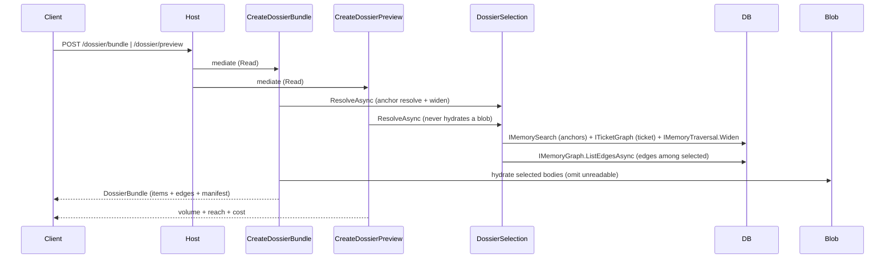

# DOSSIER_AGENTS.md

## TL;DR

Deterministic side of HLD-005 contextual export: `POST /api/context/dossier/bundle` and `.../dossier/preview`. The API assembles the **bundle** (selected memories + edges + manifest); the **dossier skill** composes the document. This feature is selection and materialisation only — no model, no judgement, no write.

## Non-Negotiables

- **Never call a model from Application or Host.** Selection is mechanical; ordering, collapse and findings are the skill's.
- **Never extend the forensic `export` CLI.** Separate path (LADR-01). The dossier reuses `ExportBlobReader` (internal) for body reads only — it does not touch `Features/Export` handlers.
- **Never default the widening bound.** `WidenDepth` is required on the wire (`1..5`), refused at the validator **and** the store layer (`NpgsqlMemoryTraversal.WidenAsync` throws outside 1-5). No server-side default.
- **Scope-gate every vertex crossed with `MemoryScopeFilter.HiddenDimensions`, not `Plan().ExcludedDimensions`** (empty for every explicit dimension). A path through a hidden memory is dropped whole, never shortened.
- **Never write.** No version, edge, label registration, or blob. The selection path never calls `SaveChanges`.
- **No generation timestamp anywhere in the payload** — that would break byte-equality (NFR-02). Stored times are data.
- **`kind = understanding` is a kind like any other** (LADR-15): same selection, widening, scope gating, citation, reconciliation, read-only. Adds no special path.
- **Omission reasons come from the bounded set** in `DossierOmissionReason` — exactly `cap reached`, `depth reached`, `unreadable body`, `collapsed into another claim`, `hidden by scope`. No free text (NFR-04).
- **`outside-focus` (named in HLD-005 NFR-04) is deliberately NOT a bundle `omitted` reason.** It is a composition/focus-side concept owned by the blocked, skill-side dossier workstream; the deterministic bundle has no focus, so it never emits it. Do not add it to `DossierOmissionReason` to "complete" the set against NFR-04 — that would let a future version disagree with the preview over one selection. The focused-dossier omission accounting is the skill's to implement.
- **`manifest.limitsHit` is a deliberate subset of `DossierOmissionReason`, not a separate set** — only `depth reached` and `cap reached`, i.e. the limits the blob-free preview can foresee. The per-item `cap reached` a history-inflated cut produces stays in the `omitted` list and never enters `limitsHit` (the preview could not have predicted it). `DossierLimitHit.Limit` is populated from the same enum constants, so no second bounded set exists.

## System Context

```mermaid
sequenceDiagram
    participant Client
    participant Host
    participant Bundle as CreateDossierBundle
    participant Preview as CreateDossierPreview
    participant Sel as DossierSelection
    participant DB
    participant Blob

    Client->>Host: POST /dossier/bundle | /dossier/preview
    Host->>Bundle: mediate (Read)
    Host->>Preview: mediate (Read)
    Bundle->>Sel: ResolveAsync (anchor resolve + widen)
    Preview->>Sel: ResolveAsync (never hydrates a blob)
    Sel->>DB: IMemorySearch (anchors) + ITicketGraph (ticket) + IMemoryTraversal.Widen
    Sel->>DB: IMemoryGraph.ListEdgesAsync (edges among selected)
    Bundle->>Blob: hydrate selected bodies (omit unreadable)
    Bundle-->>Client: DossierBundle (items + edges + manifest)
    Preview-->>Client: volume + reach + cost
```

## Architecture Decisions

### LADR-201: Two slices, one shared deterministic selection

- **Date**: 2026-09-22
- **Status**: Accepted
- **Context**: Bundle and preview must resolve the *same* selection (LADR-14 binds them to one recorded selection), and preview must never hydrate a body (NFR-03).
- **Decision**: `CreateDossierBundle` and `CreateDossierPreview` are separate Mediator slices sharing `DossierSelection.ResolveAsync` (anchor resolve + widen + mechanical collapse + deterministic ordering). The preview slice takes **no** `IBlobStorage` — it is blob-free by structure, so the zero-blob-read guarantee is structural, not behavioural.
- **Consequences**: A change to selection semantics lands once. The preview cannot hydate a body because it has no blob capability.

### LADR-202: Widening is a new store read, not N traversals

- **Date**: 2026-09-22
- **Status**: Accepted
- **Context**: LADR-03 rejects N per-anchor traversals.
- **Decision**: `IMemoryTraversal.WidenAsync(MemoryWidenQuery)` widens from a set of anchor identities in one statement, gating every vertex against `HiddenDimensions`, and enforces the 1-5 bound at the store layer.
- **Consequences**: One round trip per bundle; the store-layer bound is non-bypassable.

### LADR-203: Mechanical collapse only, on the bundle

- **Date**: 2026-09-22
- **Status**: Accepted
- **Context**: LADR-05 puts mechanical collapse on the reproducible side; semantic consolidation is the skill's.
- **Decision**: The bundle dedups to one item per memory-version, and collapses distinct memories whose inlined body is identical (`collapsed into another claim`). The bundle never merges equivalents by meaning.

## Key Behaviors

- **Anchor resolution**: repo/initiative/tags/kind/status via `IMemorySearch` (one statement, indexes); the ticket via `ITicketGraph.TraverseAsync` (mirrors `FindTicketPaths`, grants no scope consent). Within a category values are alternatives; across categories conjunctive (intersection).
- **A no-match is a no-match**: an empty anchor set returns an empty bundle with `manifest.noMatch = true`, never broadened.
- **Edges are read for the selection, never for the whole store.** `DossierSelection` calls `IMemoryGraph.ListEdgesAsync(selectedUuids)`, an index-served per-uuid read (HLD-003 LADR-06), so the cost is bounded by the selection size. `IMemoryGraph.ListAllAsync` is the whole-edge read; do not substitute it here — that is the scan this bounded call exists to avoid.
- **The bundle's `manifest.selectedCount` equals `items.Count + omitted.Count`** (NFR-04 reconciliation left-hand side).
- **Preview `volume.selected` and bundle `manifest.selectedCount` are deliberately different quantities.** The preview reports distinct current memories (`selection.Selected.Count`); the bundle reports present + omitted version rows. Do not "fix" the two to agree — the latter is the NFR-04 reconciliation left-hand side, the former is the consent-surface volume.
- **The bundle's `manifest.limitsHit` reports only the limits the preview can foresee**: `depth reached`, and `cap reached` when the selection fills the fetch ceiling — whether via the `LimitReached` flag or `Selected.Count` reaching `ItemLimit` (the anchor search exposes no truncation signal, so the ceiling-fill is reported from the selected count). A history-inflated item cut (many versions of few selected memories) is disclosed by the bundle through its omitted list (per-item `cap reached`), never through `limitsHit` — the preview is blob-free by structure and cannot predict it, so it must not appear in a consent artefact it was never shown.
- **Cut-on-cap is decided by the ordering** (validity, capture, identity), never by what the traversal reached first.
- **The manifest records the effective selection** (criteria, combination rule, widening bound, history policy, retrieval policy) in a form sufficient to repeat it (BR-20 / LADR-14). Tags are recorded ordinal-sorted so reordering a request changes nothing.
- **`IncludeHistory`** adds non-current versions of selected memories as separate items; the history policy is recorded in the manifest.

## Test References

- L0: `tests/.../Application.UnitTest/Features/ContextDossier/` — validators (depth absent/0/6 refused), provenance tiebreak, bounded omission reasons, no generation timestamp (schema-level), mechanical collapse, manifest count == item count, payload byte-equality, kind=understanding like any kind.
- L1: `tests/.../Application.ComponentTest/Features/DossierBundleHandlerTests.cs` — byte-identity across calls and restart (a fresh EF context + handler + data source over the same store, so no in-process caching or hash-seed dependence leaks into the bytes), reorder anchors/tags, hidden-dimension drop at depth, preview blob-free, zero-write, understanding citation, store-layer depth refusal.
- L1 evidence (env-gated): `tests/.../Application.ComponentTest/Features/DossierWorkflowBenchmarkTests.cs` — the NFR-03 reference-workflow measurement harness (`SMOOTH_DOSSIER_BENCH=1`). It seeds a representative store and records slice size, item-limit fit, payload size, and preview/bundle latency for the spec-preparation, handover and re-entry workflows. Reported values are evidence, never an asserted cap.

## Migration Plans

- The numeric item limit is provisional (`DossierDefaults.ItemLimit`) pending reference-workflow validation; recorded per export, never cited as a specification (NFR-03). It is deliberately bound to the selection path's fetch ceiling (`MemorySearchDefaults.MaxLimit`, 200) so the stated cap is the effective, reachable bound — a higher stated cap would be an unreachable number that can never be hit or reported.
- **Historical (2026-09-23):** earlier this dropped to 200 because selection fetched at `MemorySearchDefaults.MaxLimit`, so a 500 cap was unreachable. Any later raise of `MemorySearchDefaults.MaxLimit` must keep the dossier cap equal to it, or the cap is again dead.
- The dossier skill (composition, focus, findings taxonomy) and tag identity/synonyms remain separate, blocked workstreams — not part of this deterministic side.

## Changelog

| Date | Change | Ref |
|:-----|:-------|:----|
| 2026-09-27 | Record pass: documented the deliberate bounded-reason relationships so a future reader does not "fix" them — `DossierOmissionReason` is exactly the 5 bundle values (no `outside-focus`, which is the blocked skill-side composition's); `limitsHit` is a subset of that same enum (`depth reached`, `cap reached` only), not a separate set. | record pass, HLD-005 NFR-04 |
| 2026-09-22 | Created — deterministic bundle/preview half of HLD-005 contextual export. Bundle + preview slices, shared selection, new store widening read, two Host endpoints, L0 + L1 tests. | HLD-005 |
| 2026-09-23 | Added the NFR-03 reference-workflow measurement harness (`DossierWorkflowBenchmarkTests`, `SMOOTH_DOSSIER_BENCH=1`) and the NFR-02 cross-restart byte-equality L1 test. Recorded that the selection caps at 200 (MaxLimit), not the 500 item cap. | HLD-005 NFR-02/NFR-03 |
| 2026-09-23 | Migration Plans updated to the shipped state: the dossier item cap is bound to the selection fetch ceiling (`MemorySearchDefaults.MaxLimit`), resolving the earlier 500-vs-200 flag rather than leaving it open. | HLD-005 NFR-03 |
| 2026-09-24 | Post-merge review follow-up: preview validator tests now mirror the bundle's (depth bounds incl. `-1`/`MaxDepth + 1`, ticket key/provider pairing); the hidden-path L1 test also asserts the visible neighbour and its anchor edge survive; the restart test's comment no longer claims hash-seed coverage a same-process restart cannot give. | PR #99 review |
| 2026-09-26 | The zero-match ticket short-circuit propagates the ticket traversal's disclosure flags instead of hardcoding all three false, so a ticket that hit a depth/path/memory limit and yielded zero identities reports a truncated-empty result rather than a complete-empty one. `HiddenPathDropped` stays false there because the short-circuit returns before any edge is read. No test supplies a ticket anchor yet. | PR #118 review |
| 2026-09-27 | `DossierSelection.BuildLimitsHit` also reports `cap reached` when `Selected.Count` reaches `ItemLimit`, closing the ceiling-fill gap: the anchor `IMemorySearch.SearchAsync` exposes no truncation signal, so a selection that filled the fetch ceiling (with no widen/ticket limit flag) was previously reported as hitting no limit and a truncated result presented as unbounded. Both slices compute it from `Selected.Count`, so bundle/preview convergence is preserved. | PR #120 review |
| 2026-09-27 | The bundle's `manifest.limitsHit` and the preview now share one limit builder (`DossierSelection.BuildLimitsHit`) and report the same set — only `depth reached`, and `cap reached` on a fetch-ceiling `LimitReached` *or* a `Selected.Count` at the ceiling (see the 2026-09-27 `DossierSelection.BuildLimitsHit` changelog row for the ceiling-fill addition). The bundle no longer adds `cap reached` to `limitsHit` from a history-inflated item cut (that stays disclosed per-item in the `omitted` list), because the preview is blob-free by structure and could not have predicted it. Documented that preview `volume.selected` (distinct current memories) and bundle `manifest.selectedCount` (present + omitted version rows) are deliberately different quantities. Added the first ticket-anchor fixture test hitting the truncated-empty path. | PR #120 review |
| 2026-09-27 | The bundle slice converts those same disclosure flags on its zero-match path instead of hard-coding `limitsHit: []`, so a truncated-empty bundle and the preview over the same selection no longer disagree; it reuses the bundle's existing limit conversion, which reduces to exactly the preview's two cases when nothing is selected. Reconciliation is unaffected — `limitsHit` is not part of `selectedCount == items + omitted`. No executed coverage: no test supplies a ticket anchor. | PR #118 review |
| 2026-09-27 | Context sync for the bounded edge load: the sequence diagram and Key Behaviors name `IMemoryGraph.ListEdgesAsync(selectedUuids)` (index-served per uuid, HLD-003 LADR-06) instead of the whole-edge `ListAllAsync`, which this feature must not restore. | pre-MVP review loop |
| 2026-09-30 | **`DossierOmittedItem` carries the version, and widening now applies the proposed rule.** (1) The omission record gained `Version`. The cap cut and the collapse cut are both decided per item, so on a bundle requested with `IncludeHistory` an omission naming only the memory cannot say which version was cut — and the same memory then legitimately appears in both `items` and `omitted`, which the composer cannot distinguish from the double-count it refuses to render. The reconciliation's left-hand side is per item, so the omission has to be too. (2) `MemoryWidenQuery` gained `ExcludeProposed` (default `true`) and `NpgsqlMemoryTraversal`'s widening SQL replaced `(@status IS NULL OR v.status = @status)` with the parenthesised form the other two stages already use. Widening was the only one of the three dossier selection stages carrying no proposed rule, so a proposed memory one hop from an approved anchor was selected while `RetrievalPolicy` recorded `current-only, proposed-excluded` — the manifest asserting the opposite of what the selection did. The default is what closes it, and the call site states it: each stage having to be told the same rule separately is the drift class this is the third instance of. The stage-1 ticket regression test was green for the wrong reason — its seed created no `LINKS` edge to the proposed memory, so widening ran, found nothing, and the control asserted the exclusion of a memory widening could not have returned; the seed now carries the edge, and the test fails without the fix. | HLD-005 LADR-03, NFR-02 |
| 2026-10-01 | **The second no-match return keeps the ticket traversal's disclosure.** `DossierSelection` had two empty returns: the ticket-yields-nothing one propagated the traversal's depth/path/memory flags, but the anchor-search-matches-nothing one hard-coded both limits `false`. A ticket walk cut short at its depth or memory bound whose surviving identities the repo/kind/status criteria then all rejected was therefore reported as complete-empty, and both bundle and preview carried an empty `limitsHit`. The flags are now computed once and used by all three returns. Pinned by `DossierSelectionTests` (L0, fake stores), which fails on `DepthLimitReached` without the change. | HLD-005 NFR-04 |
| 2026-10-01 | **The three selection stages are built from one `SelectionFilter`.** The ticket traversal, anchor search and widening each had kind, status, the proposed rule, scope and `AsOf` set by hand, and each of `AsOf`, the ticket status opt-in and the widening proposed rule drifted once. `SelectionFilter.From(anchor)` now resolves those predicates once and is the only constructor of the three stage queries (`TicketTraversal`, `AnchorSearch`, `Widen`), so a new predicate lands in one place. `ExcludeProposed` is stated rather than left to each query's default. Behaviour-preserving: the dossier L1 tests are unchanged and green. The ticket traversal still carries no `AsOf` — its identities only narrow the anchor search, which applies the window. `DossierSelectionTests` asserts that every stage query carries the filter's predicates. | HLD-005 LADR-03 |
| 2026-10-01 | Handler-level L1 coverage for two guarantees that were only asserted in L0: (1) bundle item order is the bundle's own row ordering (validity, capture, identity, version), pinned on a five-row seed with a history row valid before every other row, which the selection's per-memory order would place last; (2) a non-null `AsOf` (sent at `+02:00`) withholds a memory whose validity starts after it from both the anchor and the widening stage, against a no-`AsOf` control that reaches both. Every earlier handler test passed `AsOf: null`. | HLD-005 NFR-02, LADR-07 |
