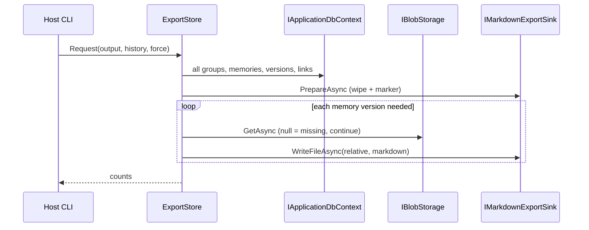

# EXPORT_AGENTS.md

## TL;DR

One-way generated Markdown projection of the store (groups, memories, current versions, history on request). Reconstructs documents from hash-addressed blobs plus database metadata. **Generated, never maintained** — disposable, regenerable, never hand-edited, never imported back.

## Non-Negotiables

- **Generated, never maintained.** Output is a projection. Hand-editing it is a defect. There is no import path and there must not be one — ADR-0002 chose database-as-truth; import would reverse that by the back door.
- **Current-only by default.** `--history` adds version chains as extra sections in the same file. History is not the default — it duplicates content and would swamp the tree.
- **Blob bodies are inlined.** Never print a content hash as if it were the document. A missing blob warns and continues; a non-text blob is noted and omitted.
- **Relationships live in file content.** `group_uuid` is written into every memory file. Directory placement is navigation, not proof. A prior trial encoded the parent only in the path; a moved file lost it silently.
- **Forensic dump, not HTTP retrieval.** Export bypasses `MemoryScopeFilter` and does not use `IMemorySearch`. Programme rows are included and marked. LADR-003 stays HTTP-only.
- **Never log memory content.** Information = lifecycle + counts. Debug = per-entity uuid. Warning = missing/non-text blob (uuid + version, not address or body).
- **No schema change, no 8th entity, no API endpoint.**

## System Context

ADR-0002 made PostgreSQL the source of truth and recorded the cost: the store is opaque without tooling. ADR-0001 made blobs content-addressed, so a directory of SHA-256 hashes is no more readable than a table. This command is that tooling.

## Architecture Decisions

### LADR-101: Application policy, Infrastructure sink, Host argv

- **Date**: 2026-09-13
- **Status**: Accepted
- **Context**: The worktask allowed Infrastructure or a small console entry point. Clean Architecture forbids business rules in Infrastructure; a second console csproj is a second composition root.
- **Decision**: `Features/Export/` owns tree shape, frontmatter, slugs, collision, sort, and banners. `IMarkdownExportSink` writes bytes. Host parses `export` before `WebApplication.CreateBuilder` and composes `Host.CreateApplicationBuilder` + `AddApplication` + `AddInfrastructure` (user secrets loaded explicitly — the CLI host defaults to Production) — no Kestrel, no OpenAPI, no migrate-on-start. YAML is hand-rolled (no YamlDotNet): free-text scalars are quoted with `\n`/`\r`/`\t`/control-char escapes, and numeric-looking strings are quoted to keep their YAML type `string`.
- **Consequences**: L0/L1 live under Application tests. `System.CommandLine` is Host-only.

### LADR-102: Forensic dump bypasses MemoryScopeFilter

- **Date**: 2026-09-13
- **Status**: Accepted
- **Context**: HTTP retrieval hides `program` so it cannot be cited as shipped product fact. Export answers "what does it actually know?"
- **Decision**: Read `IApplicationDbContext` DbSets directly. Include every scope and status. Mark `program` and `self` with YAML `scope:` plus a body banner.
- **Consequences**: LADR-003 is unchanged for HTTP. Export never calls `IMemorySearch`.

### LADR-103: Wipe-and-rewrite behind a marker

- **Date**: 2026-09-13
- **Status**: Accepted
- **Context**: Merging into an existing tree leaves ghost files after a store delete, so two runs of the same store would not be byte-identical.
- **Decision**: Write marker `.context-memory-export`. Wipe when the directory is empty or contains the marker. Refuse an unmarked non-empty directory unless `--force`. Refuse `/` and a directory that is a git root.
- **Consequences**: Default output `.context/export/` (gitignored). Tests use `--force` or a fresh temp dir.

### LADR-104: Generated, never maintained

- **Date**: 2026-09-13
- **Status**: Accepted
- **Context**: A trial's hand-written index became a maintenance obligation and drifted immediately.
- **Decision**: One-way projection. Every file carries a GENERATED marker. Output directories are gitignored. No import, no Obsidian wiki-links, no graph view.
- **Consequences**: Adding import later is a defect against ADR-0002.

## Key Behaviors

- **Run:** `dotnet run --project src/SmoothAiProductContextMemory.Host -- export [--output DIR] [--history] [--force]`. Needs the same `ConnectionStrings:SmoothAiProductContextMemory` and `BlobStorage:*` as the API (Aspire AppHost or user secrets). Missing schema fails the command — export does not migrate.
- **Layout:** `groups/<group-slug>/_group.md` and `groups/<group-slug>/mem-<subject-slug>.md`.
- **Group slug:** `Slug.Subject` of the current `GroupDescription.Name` (highest version). No/unslugable name → `group-<uuid>`. Slug clash (Uuid-sorted): first keeps the clean name; later get `--` + first 8 hex of `Uuid` (`N` format); if that still clashes, full 32-hex `Uuid` (guaranteed unique).
- **Memory file clash:** same suffix rule. In-group `subject_slug` is unique, so this is a backstop.
- **Frontmatter** is a closed key list, fixed order, UTF-8 no BOM, LF scaffolding, exactly one trailing newline on the file. No `exported_at`. Timestamps use `DateTimeOffset` round-trip `"O"`.
- **Both time axes:** `valid_from` / `valid_until` = business time; `created_on` = system time.
- **`--history`:** extra `## Version N` (and extra group-description sections) in the same file, version descending, excluding current. Default omits them.
- **Links** are listed in the memory file (outgoing and incoming): relation, reason, other uuid, subject, other `group_uuid`. No extra graph files.
- **Empty store:** marker only; no `groups/` directory; does not throw.
- **Empty group:** still emits `_group.md`.
- **Plaintext on disk.** Output inherits the store's sensitivity. `--history` may include unredacted older versions. Keep it gitignored and locally encrypted.

## Requirements

Approved WT-4 Phase 4 plan (2026-09-13):

1. `IMarkdownExportSink` in Application; `FileSystemMarkdownExportSink` in Infrastructure.
2. Pure `ExportPaths` + `ExportRenderer` (L0-tested).
3. `ExportStore` Mediator slice: `Request(OutputDirectory, IncludeHistory, Force)`.
4. Host CLI: `dotnet run --project src/SmoothAiProductContextMemory.Host -- export [--output DIR] [--history] [--force]`.
5. Gitignore `export/` and `.context/export/`. Root `AGENTS.md` command list updated.

## Test References

- L0: `tests/SmoothAiProductContextMemory.Application.UnitTest/Features/Export/` — paths, collision, frontmatter order, banners, history on/off, missing-blob note, encoding, gitignore exact lines.
- L1: `tests/SmoothAiProductContextMemory.Application.ComponentTest/Features/ExportStoreHandlerTests.cs` — seeded store vs real Postgres; byte-identical re-run; blob inline; missing blob warns; current-only vs `--history`; `program`/`self` banners; empty store; name clash; links; `group_uuid` in file content.

## Quality Constraints

- Determinism over performance. Stream blobs one at a time; dispose each `BlobContent`.
- Scaffolding is LF even on Windows. Blob bytes are inlined as decoded UTF-8 without rewriting their interior newlines.

## Changelog

| Date | Change | Ref |
|:-----|:-------|:----|
| 2026-09-13 | Created — generated Markdown export contract (WT-4). | WT-4 |
