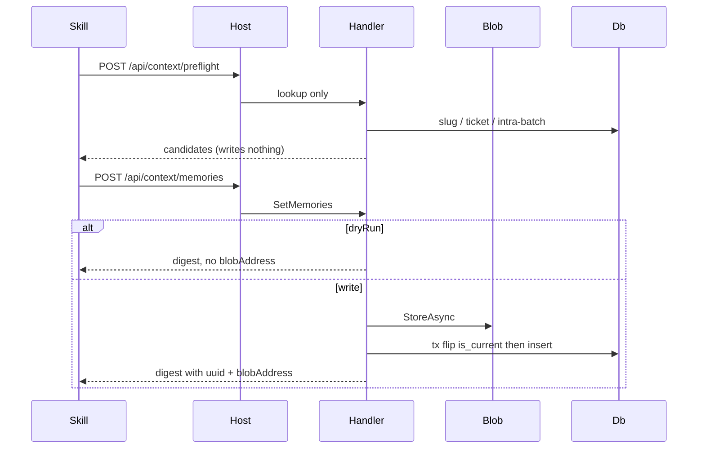

# FEATURES_AGENTS.md

## TL;DR

HTTP API the context-memory skill consumes — uuid-only wire, Mediator slices, lookup/mechanics only; skill owns judgement.

## Non-Negotiables

- **Wire identity is `uuid`, never the surrogate `bigint`.** Handlers resolve FKs internally.
- **No LLM in Application/Host.** Preflight is exact-match recall (`subject_slug`, ticket hits, intra-batch slug collisions). Skill decides new / version / skip and typed links.
- **Never expose or let the caller set `is_current`.** `SetMemories` owns the flag in one transaction: flip old current off, then insert the new current. A failure between those statements strands zero currents — a state no constraint forbids.
- **Dry-run skips blob and `SaveChanges`.** Do not begin-then-rollback: blob writes sit outside Postgres and would orphan objects. `blobAddress` is null on dry-run.
- **Never `DeleteAsync` on the write path.** Content-addressed blobs are shared; "orphan" means drop the DB reference only.
- **Do not add a LabelUsage entity** for the `label_usage` view — the seven-type model-shape guard fails on purpose.
- **`kind` is an open string**, not an enum or check constraint.
- **Programme scope is never citable as product fact.** Default query omits `scope_dimension = program` unless the caller filters by that scope, a group uuid, or a ticket (in-group context). `self` is always returned with `scopeDimension`. Write path does not reject programme.
- **Never log statement, summary, content, or blob address at Information.**

## System Context

Skill is the only writer and the only judge. This layer persists what the skill already resolved and returns cheap fields for retrieval. Blob bodies go through `IBlobStorage`; PostgreSQL stays an index.

## Architecture Decisions

### LADR-001: IApplicationDbContext in Application

- **Date**: 2026-09-10
- **Status**: Accepted
- **Context**: Handlers need `DbSet` and transactions; Application must not reference Infrastructure types.
- **Decision**: `IApplicationDbContext` in `Common/Persistence/`; `SmoothAiProductContextMemoryDbContext` implements it; DI maps scoped.
- **Consequences**: Application references EF Core abstractions. Seven `DbSet`s only. `label_usage` is queried as SQL into an unmapped DTO.

### LADR-002: Dry-run persist gate, not rollback

- **Date**: 2026-09-10
- **Status**: Accepted
- **Context**: Blob store is outside the Postgres transaction.
- **Decision**: `DryRun` on `SetMemories.Request`; skip `StoreAsync` and `SaveChangesAsync`.
- **Consequences**: Dry-run and write share one handler. Rolling back a transaction would still leave blobs.

### LADR-003: Scope filter in Application

- **Date**: 2026-09-10
- **Status**: Accepted
- **Context**: Programme knowledge must not appear as shipped product behaviour; blob is proxied so MinIO URLs cannot bypass the rule.
- **Decision**: Shared `MemoryScopeFilter`. Default omit `program` on open search. Explicit scope/group/ticket includes those rows, still tagged. Blob GET of a known uuid is allowed (drill-down); query is what hides programme from product search.
- **Consequences**: First tests of this rule live in L0 (filter) and L2 (HTTP query).

### LADR-004: SET LOCAL has no HTTP caller

- **Date**: 2026-09-10
- **Status**: Accepted
- **Context**: WT-2 AC mentioned cascade-delete `SET LOCAL`; ADR-0003 has no DELETE.
- **Decision**: Do not add a delete endpoint or unused bypass helper. Persistence L1 already covers the trigger.
- **Consequences**: A future purge endpoint must use `SET LOCAL` inside an explicit transaction, never plain `SET`.

## Key Behaviors

- Retrieval defaults to **current-only** and **excludes `proposed`**. History is `GET .../versions`. Empty query is `200 []`.
- API digest is a persist receipt: `created` / `versioned` / `linked` / `labelsProposed`; `skipped` and `diverged` are always 0 here. Skill composes the human digest.
- API persists `status` as given — no re-gate by kind.
- Resolve-or-create matches by ticket (200 existing group) or creates (`local:<guid>` when untracked). Initiative is a **name** (entity has no uuid); default `to-be-decided`. Optional repo/scope apply on **create only**.
- Ticket uniqueness is soft: resolve returns the owning group. Exact `(group_id, subject_slug)` unique index is the only in-DB subject backstop.
- Sources and tickets serialize only through `JsonShapeDocument` so `v` is never hand-written.
- D42 summary stamp is jsonb `SummaryStampDocument` on `memory_version`; `append_only_guard` equality list includes `summary_stamp`.

## Test References

- L0: `tests/SmoothAiProductContextMemory.Application.UnitTest/Features/` (validators, `MemoryScopeFilter`)
- L0: `tests/SmoothAiProductContextMemory.Host.UnitTest/` (ProblemDetails mapping)
- L1: `tests/SmoothAiProductContextMemory.Application.ComponentTest/Features/` (handlers vs real Postgres)
- L2: `tests/SmoothAiProductContextMemory.Host.IntegrationTest/` (HTTP round-trips, scope enforcement, dry-run, Scalar/OpenAPI)

## Quality Constraints

- Target query (current, approved, facet, repo, ticket, in-scope, validity) must stay index-served. `memory_group.repo` has a btree for that query.
- Bind locally; no auth. Do not return raw blob URLs.

## Changelog

| Date | Change | Ref |
|:-----|:-------|:----|
| 2026-09-10 | Created — ADR-0003 API surface, uuid wire, dry-run persist gate, scope filter, D42 stamp. | WT-2 |
