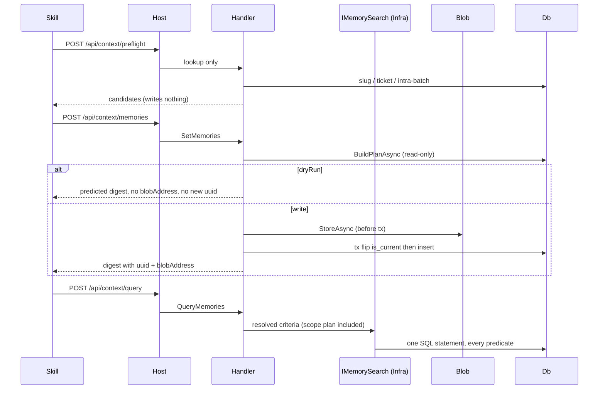

# FEATURES_AGENTS.md

## TL;DR

HTTP API the context-memory skill consumes — uuid-only wire, Mediator slices, lookup/mechanics only; skill owns judgement. Retrieval runs in PostgreSQL; the dry run runs the real plan.

## Non-Negotiables

- **Wire identity is `uuid`, never the surrogate `bigint`.** Handlers resolve FKs internally.
- **No LLM in Application/Host.** Preflight is exact-match recall (`subject_slug`, ticket hits, intra-batch slug collisions). Skill decides new / version / skip and typed links.
- **Never expose or let the caller set `is_current`.** `SetMemories` owns the flag in one transaction: flip old current off, then insert the new current. A failure between those statements strands zero currents — a state no constraint forbids.
- **Dry run and write share one plan, not just one handler.** Every verdict is reached in `BuildPlanAsync`, which mutates nothing; only the persist step branches. A shortcut dry-run path stops predicting the write, and this endpoint is the caller's only pre-write veto point.
- **Dry-run skips blob and `SaveChanges`.** Do not begin-then-rollback: blob writes sit outside Postgres and would orphan objects. `blobAddress` and (for planned creates) `uuid` are null on dry run.
- **Blobs are stored before the transaction opens**, never inside it. They are content-addressed and immutable, so the write is idempotent on retry and the transaction never stays open across object-storage round trips.
- **Never `DeleteAsync` on the write path.** Content-addressed blobs are shared; "orphan" means drop the DB reference only.
- **No predicate is evaluated in the handler.** Retrieval goes through `IMemorySearch`; filtering materialised rows defeats the full-text/array/validity indexes and drags whole version chains over the wire.
- **Never classify a database error by message text.** `IDbErrorMapper` matches SQLSTATE. Substring matching mis-fires on any message containing a word like "unique", and provider text must never reach the caller.
- **Do not add a LabelUsage entity** for the `label_usage` view — the seven-type model-shape guard fails on purpose.
- **`kind` is an open string**, not an enum or check constraint.
- **Programme scope is never citable as product fact.** `MemoryScopeFilter.Plan` is the one source of truth and is expressed as *data* so the provider can push it into SQL. Default query omits `scope_dimension = program` unless the caller filters by that scope, a group uuid, or a ticket (in-group context). `self` is always returned with `scopeDimension`. The same plan gates the blob proxy and version history. Write path does not reject programme.
- **Never log statement, summary, content, or blob address at Information.** Counts and lifecycle at `Information`, per-operation decisions at `Debug`.

## System Context

Skill is the only writer and the only judge. This layer persists what the skill already resolved and returns cheap fields for retrieval. Blob bodies go through `IBlobStorage`; PostgreSQL stays an index.

## Architecture Decisions

### LADR-001: IApplicationDbContext in Application

- **Date**: 2026-09-10
- **Status**: Accepted
- **Context**: Handlers need `DbSet` and transactions; Application must not reference Infrastructure types.
- **Decision**: `IApplicationDbContext` in `Common/Persistence/`; `SmoothAiProductContextMemoryDbContext` implements it; DI maps scoped.
- **Consequences**: Application references EF Core abstractions. Seven `DbSet`s only. `label_usage` is queried as SQL into an unmapped DTO.

### LADR-002: Dry run is the real plan, gated at persist

- **Date**: 2026-09-11 (supersedes the 2026-09-10 "persist gate, not rollback" decision)
- **Status**: Accepted
- **Context**: The blob store is outside the Postgres transaction, so a dry run cannot be a rollback. The first implementation of that rule went further than needed and gave the dry run its own shorter path, which then failed to predict duplicate links, already-registered labels and subject collisions.
- **Decision**: `BuildPlanAsync` resolves every write against stored state and mutates nothing. `Predict` reports the plan's counts; `PersistAsync` executes the same plan. Both paths throw on the same conflicts.
- **Consequences**: One extra read pass on the write path, in exchange for a veto point that means something. `ItemResult.Uuid` is nullable because a planned create has no identity until persist.

### LADR-003: Scope rule as data, applied on every read path

- **Date**: 2026-09-11 (extends the 2026-09-10 scope-filter decision)
- **Status**: Accepted
- **Context**: Programme knowledge must not appear as shipped product behaviour. The rule was originally a boolean predicate, which forced the query handler to materialise rows and filter them in memory — and left the blob proxy unguarded, so a caller holding a uuid could read what the query hid.
- **Decision**: `MemoryScopeFilter.Plan` returns `(RequiredDimension, ExcludedDimensions)`. The query handler passes it into `MemorySearchCriteria` so it becomes SQL. `GetMemoryBlob` and `GetMemoryVersions` take `?scope=` and apply the same plan, returning `403` when the dimension is hidden. `IncludeGroup` is kept as the readable statement of the rule and is derived from `Plan`, so the two cannot drift.
- **Consequences**: Scope is enforced at L0 (plan + predicate), L1 (SQL against real Postgres) and L2 (HTTP query, blob and version history). Reading a programme-scoped memory's blob or version history now requires the caller to declare the dimension it is reading as.

### LADR-004: SET LOCAL has no HTTP caller

- **Date**: 2026-09-10
- **Status**: Accepted
- **Context**: WT-2 AC mentioned cascade-delete `SET LOCAL`; ADR-0003 has no DELETE.
- **Decision**: Do not add a delete endpoint or unused bypass helper. Persistence L1 already covers the trigger.
- **Consequences**: A future purge endpoint must use `SET LOCAL` inside an explicit transaction, never plain `SET`. The append-only trigger is therefore **unreachable through the API** — no request can UPDATE or DELETE history — so its HTTP mapping is proven at L0 on the mapper, not by an L2 round trip.

### LADR-005: Retrieval lives in Infrastructure behind IMemorySearch

- **Date**: 2026-09-11
- **Status**: Accepted
- **Context**: Matching the indexes ADR-0002 defines needs provider-specific operators — `to_tsvector`/`plainto_tsquery` for full text, `@>` for facet and tag arrays. Those come from the Npgsql EF provider, which Application must not reference. Composing the query in Application therefore meant filtering in memory.
- **Decision**: Application owns `IMemorySearch` + `MemorySearchCriteria` (a fully resolved request, including the scope plan and the resolved group id). `NpgsqlMemorySearch` in Infrastructure translates it and projects straight to `CheapMemory`.
- **Consequences**: The handler resolves identity and policy; the provider translates predicates. Facet/tag containment uses a small `FROM` fragment because `EF.Functions` exposes no array-containment helper and LINQ's `Contains` translates to `= ANY`, which the GIN indexes do not serve — column names are literals, values are parameters. `plainto_tsquery` must stay inside the expression tree; hoisting it to a local throws.

### LADR-006: Database errors are classified by SQLSTATE

- **Date**: 2026-09-11
- **Status**: Accepted
- **Context**: The first implementation matched substrings of exception messages (`"unique"`, `"23505"`, `"Append-only history"`) in both Application and Host. That mis-classifies any message that happens to contain those words, and depends on provider locale and version.
- **Decision**: `IDbErrorMapper.TryMap` in Application; `NpgsqlDbErrorMapper` in Infrastructure matches `PostgresException.SqlState` and returns fixed message strings. Unrecognised exceptions return `false` so they propagate with their stack intact.
- **Consequences**: Host no longer inspects exception text. Constraint violations cannot leak SQL, column names or values. `DbExceptionMapping` is gone; handlers take the mapper and call `SaveOrMapAsync`.

### LADR-007: The facet endpoint is the view unioned with the registry

- **Date**: 2026-09-11
- **Status**: Accepted
- **Context**: Usage is derived from facets actually in use; the registry is deliberately non-enforcing. Reading the registry and joining usage onto it hid every facet in use that nobody had registered — exactly the drift the endpoint exists to surface.
- **Decision**: `GetLabels` unions the `label_usage` view with the registry. `status` is the registry status, or null when the facet has no registry row.
- **Consequences**: A caller can see unregistered vocabulary and propose it. `LabelRow.Status` is nullable.

### LADR-008: A stale derived link is skipped, not fatal

- **Date**: 2026-09-11
- **Status**: Accepted
- **Context**: Links arrive derived, alongside the memories they describe. Failing the whole `set` on a link that already exists discarded a whole checkpoint's capture over a duplicate edge.
- **Decision**: In `SetMemories`, an already-present link (in the store or repeated in the batch) is counted in the digest's `skipped` and not written. The standalone `POST /links` still returns `409`, because there the link *is* the request.
- **Consequences**: `skipped` in the digest means "links skipped"; `diverged` stays 0 (V2). A self-link is still a `400` from the validator on both paths.

## Key Behaviors

- Retrieval defaults to **current-only** and **excludes `proposed`**. History is `GET .../versions`. Empty query is `200 []`. `limit` defaults to 50 and is capped at 200 — an uncapped read floods the caller's context.
- `asOf` narrows to claims valid at a business-time instant. Absent means no temporal narrowing.
- API digest is a persist receipt: `created` / `versioned` / `linked` / `skipped` / `labelsProposed`; `diverged` is always 0 here. Skill composes the human digest.
- API persists `status` as given — no re-gate by kind.
- **Subject uniqueness is checked before the write, not only by the index.** A create whose `subject_slug` already exists in the group is a `409` telling the caller to send a version bump — on the dry run too. Two items in one batch sharing a subject is the same `409`.
- Resolve-or-create matches by ticket (200 existing group) or creates (`local:<guid>` when untracked). Initiative is a **name** (entity has no uuid); default `to-be-decided`. Optional repo/scope apply on **create only** — use `PATCH /groups/{uuid}` afterwards.
- Ticket uniqueness is soft: resolve returns the owning group. Exact `(group_id, subject_slug)` unique index is the only in-DB subject backstop.
- Sources and tickets serialize only through `JsonShapeDocument` so `v` is never hand-written.
- D42 summary stamp is jsonb `SummaryStampDocument` on `memory_version`; `append_only_guard` equality list includes `summary_stamp`.
- Error contract is RFC 7807 on `application/problem+json` for every failure: `400` validation, `403` scope, `404` missing, `409` conflict, `500` with a fixed detail.

## Known Limitations

- **A link between two memories that are both new in the same batch cannot be expressed.** `MemoryWrite.Uuid` means "version this existing memory", so a create has no caller-known identity until persist, and `LinkWrite` addresses memories by uuid. Link the two in a follow-up `POST /links`, or send one of them first. Adding a batch-local reference is a wire-contract change and belongs with WT-3.
- **`ix_memory_version_validity` (GIST over `tstzrange`) is unreachable from LINQ**, which cannot construct a range from two columns. The `asOf` predicate is scalar and always combined with a narrowing predicate. Index usage is not asserted by a test: at test data volumes the planner correctly prefers a sequential scan regardless, so such a test would prove nothing. Verify with `EXPLAIN` against a realistic dataset.

## Test References

- L0: `tests/SmoothAiProductContextMemory.Application.UnitTest/Features/` (validators, `MemoryScopeFilter` predicate **and** plan)
- L0: `tests/SmoothAiProductContextMemory.Host.UnitTest/` (ProblemDetails mapping, 403, no-leak on unmapped)
- L0: `tests/SmoothAiProductContextMemory.Infrastructure.UnitTest/NpgsqlDbErrorMapperTests` (SQLSTATE classification, no provider text in messages)
- L1: `tests/SmoothAiProductContextMemory.Application.ComponentTest/Features/` (handlers vs real Postgres — ordered version bump, dry-run/write parity, skipped links, full text, facet/tag containment, `asOf`, current-only, limit)
- L2: `tests/SmoothAiProductContextMemory.Host.IntegrationTest/` (HTTP round-trips, scope enforcement on query, blob **and** version history, dry run, subject-collision 409, group patch, initiatives, facet vocabulary, Scalar/OpenAPI)

## Quality Constraints

- Target query (current, approved, facet, repo, ticket, in-scope, validity) is one SQL statement. `memory_group.repo` has a btree; facets/tags have GIN and are matched with `@>`; full text matches the two `to_tsvector('simple', … || ' ' || …)` GIN expressions verbatim — changing either concatenation silently drops the index.
- Bind locally; no auth. Do not return raw blob URLs.

## Changelog

| Date | Change | Ref |
|:-----|:-------|:----|
| 2026-09-11 | Review fixes: dry run shares the write plan (LADR-002); retrieval pushed into PostgreSQL behind `IMemorySearch` with `asOf` + `limit` (LADR-005); scope rule as data and enforced on the blob proxy (LADR-003); errors classified by SQLSTATE (LADR-006); facet endpoint reads the view (LADR-007); stale links skipped (LADR-008); `PATCH /groups/{uuid}` and initiative registry added; preflight narrows by kind before the cap. | WT-2 review |
| 2026-09-12 | /ai-review fixes: `GetMemoryVersions` scope-gated like the blob proxy (LADR-003 now covers versions too); `LabelsProposed` capped at 100; duplicate version-target in a batch is a `ConflictException` on both dry-run and write; letter/digit-free `Description` rejected as a 400 via `Slug.TrySubject`. | /ai-review PR #14 |
| 2026-09-10 | Created — ADR-0003 API surface, uuid wire, dry-run persist gate, scope filter, D42 stamp. | WT-2 |
