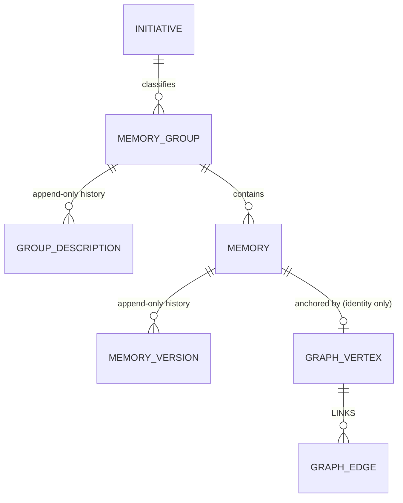

# PERSISTENCE_AGENTS.md

## TL;DR

EF Core + PostgreSQL index over blob-stored content. **Six** entities: `Initiative`, `Label`, `MemoryGroup`, `GroupDescription`, `Memory`, `MemoryVersion`. Relationships are Apache AGE edges in `memory_graph` (HLD 003 cutover) — not an EF entity. Authoritative model is `docs/hlds/001-context-memory-storage/`; graph rules live in `docs/hlds/003-graph-edges-on-age/`.

## Non-Negotiables

- **Six EF entities, no more.** The seventh (`MemoryLink`) was dropped deliberately in the HLD 003 cutover; keep the guard's literal list and `Length.ShouldBe(6)` together. Tags, facets, sources, repositories and ticket membership stay denormalised. HLD-003 LADR-08 implements identity-only graph Tickets, not another EF entity or relational ticket table.
- **Graph anchor lookups are property predicates, never inline maps.** `MATCH (n:Memory) WHERE n.memory_uuid = x`
  is served by `ix_memory_vertex_uuid`; `MATCH (n:Memory {memory_uuid: x})` compiles to `properties @>` and
  sequentially scans the vertex table. `MERGE` cannot be rewritten and has `ix_memory_vertex_properties` (GIN)
  instead. Both indexes are created by `20260914120000_AddGraphPropertyIndexes` and are invisible to the EF
  model snapshot, like every other graph object. Writing the wrong form is not a compile error and not a test
  failure — it is a plan regression, so check `EXPLAIN` (HLD-003 LADR-06).
- **Domain entities carry no EF attributes** and reference nothing from `Microsoft.EntityFrameworkCore`; all mapping is fluent in `Persistence/Configurations/`.
- **`MemoryVersion` and `GroupDescription` are append-only**, enforced by DB triggers. Never edit or delete a row in place — a correction is a new version with a higher version number.
- **Every JSONB element carries its own `v` shape marker** (`{"v":1,"provider":"jira","key":"ACM-1","url":"..."}`). It is set in exactly one place — `JsonShapeDocument.Create`/base `V` property — and never hand-written. Do not bypass the typed model. Retrofitting is impossible.
- **`kind` is open vocabulary.** It must not become a C# enum or a check constraint; new kinds emerge by design.
- **The migrations-history table is schema-pinned** via `MigrationsHistoryConvention` at every site that
  migrates. AGE session init sets `search_path = ag_catalog, "$user", public`, which makes
  `current_schema()` return `ag_catalog`; EF resolves an unqualified `__EFMigrationsHistory` against the
  current schema, so it looked in `ag_catalog`, concluded the database had never been migrated and
  re-applied `InitialCreate`. The first start of a fresh database succeeded because AGE is not installed
  yet when history is first read — **every start after that failed**. Every test tier recreates its
  database, so the suite is always a first start and never sees this. Do not drop the pin, and add it to
  any new `UseNpgsql` call site or history will split.
- **AGE session init is per physical connection**, via `NpgsqlDataSourceFactory` / `UsePhysicalConnectionInitializer`. Never initialise once at start-up — that prepares one pooled connection and leaves the rest failing under load (HLD 003 / LADR-04).
- **Do not model graph objects in EF.** `memory_graph`, `Memory` and `LINKS` are SQL-created and invisible to the model snapshot. HLD-003 LADR-08's `Ticket`/`TICKET_PARENT` follows the same boundary through `ITicketGraph` / `NpgsqlTicketGraph`, never a `DbSet`.
- **Never put a descriptive property on a vertex.** `Memory` holds only `memory_uuid`; `Vertex_CarriesIdentityOnly` remains a Memory-specific guard. `Ticket` holds only exact `provider`/`key`; no scope, owner, URL or copied metadata. HLD-003 LADR-08 superseded LADR-02 in writing before the ticket migration.
- **Never write a relationship to a table and the graph.** `memory_link` is gone; dual-write is a defect (LADR-03).
- **Owning-row cleanup is trigger-owned.** Memory cleanup is `BEFORE DELETE ON memory` (`memory_graph_cascade`), never a second C# path. Group-ticket cleanup uses `trg_ticket_graph_membership`. Explicit hierarchy remove/reparent is a separate operation, not permission to duplicate cascade cleanup.
- **Memory LINKS use read-before-write.** Uniqueness is `(source uuid, target uuid, relation)`; the same pair may hold different relations. Existing concurrent duplicate-create races are accepted for memory links, not for ticket one-parent/cycle invariants (HLD-003 LADR-08).
- **`Label` registry is advisory, not enforcing.** There is deliberately no FK from `memory.facets` to `label`. A facet absent from the registry must be accepted.

## System Context

The store is an index over content, not a content store. Document bodies live in blob storage (HLD 001 / LADR-06); PostgreSQL holds metadata, relationships, and everything filtered on. Blob content is therefore not indexable — the AI-generated `content_summary` and keywords are the search surface.



## Architecture Decisions

**LADR-001: Store history as tables, not JSONB arrays.** Appending to a JSONB array is read-modify-write, so concurrent appends silently lose one. A table `INSERT` is atomic, and history *is* the audit trail — silently losing entries defeats the additive-only guarantee. Consequence: `MemoryVersion` and `GroupDescription` grow monotonically.

**LADR-002 (superseded by HLD 003):** `MemoryLink` was a table so reverse lookup was an index seek. The HLD 003 cutover replaced it with AGE edges (`:LINKS` with `relation` + `reason`). Reverse lookup is Cypher one-hop keyed on `memory_uuid`. Uniqueness and cascade are application/trigger invariants (LADR-05), not a composite PK / FK.

**LADR-003: `Memory`/`MemoryVersion` split along the subject/claim line.** Description (subject) is stable by definition and is what deduplication matches on, so it and `subject_slug` live on the stable `Memory` row. Statement (claim) is volatile, so it lives on the versioned row. Tags and facets are classification, not claims, and are therefore unversioned — placing them on `Memory` is what makes that true.

**LADR-004: Two independent time axes on `MemoryVersion`.** `valid_from`/`valid_until` are business time (when it was true in the world); `created_on` is system time (when we recorded it). Neither derives from the other. Removing `created_on` makes correcting a record indistinguishable from the world changing.

**LADR-005: Three identity keys per memory.** Surrogate `bigint` (FK joins), `uuid` (logical identity, stable across versions), `lineage_id` (clone set across groups). Uuid equals lineage until a clone exists — correct, not redundant.

## Key Behaviors

- **Subject/claim**: `description` (stable, what dedup matches on) vs `statement` (volatile, what versioning replaces) must never be collapsed — that would destroy "same subject, new claim".
- **`sources` sits on the version**, because provenance records where *this claim* came from. v1 and v2 legitimately carry different sources.
- **`is_current` flag**: exactly one current version per memory, enforced by a partial unique index `WHERE "is_current"`. Version chain integrity is the unique `(memory_id, version)`.
- **`MemoryGroup` is keyed by its own GUID**, not by its tickets — tickets accumulate over time. A group holds many tickets, an optional repo, the scope, and a mandatory initiative FK (defaulting to the seeded `to-be-decided` row, id 1).
- **Existing subject and ticket ownership identity stays exact.** Subject uniqueness has only the `(group_id, subject_slug)` backstop. Ticket ownership now has application checks plus a trigger rejection of cross-group exact provider/key conflicts, serialized with hierarchy mutation by advisory transaction lock `(734921, 1)`; no normalized ownership table or composite uniqueness constraint. Reads still resolve exactly one live JSONB owner, never choose the first.
- **`label_usage` is a derived view**, not a column. A maintained counter drifts; a derived one cannot.
- **Append-only guard (DB trigger `append_only_guard`)**:
  - The one permitted `memory_version` UPDATE is a **version-bump pointer transfer** (`is_current` flips with all content unchanged). Any content edit raises.
  - All `group_description` UPDATEs and any DELETE raise unless the bypass GUC `app.allow_history_delete` is set to `'true'`.
  - A **cascade delete** of a group/memory that has history therefore needs the bypass. **Always use `SET LOCAL` inside an explicit transaction:**

    ```sql
    BEGIN;
    SET LOCAL app.allow_history_delete = 'true';   -- auto-reverts at COMMIT/ROLLBACK
    DELETE FROM memory_group WHERE id = ...;
    COMMIT;
    ```

    **Never plain `SET`.** A session-scoped GUC survives the statement and, on a pooled connection,
    outlives the operation — the next unrelated caller to borrow that connection inherits a live
    permission to delete history. That silently defeats the guarantee the trigger exists to provide.
- **Version bump ordering**: because the partial unique index only allows one current version, a bump must flip the old version's `is_current` to `false` *before* inserting the new current version. Inserting the new current while the old is still current violates the index (both current at insert time). **Wrap both statements in one transaction** — they are separate round-trips, so a failure between them leaves the memory with *zero* current versions, a state no constraint forbids and nothing detects. See `BumpVersionAsync` in the L1 tests.
- **AGE LOAD + `search_path` are session properties.** `DISCARD ALL` on pool return would undo them, so the data source sets `NoResetOnClose`. This applies to **all** connections (one shared data source): session state is never reset on pool return, so a leaked session-scoped `SET` survives into the next borrower — the trigger's `SET LOCAL`-only rule above is load-bearing, not a style preference. The initialiser skips `LOAD` until `pg_extension` contains `age`, then migrate clears that pool (without opening a connection) so connections opened before `CREATE EXTENSION` are not reused unprepared, and asserts the PG major + AGE version pairing (NFR-04) on a fresh connection. Test/host migrate DI must register the same `NpgsqlDataSource` singleton — migrate now fails loudly if it is absent, because clearing a differently-keyed pool is a silent no-op. **Multi-instance rollout constraint (cutover):** `ClearPool` only heals the migrating process; other instances whose pools filled before `CREATE EXTENSION` keep unprepared connections until restart. Roll out graph reads only after all instances have restarted past the migration.
- **AGE catalog writes must commit to become visible.** The AGE migration uses `suppressTransaction: true` because `create_graph` / `create_*label` inside the ambient migration transaction are invisible to other sessions. Every step is guarded by an `ag_catalog` existence check so a mid-batch failure (partial state, migration unrecorded) re-runs cleanly.
- **Relationship uniqueness** is read-before-write on `(source uuid, target uuid, relation)` inside `IMemoryGraph.CreateAsync`. The same pair may hold several different relations; the same directed triple cannot. Direction is identity — A→B and B→A are distinct. Relationships are not group-bounded. Open vocabulary: relation is an edge property on `:LINKS`, not a per-type elabel. Concurrent duplicate creates can race (no unique constraint); sequential CreateLink still 409, SetMemories still skip.
- **Deleting a memory strips its Memory vertex and incident LINKS in the same transaction** via `BEFORE DELETE ON memory` (`memory_graph_cascade`). Fires for `Memories.Remove`, group cascade, and a future purge; never removes ticket hierarchy, even for the group's final memory. Versionless memories delete without the history bypass; a memory that has versions still needs `SET LOCAL app.allow_history_delete`. A failure after graph cleanup rolls both back.
- **Self-link is unprevented at persistence.** Same uuid as source and target persists as a loop. Application validators reject it (400). The split is current behaviour, characterised not tightened (HLD-003).
- **Memory vertices are lazy.** MERGE on first edge; memories with no relationships have no vertex. Ticket identities follow group JSONB membership changes/backfill, even for groups with no memories; identity backfill creates no hierarchy.
- **Graph commands enlist in the ambient EF transaction** on the same connection. CreateLink opens an explicit transaction (there is no SaveChanges). SetMemories already has one.

### Ticket extension - implemented and accepted

[HLD-003 LADR-08](../../../docs/hlds/003-graph-edges-on-age/ladrs/LADR-08-captured-ticket-hierarchy.md)
is the current design authority, superseding HLD-003 LADR-02 before any ticket migration.

- Group-ticket change triggers maintain exact Ticket identities; backfill reads JSONB and rejects
  ambiguous owners. Group deletion removes its Ticket vertices and all incident hierarchy edges in
  the same transaction. Membership removal cleans up now-unowned identities; no new removal API is implied.
- `20260914180000_AddTicketGraph` creates the labels, identity backfill and group triggers. Its
  provider/key equality indexes are separate HASH expression indexes (`ix_ticket_vertex_provider`,
  `ix_ticket_vertex_key`), plus properties GIN for MERGE. Do not substitute a composite btree over
  unrestricted existing JSONB keys: long strings can exceed btree entry-size limits. Exact identity
  is preserved; the ticket endpoints separately validate 512-character component limits.
  `ix_ticket_parent_id` is a btree on `TICKET_PARENT(id)` for post-cap hop hydration, not expansion;
  AGE start/end indexes remain the adjacency access path.
- Group-ticket mutation, trigger cleanup and explicit hierarchy set/reparent/remove share one
  transaction-scoped advisory lock, including ownership and expected-parent validation. One parent,
  no cycles, mandatory reason/source/recordedAt and optional observedAt; current state, not history.
- Ticket locking requires explicit EF `ReadCommitted`; other isolation levels are rejected before
  SQL because advisory locking cannot refresh a stale snapshot. `ChangeParentAsync` owns a transaction
  or uses private `ticket_graph_parent_change` on a serial, non-reentrant context; failure rolls back
  and releases the savepoint with `CancellationToken.None`, preserving prior outer work if the
  connection remains usable. `TransactionScope` and unenlisted raw transactions are unsupported.
  Reparent DELETE/CREATE is one Cypher command with exactly one result; every supplied identity must
  have exactly one owner and one vertex before destructive work. Reject corruption, never repair it.
- Migration Up/Down takes advisory `(734921, 1)` before `memory_group` SHARE ROW EXCLUSIVE `NOWAIT`.
  Raw group DML takes its table lock before the advisory-lock trigger; waiting for that table while
  holding advisory would deadlock. Table contention fails `55P03`: quiesce writers and retry, with
  no automatic live-migration retry guarantee.
- `ExpectedParent` is validated before identical-state no-op. Matching current parent and unchanged
  parent/reason/source/observedAt returns false without changing `recordedAt`; replaying an initial
  null expectation after successful set conflicts. There is no operation replay token.
- Separate composed ticket traversal joins every ticket to exactly one live JSONB owner and memories
  relationally through that group. A Cypher anchor composes with recursive SQL over indexed AGE
  adjacency; identities are parsed once in a materialized CTE and owner equality uses ordinal `C`
  collation, avoiding the original quadratic join shape. Expansion is recursive SQL, not
  variable-length Cypher. Only selected capped path endpoint groups plus anchor
  contribute memories; group IDs are unioned before the current-version join and memory cap.
  No membership fanout, stored owner/scope or memory `LINKS` projection.
  `HiddenDimensions` gates every hop, dropping whole paths; endpoint `Plan()` narrows memories.
  Ticket identity grants no scope consent. Required depth 1..5, deterministic caps, distinct current
  non-proposed memories including the anchor, generic upstream/freshness disclosure, no hidden IDs/counts.
- Keep the owner aggregate unfiltered: `CASE` returns NULL for ineligible IDs, which cannot join the
  anchor or next frontier. Stricter JSON guards plus `HAVING` collapsed owner estimates and reversed
  expansion. `OFFSET 0` anchors adjacency and keeps owner joins per recursive level rather than per
  vertex. Walk IDs/sort keys/live group IDs first; hydrate ordered hop JSON only after the path cap.
  All ownership, scope, selection and hydration share one SQL snapshot; no persisted ownership cache.
- Mutation owner checks and traversal require JSON string provider/key fields with ordinal equality;
  invalid non-array containers supply no memberships, and numeric/null/missing fields are not coerced.
  Selected traversal JSON deserialization failures become a fixed exception without the original
  `JsonException` chain, yielding sanitized HTTP 500 rather than request-body 400. Hidden-only malformed
  metadata is gated out before deserialization and must not affect responses or cap flags.
- Ticket-only Down warns of declaration loss and preserves memory `LINKS`, Memory vertices and all
  relational metadata. Existing NFR-02 budgets stay; composed ticket p95 <= 100 ms requires a hub-active
  actual-traversal benchmark, not reused memory evidence. All ticket fanouts and requested depths
  2/3/5 passed, alongside the original memory benchmark. Requested depth 5 used a
  three-deep hierarchy. [Final evidence](../../../docs/hlds/003-graph-edges-on-age/nfrs/NFR-02-ticket-traversal-measurements.md)
  preserves original acceptance and dated post-review revalidation without threshold relaxation;
  the final full-suite repeat after query fixes passed with 429 tests, 4 gated benchmark skips and zero failures.

## Test References

- Ticket coverage: `TicketGraphLifecycleTests`, `TicketGraphMutationTests`, `TicketTraversalTests`;
  actual-command benchmark `TicketTraversalBenchmarkTests` is gated by `SMOOTH_AGE_BENCH=1`.
  Historical suites, focused checks and explicit post-fix benchmarks are recorded separately in
  HLD-003 NFR-02; the final suite repeat passed 429 tests with 4 gated skips and zero failures.
  Benchmark acceptance comes from the four explicit passes, not gated skips.

- **L0** — `tests/SmoothAiProductContextMemory.Domain.UnitTest/` (`SlugTests`, `JsonShapeDocumentTests`, `EntityInvariantTests`); `tests/SmoothAiProductContextMemory.Infrastructure.UnitTest/` (`ModelShapeGuardTests`, `NpgsqlDataSourceFactoryTests`).
- **L1** — `tests/SmoothAiProductContextMemory.Infrastructure.ComponentTest/Persistence/` against real PostgreSQL via `AspireFixture`, fresh migrated database per test (`PersistenceTestBase`). Relationship uniqueness/integrity contract: `LinkTests` (duplicate directed triple refused by `CreateAsync`, same pair different relations, opposite directions, trigger cascade inbound+outbound, group-delete orphan=0, mid-delete rollback, vertex identity-only, self-link persists at store, cross-group). AGE pool-recycle and cross-session visibility: `AgeFoundationTests`. NFR-02 relational one-hop numbers live in `docs/hlds/003-graph-edges-on-age/nfrs/NFR-02-one-hop-baseline.md`; the post-cutover AGE measurements and the baseline comparison are in `docs/hlds/003-graph-edges-on-age/nfrs/NFR-02-traversal-measurements.md`. Bounded traversal: `TraversalTests`. Benchmark: `Nfr02BenchmarkTests` (env-gated `SMOOTH_AGE_BENCH=1`).

## Quality Constraints

- **Audit**: append-only history is the audit trail; never update history in place.
- **Logging**: never log memory content. `Information` for lifecycle, `Debug` for per-operation detail.

## Changelog

| Date | Change | Ref |
|:-----|:-------|:----|
| 2026-09-15 | Final full-suite repeat verified after query fixes: 429 passed, 4 gated skips, zero failures. NFR-02 retains the prior benchmark-fixture connection timeout and successful `--no-build` repeat; original pre-merge evidence unchanged. | HLD-003 NFR-02 |
| 2026-09-15 | Synced CASE-based owner eligibility, OFFSET 0 frontier joins and ix_ticket_parent_id post-cap hydration to measured provider SQL. No persisted owner cache or snapshot split. Dated NFR-02 records four post-fix benchmark passes and earlier failures. | HLD-003 LADR-08; NFR-02 |
| 2026-09-15 | Promoted transaction/cardinality and NOWAIT constraints into ticket guardrails; documented invalid-container-as-absent membership reads and sanitized stored-JSON 500 versus hidden-only corruption with no response impact. Historical evidence retained; no new verification recorded. | HLD-003 LADR-08 |
| 2026-09-15 | Ticket mutations support only explicit EF-managed ReadCommitted transactions, or create their own ReadCommitted transaction; LockAsync rejects other isolation levels before SQL. System.Transactions TransactionScope and unenlisted raw transactions are not supported. Ambient operations use the private `ticket_graph_parent_change` savepoint on a serial, non-reentrant DbContext/connection; failures roll back/release it with CancellationToken.None, preserving prior outer work when the connection remains usable. Reparent DELETE/CREATE is one Cypher command and requires exactly one result. Ownership accepts only exact string provider/key JSONB memberships and exactly one graph vertex per supplied identity before destructive work; corrupt identities are rejected, not repaired. | HLD-003 LADR-08 |
| 2026-09-15 | Ticket migration Up/Down acquires advisory lock `(734921, 1)` before `memory_group` SHARE ROW EXCLUSIVE NOWAIT. Handlers acquire advisory before DML; raw group DML obtains its table lock before the statement trigger acquires advisory. NOWAIT prevents this ordering difference from forming a migration deadlock: table contention fails with SQLSTATE 55P03, with no custom identity-bearing error. Quiesce writers and retry; no automatic live-migration retry or broader raw-SQL concurrency API is promised. Regressions cover reproduced stale RepeatableRead second-parent commit and migration 40P01, replacement CREATE cancellation/SQL failure with outer commit, missing/duplicate anchors, malformed memberships, NOWAIT retry and multirow cleanup. | HLD-003 LADR-08 |
| 2026-09-15 | Finalized ticket acceptance after the full suite and all four explicit benchmark cases passed. Recorded parse-once identities and ordinal owner joins, actual indexed adjacency plans and three-deep/maxDepth-5 fixture limit. Ticket-only Down still warns of declaration loss while preserving memory graph and relational metadata. | HLD-003 final NFR-02 evidence |
| 2026-09-14 | Synced implemented ticket migration/trigger ownership, provider/key HASH plus properties GIN, strict expected-parent-before-no-op mutation and recursive SQL over indexed AGE adjacency composed with a Cypher anchor. Memory association follows selected capped paths plus anchor. Performance gate remains open; no threshold relaxation or release-accepted claim. | HLD-003 LADR-08; NFR-02 |
| 2026-09-14 | Recorded accepted, implementation-pending ticket graph boundary: exact identity-only vertices, JSONB association, shared advisory locking, trigger lifecycle, live scope-safe composed traversal and warned ticket-only Down. Scoped existing Memory-only parser/model/cleanup rules without changing code or migrations. | HLD-003 LADR-08 |
| 2026-09-14 | `tickets` jsonb mapping gained a `ValueComparer` (snapshot-by-copy, field-wise element equality) — without it EF snapshots the converted list by reference and `UpdateGroup`'s in-place ticket merge never persisted. No schema change. | PR #53 review |
| 2026-09-13 | `NpgsqlMemorySearch` facet/tag matching changed from containment (`@>`) to overlap (`&&`, ANY) for the recall path. No schema change — same GIN indexes serve both. | BUG-02 |
| 2026-09-13 | Cutover: drop `memory_link`; relationships are `:LINKS` edges (`relation` + `reason`); vertices `memory_uuid` only; delete via `memory_graph_cascade`; model-shape guard **six** types (deliberate). | HLD-003 |
| 2026-09-13 | Characterised relationship uniqueness/integrity as the relational store provides it (duplicate directed triple, direction, cascade, self-link persists, cross-group). No production change. | HLD-003 |
| 2026-09-13 | AGE foundation review fixes: idempotent migration guards, runtime PG/AGE version-pairing assert after migrate, migrate fails loudly without registered `NpgsqlDataSource`, multi-instance rollout constraint documented. | HLD-003 |
| 2026-09-13 | AGE foundation: extension-bearing image, per-connection session init, non-transactional graph/label migration. `memory_link` unchanged. | HLD-003 |
| 2026-09-13 | `.docs`→`docs` move and ADR-0002→HLD 001 authority retarget recorded; ADR-era citations now reference HLD 001 (blob storage → LADR-06, in-database enforcement → LADR-07). | — |
| 2026-09-11 | Documented that `ix_memory_version_validity` (GIST over `tstzrange`) is unreachable from LINQ; `NpgsqlMemorySearch` uses scalar validity comparisons and `@>` for facet/tag GIN matching. No schema change. | PR #14 review |
| 2026-09-10 | Additive `memory_version.summary_stamp` jsonb (D42) + `append_only_guard` equality-list extension + btree on `memory_group.repo`. | PR #14, ADR-0003 |
| 2026-09-09 | Created — entity map, subject/claim and system/business-time splits, constraint rationale, versioning, JSONB `v` contract. | ADR-0002 |
