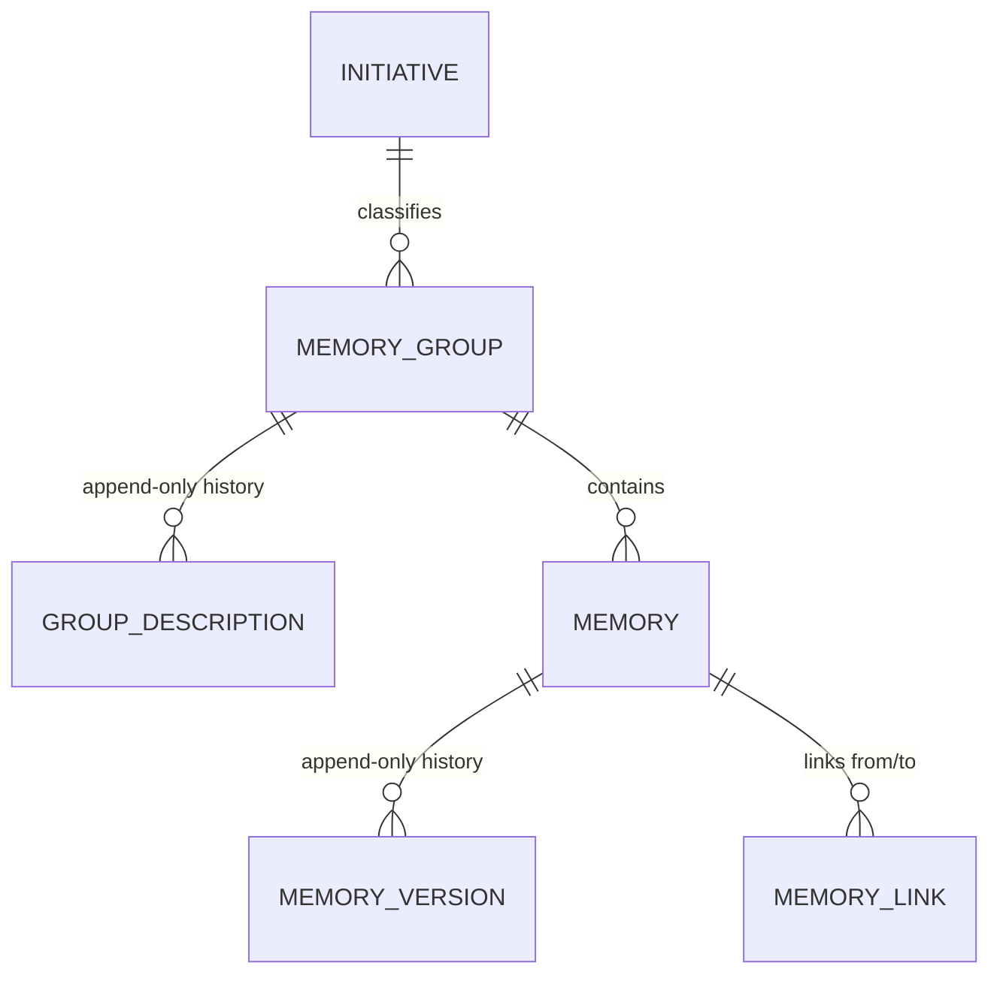

# PERSISTENCE_AGENTS.md

## TL;DR

EF Core + PostgreSQL index over blob-stored content. Seven entities: `Initiative`, `Label`, `MemoryGroup`, `GroupDescription`, `Memory`, `MemoryVersion`, `MemoryLink`. Apache AGE is installed in the same instance (empty `memory_graph` until HLD 003 WT-02). Authoritative model is `docs/hlds/001-context-memory-storage/`; graph rules live in `docs/hlds/003-graph-edges-on-age/`.

## Non-Negotiables

- **Seven entities, no more.** Tags, facets, sources, repositories and tickets are deliberately denormalised, not tables. Reintroducing one fails the model-shape guard test (`Infrastructure.UnitTest/ModelShapeGuardTests`) by design — the failure is the point.
- **Domain entities carry no EF attributes** and reference nothing from `Microsoft.EntityFrameworkCore`; all mapping is fluent in `Persistence/Configurations/`.
- **`MemoryVersion` and `GroupDescription` are append-only**, enforced by DB triggers. Never edit or delete a row in place — a correction is a new version with a higher version number.
- **Every JSONB element carries its own `v` shape marker** (`{"v":1,"provider":"jira","key":"ACM-1","url":"..."}`). It is set in exactly one place — `JsonShapeDocument.Create`/base `V` property — and never hand-written. Do not bypass the typed model. Retrofitting is impossible.
- **`kind` is open vocabulary.** It must not become a C# enum or a check constraint; new kinds emerge by design.
- **AGE session init is per physical connection**, via `NpgsqlDataSourceFactory` / `UsePhysicalConnectionInitializer`. Never initialise once at start-up — that prepares one pooled connection and leaves the rest failing under load (HLD 003 / LADR-04).
- **Do not model graph objects in EF.** `memory_graph`, vertex label `Memory`, and edge labels are created by SQL in a non-transactional migration and are invisible to the model snapshot. `memory_link` stays until WT-02.
- **`Label` registry is advisory, not enforcing.** There is deliberately no FK from `memory.facets` to `label`. A facet absent from the registry must be accepted.

## System Context

The store is an index over content, not a content store. Document bodies live in blob storage (HLD 001 / LADR-06); PostgreSQL holds metadata, relationships, and everything filtered on. Blob content is therefore not indexable — the AI-generated `content_summary` and keywords are the search surface.



## Architecture Decisions

**LADR-001: Store history as tables, not JSONB arrays.** Appending to a JSONB array is read-modify-write, so concurrent appends silently lose one. A table `INSERT` is atomic, and history *is* the audit trail — silently losing entries defeats the additive-only guarantee. Consequence: `MemoryVersion` and `GroupDescription` grow monotonically.

**LADR-002: Keep `MemoryLink` as a table.** "What points at this memory?" is an index seek on `target_memory_id` as a table but a full containment scan as JSONB. Graph edges are the one genuinely relational structure here.

**LADR-003: `Memory`/`MemoryVersion` split along the subject/claim line.** Description (subject) is stable by definition and is what deduplication matches on, so it and `subject_slug` live on the stable `Memory` row. Statement (claim) is volatile, so it lives on the versioned row. Tags and facets are classification, not claims, and are therefore unversioned — placing them on `Memory` is what makes that true.

**LADR-004: Two independent time axes on `MemoryVersion`.** `valid_from`/`valid_until` are business time (when it was true in the world); `created_on` is system time (when we recorded it). Neither derives from the other. Removing `created_on` makes correcting a record indistinguishable from the world changing.

**LADR-005: Three identity keys per memory.** Surrogate `bigint` (FK joins), `uuid` (logical identity, stable across versions), `lineage_id` (clone set across groups). Uuid equals lineage until a clone exists — correct, not redundant.

## Key Behaviors

- **Subject/claim**: `description` (stable, what dedup matches on) vs `statement` (volatile, what versioning replaces) must never be collapsed — that would destroy "same subject, new claim".
- **`sources` sits on the version**, because provenance records where *this claim* came from. v1 and v2 legitimately carry different sources.
- **`is_current` flag**: exactly one current version per memory, enforced by a partial unique index `WHERE "is_current"`. Version chain integrity is the unique `(memory_id, version)`.
- **`MemoryGroup` is keyed by its own GUID**, not by its tickets — tickets accumulate over time. A group holds many tickets, an optional repo, the scope, and a mandatory initiative FK (defaulting to the seeded `to-be-decided` row, id 1).
- **Two constraints are deliberately soft**: subject uniqueness (unique `(group_id, subject_slug)` is an exact-match backstop only) and ticket-to-group uniqueness (application-enforced read-before-write). Do not attempt to enforce either in-database — see HLD 001 / LADR-07.
- **`label_usage` is a derived view**, not a column. A maintained counter drifts; a derived one cannot.
- **Append-only guard (DB trigger `append_only_guard`)**:
  - The one permitted `memory_version` UPDATE is a **version-bump pointer transfer** (`is_current` flips with all content unchanged). Any content edit raises.
  - All `group_description` UPDATEs and any DELETE raise unless the bypass GUC `app.allow_history_delete` is set to `'true'`.
  - A **cascade delete** of a group/memory that has history therefore needs the bypass. **Always use `SET LOCAL` inside an explicit transaction:**

    ```sql
    BEGIN;
    SET LOCAL app.allow_history_delete = 'true';   -- auto-reverts at COMMIT/ROLLBACK
    DELETE FROM memory_group WHERE id = ...;
    COMMIT;
    ```

    **Never plain `SET`.** A session-scoped GUC survives the statement and, on a pooled connection,
    outlives the operation — the next unrelated caller to borrow that connection inherits a live
    permission to delete history. That silently defeats the guarantee the trigger exists to provide.
- **Version bump ordering**: because the partial unique index only allows one current version, a bump must flip the old version's `is_current` to `false` *before* inserting the new current version. Inserting the new current while the old is still current violates the index (both current at insert time). **Wrap both statements in one transaction** — they are separate round-trips, so a failure between them leaves the memory with *zero* current versions, a state no constraint forbids and nothing detects. See `BumpVersionAsync` in the L1 tests.
- **AGE LOAD + `search_path` are session properties.** `DISCARD ALL` on pool return would undo them, so the data source sets `NoResetOnClose`. The initialiser skips `LOAD` until `pg_extension` contains `age`, then migrate clears that pool so connections opened before `CREATE EXTENSION` are not reused unprepared.
- **AGE catalog writes must commit to become visible.** The AGE migration uses `suppressTransaction: true` because `create_graph` / `create_*label` inside the ambient migration transaction are invisible to other sessions.

## Test References

- **L0** — `tests/SmoothAiProductContextMemory.Domain.UnitTest/` (`SlugTests`, `JsonShapeDocumentTests`, `EntityInvariantTests`); `tests/SmoothAiProductContextMemory.Infrastructure.UnitTest/ModelShapeGuardTests`.
- **L1** — `tests/SmoothAiProductContextMemory.Infrastructure.ComponentTest/Persistence/` against real PostgreSQL via `AspireFixture`, fresh migrated database per test (`PersistenceTestBase`). AGE pool-recycle and cross-session visibility: `AgeFoundationTests`. Optional NFR-02 one-hop baseline: `AgeOneHopBaselineTests` (`SMOOTH_AGE_BASELINE=1`).

## Quality Constraints

- **Audit**: append-only history is the audit trail; never update history in place.
- **Logging**: never log memory content. `Information` for lifecycle, `Debug` for per-operation detail.

## Changelog

| Date | Change | Ref |
|:-----|:-------|:----|
| 2026-09-13 | AGE foundation: extension-bearing image, per-connection session init, non-transactional graph/label migration. `memory_link` unchanged. | HLD-003 WT-01 |
| 2026-09-13 | `.docs`→`docs` move and ADR-0002→HLD 001 authority retarget recorded; ADR-era citations now reference HLD 001 (blob storage → LADR-06, in-database enforcement → LADR-07). | — |
| 2026-09-11 | Documented that `ix_memory_version_validity` (GIST over `tstzrange`) is unreachable from LINQ; `NpgsqlMemorySearch` uses scalar validity comparisons and `@>` for facet/tag GIN matching. No schema change. | WT-2 review |
| 2026-09-10 | Additive `memory_version.summary_stamp` jsonb (D42) + `append_only_guard` equality-list extension + btree on `memory_group.repo`. | WT-2, ADR-0003 |
| 2026-09-09 | Created — entity map, subject/claim and system/business-time splits, constraint rationale, versioning, JSONB `v` contract. | ADR-0002 |
